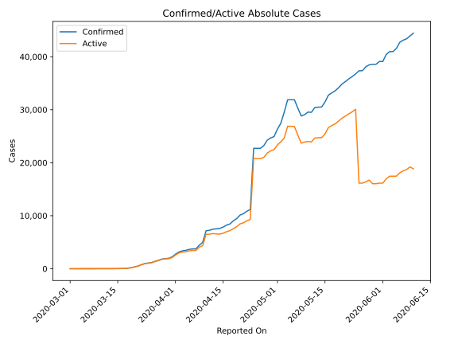
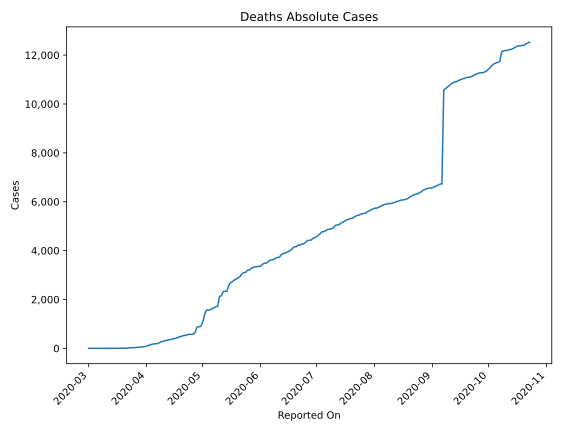
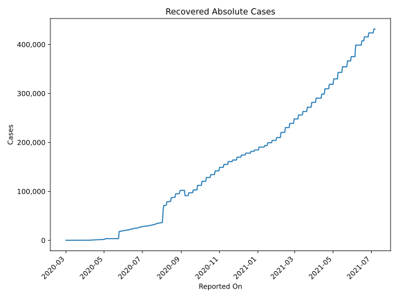
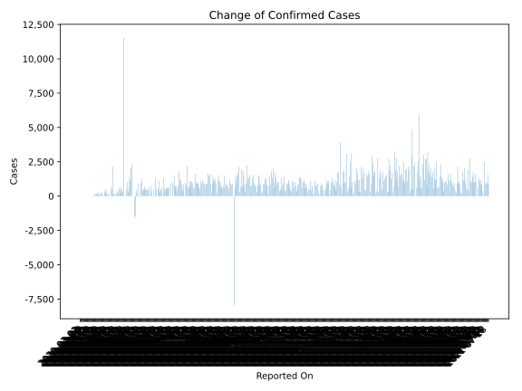
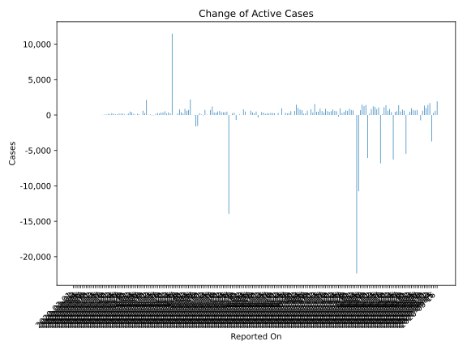
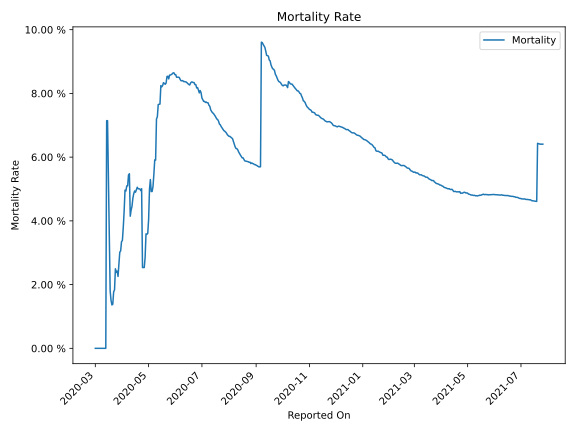

# Country Figures: Time Series for Ecuador 

| Reported On | Confirmed | Deaths | Recovered | Active | Mortality | &Delta; Confirmed | &Delta; Deaths | &Delta; Recovered | &Delta; Active | % Active of Population |
|-------------|-----------|--------|-----------|--------|-----------|-------------------|----------------|-------------------|----------------|------------------------|
| 2020-04-12 | 7466 | 333 | 501 | 6632 |  4.46 %  | 209 | 18 | 90 | 101 |  0.039 %  | 
| 2020-04-11 | 7257 | 315 | 411 | 6531 |  4.34 %  | 96 | 18 | 43 | 35 |  0.038 %  | 
| 2020-04-10 | 7161 | 297 | 368 | 6496 |  4.15 %  | 2196 | 25 | 29 | 2142 |  0.038 %  | 
| 2020-04-09 | 4965 | 272 | 339 | 4354 |  5.48 %  | 515 | 30 | 199 | 286 |  0.025 %  | 
| 2020-04-08 | 4450 | 242 | 140 | 4068 |  5.44 %  | 703 | 51 | 40 | 612 |  0.024 %  | 
| 2020-04-07 | 3747 | 191 | 100 | 3456 |  5.10 %  | 0 | 0 | 0 | 0 |  0.020 %  | 
| 2020-04-06 | 3747 | 191 | 100 | 3456 |  5.10 %  | 101 | 11 | 0 | 90 |  0.020 %  | 
| 2020-04-05 | 3646 | 180 | 100 | 3366 |  4.94 %  | 181 | 8 | 0 | 173 |  0.020 %  | 
| 2020-04-04 | 3465 | 172 | 100 | 3193 |  4.96 %  | 97 | 27 | 35 | 35 |  0.019 %  | 
| 2020-04-03 | 3368 | 145 | 65 | 3158 |  4.31 %  | 205 | 25 | 0 | 180 |  0.018 %  | 
| 2020-04-02 | 3163 | 120 | 65 | 2978 |  3.79 %  | 415 | 27 | 7 | 381 |  0.017 %  | 
| 2020-04-01 | 2748 | 93 | 58 | 2597 |  3.38 %  | 508 | 18 | 4 | 486 |  0.015 %  | 
| 2020-03-31 | 2240 | 75 | 54 | 2111 |  3.35 %  | 278 | 15 | 51 | 212 |  0.012 %  | 
| 2020-03-30 | 1962 | 60 | 3 | 1899 |  3.06 %  | 38 | 2 | 0 | 36 |  0.011 %  | 
| 2020-03-29 | 1924 | 58 | 3 | 1863 |  3.01 %  | 101 | 10 | 0 | 91 |  0.011 %  | 
| 2020-03-28 | 1823 | 48 | 3 | 1772 |  2.63 %  | 228 | 12 | 0 | 216 |  0.010 %  | 
| 2020-03-27 | 1595 | 36 | 3 | 1556 |  2.26 %  | 192 | 2 | 0 | 190 |  0.009 %  | 
| 2020-03-26 | 1403 | 34 | 3 | 1366 |  2.42 %  | 230 | 6 | 0 | 224 |  0.008 %  | 
| 2020-03-25 | 1173 | 28 | 3 | 1142 |  2.39 %  | 91 | 1 | 0 | 90 |  0.007 %  | 
| 2020-03-24 | 1082 | 27 | 3 | 1052 |  2.50 %  | 101 | 9 | 0 | 92 |  0.006 %  | 
| 2020-03-23 | 981 | 18 | 3 | 960 |  1.83 %  | 192 | 4 | 0 | 188 |  0.006 %  | 
| 2020-03-22 | 789 | 14 | 3 | 772 |  1.77 %  | 283 | 7 | 0 | 276 |  0.005 %  | 
| 2020-03-21 | 506 | 7 | 3 | 496 |  1.38 %  | 139 | 2 | 3 | 134 |  0.003 %  | 
| 2020-03-20 | 367 | 5 | 0 | 362 |  1.36 %  | 168 | 2 | 0 | 166 |  0.002 %  | 
| 2020-03-19 | 199 | 3 | 0 | 196 |  1.51 %  | 88 | 1 | 0 | 87 |  0.001 %  | 
| 2020-03-18 | 111 | 2 | 0 | 109 |  1.80 %  | 53 | 0 | 0 | 53 |  0.001 %  | 
| 2020-03-17 | 58 | 2 | 0 | 56 |  3.45 %  | 21 | 0 | 0 | 21 |  0.000 %  | 
| 2020-03-16 | 37 | 2 | 0 | 35 |  5.41 %  | 9 | 0 | 0 | 9 |  0.000 %  | 
| 2020-03-15 | 28 | 2 | 0 | 26 |  7.14 %  | 0 | 0 | 0 | 0 |  0.000 %  | 
| 2020-03-14 | 28 | 2 | 0 | 26 |  7.14 %  | 11 | 2 | 0 | 9 |  0.000 %  | 
| 2020-03-13 | 17 | 0 | 0 | 17 |  None  | 0 | 0 | 0 | 0 |  0.000 %  | 
| 2020-03-12 | 17 | 0 | 0 | 17 |  None  | 0 | 0 | 0 | 0 |  0.000 %  | 
| 2020-03-11 | 17 | 0 | 0 | 17 |  None  | 2 | 0 | 0 | 2 |  0.000 %  | 
| 2020-03-10 | 15 | 0 | 0 | 15 |  None  | 0 | 0 | 0 | 0 |  0.000 %  | 
| 2020-03-09 | 15 | 0 | 0 | 15 |  None  | 1 | 0 | 0 | 1 |  0.000 %  | 
| 2020-03-08 | 14 | 0 | 0 | 14 |  None  | 1 | 0 | 0 | 1 |  0.000 %  | 
| 2020-03-07 | 13 | 0 | 0 | 13 |  None  | 0 | 0 | 0 | 0 |  0.000 %  | 
| 2020-03-06 | 13 | 0 | 0 | 13 |  None  | 0 | 0 | 0 | 0 |  0.000 %  | 
| 2020-03-05 | 13 | 0 | 0 | 13 |  None  | 3 | 0 | 0 | 3 |  0.000 %  | 
| 2020-03-04 | 10 | 0 | 0 | 10 |  None  | 3 | 0 | 0 | 3 |  0.000 %  | 
| 2020-03-03 | 7 | 0 | 0 | 7 |  None  | 1 | 0 | 0 | 1 |  0.000 %  | 
| 2020-03-02 | 6 | 0 | 0 | 6 |  None  | 0 | 0 | 0 | 0 |  0.000 %  | 
| 2020-03-01 | 6 | 0 | 0 | 6 |  None  | None | None | None | None |  0.000 %  | 

