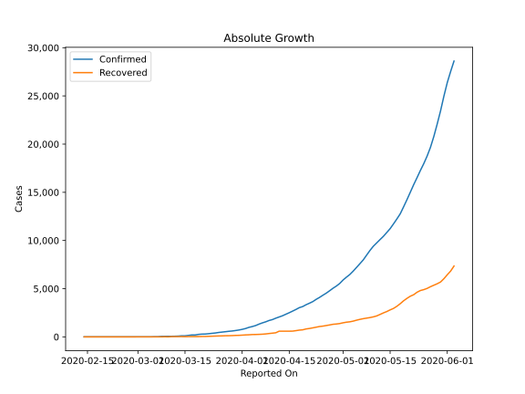
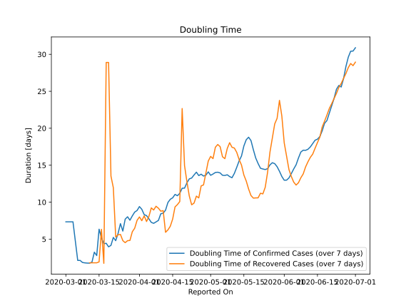

# Country Figures: Doubling Time of Infections for Egypt 

The doubling time below are calculated based on
* an exponential growth assumption
* for time difference of past seven (7) days.
The doubling time's unit is "days".

The first doubling time indicates the increase of confirmed (infected)
cases. There, the *higher* the number is, the better is to take control
of the disease.

The second doubling time indicates the increase of recovered (healed)
cases. There, the *lower* the number is, the better it is to take
control of the disease.

| Reported On | Confirmed | Doubling Time (Confirmed) | Recovered | Doubling Time (Recovered) |
|-------------|-----------|---------------------------|-----------|---------------------------|
| 2020-05-05 | 7201 |  14.0 days  | 1730 |  17.5 days  | 
| 2020-05-04 | 6813 |  14.1 days  | 1632 |  17.8 days  | 
| 2020-05-03 | 6465 |  14.0 days  | 1562 |  17.4 days  | 
| 2020-05-02 | 6193 |  13.8 days  | 1522 |  15.9 days  | 
| 2020-05-01 | 5895 |  13.6 days  | 1460 |  16.2 days  | 
| 2020-04-30 | 5537 |  14.1 days  | 1381 |  15.6 days  | 
| 2020-04-29 | 5268 |  13.7 days  | 1335 |  14.0 days  | 
| 2020-04-28 | 5042 |  13.5 days  | 1304 |  12.3 days  | 
| 2020-04-27 | 4782 |  13.8 days  | 1236 |  12.2 days  | 
| 2020-04-26 | 4534 |  13.6 days  | 1176 |  10.6 days  | 
| 2020-04-25 | 4319 |  14.1 days  | 1114 |  10.8 days  | 
| 2020-04-24 | 4092 |  13.7 days  | 1075 |  9.9 days  | 
| 2020-04-23 | 3891 |  13.3 days  | 1004 |  9.6 days  | 
| 2020-04-22 | 3659 |  13.1 days  | 935 |  10.8 days  | 
| 2020-04-21 | 3490 |  12.6 days  | 870 |  12.8 days  | 
| 2020-04-20 | 3333 |  11.9 days  | 821 |  15.0 days  | 
| 2020-04-19 | 3144 |  11.9 days  | 732 |  22.7 days  | 
| 2020-04-18 | 3032 |  11.2 days  | 701 |  10.1 days  | 
| 2020-04-17 | 2844 |  10.9 days  | 646 |  9.7 days  | 
| 2020-04-16 | 2673 |  11.1 days  | 596 |  9.4 days  | 
| 2020-04-15 | 2505 |  10.6 days  | 589 |  7.7 days  | 
| 2020-04-14 | 2350 |  10.4 days  | 589 |  6.7 days  | 
| 2020-04-13 | 2190 |  10.0 days  | 589 |  6.2 days  | 
| 2020-04-12 | 2065 |  8.9 days  | 589 |  5.9 days  | 
| 2020-04-11 | 1939 |  8.5 days  | 426 |  8.9 days  | 
| 2020-04-10 | 1794 |  8.4 days  | 384 |  8.8 days  | 
| 2020-04-09 | 1699 |  7.5 days  | 348 |  9.2 days  | 
| 2020-04-08 | 1560 |  7.3 days  | 305 |  9.4 days  | 
| 2020-04-07 | 1450 |  7.1 days  | 276 |  8.9 days  | 
| 2020-04-06 | 1322 |  7.3 days  | 259 |  9.2 days  | 
| 2020-04-05 | 1173 |  7.7 days  | 247 |  8.1 days  | 
| 2020-04-04 | 1070 |  8.2 days  | 241 |  7.4 days  | 
| 2020-04-03 | 985 |  8.3 days  | 216 |  8.1 days  | 
| 2020-04-02 | 865 |  9.0 days  | 201 |  7.5 days  | 
| 2020-04-01 | 779 |  9.4 days  | 179 |  8.0 days  | 
| 2020-03-31 | 710 |  8.9 days  | 157 |  7.5 days  | 
| 2020-03-30 | 656 |  8.7 days  | 150 |  6.5 days  | 
| 2020-03-29 | 609 |  8.1 days  | 132 |  6.0 days  | 
| 2020-03-28 | 576 |  7.6 days  | 121 |  4.8 days  | 
| 2020-03-27 | 536 |  8.0 days  | 116 |  4.8 days  | 
| 2020-03-26 | 495 |  7.7 days  | 102 |  4.5 days  | 
| 2020-03-25 | 456 |  6.1 days  | 95 |  4.8 days  | 
| 2020-03-24 | 402 |  7.1 days  | 80 |  5.6 days  | 
| 2020-03-23 | 366 |  5.8 days  | 68 |  5.6 days  | 
| 2020-03-22 | 327 |  4.8 days  | 56 |  5.3 days  | 
| 2020-03-21 | 294 |  5.2 days  | 41 |  12.0 days  | 
| 2020-03-20 | 285 |  4.2 days  | 39 |  13.5 days  | 
| 2020-03-19 | 256 |  4.0 days  | 32 |  28.9 days  | 
| 2020-03-18 | 196 |  4.4 days  | 32 |  28.9 days  | 
| 2020-03-17 | 196 |  4.4 days  | 32 |  1.7 days  | 
| 2020-03-16 | 150 |  5.2 days  | 27 |  6.3 days  | 
| 2020-03-15 | 110 |  6.3 days  | 21 |  1.9 days  | 
| 2020-03-14 | 109 |  2.8 days  | 27 |  1.8 days  | 
| 2020-03-13 | 80 |  3.2 days  | 27 |  1.8 days  | 
| 2020-03-12 | 67 |  1.9 days  | 27 |  1.8 days  | 
| 2020-03-11 | 60 |  1.8 days  | 27 |  1.8 days  | 
| 2020-03-10 | 59 |  1.8 days  | 1 |  None  | 
| 2020-03-09 | 55 |  1.8 days  | 12 |  2.3 days  | 
| 2020-03-08 | 49 |  1.8 days  | 1 |  None  | 
| 2020-03-07 | 15 |  2.1 days  | 1 |  None  | 
| 2020-03-06 | 15 |  2.1 days  | 1 |  None  | 
| 2020-03-05 | 3 |  4.8 days  | 1 |  None  | 
| 2020-03-04 | 2 |  7.3 days  | 1 |  None  | 
| 2020-03-03 | 2 |  7.3 days  | 1 |  None  | 
| 2020-03-02 | 2 |  7.3 days  | 1 |  None  | 
| 2020-03-01 | 2 |  7.3 days  | 1 |  None  | 
| 2020-02-27 | 1 |  None  | 0 |  None  | 
| 2020-02-26 | 1 |  None  | 0 |  None  | 
| 2020-02-25 | 1 |  None  | 0 |  None  | 
| 2020-02-24 | 1 |  None  | 0 |  None  | 
| 2020-02-23 | 1 |  None  | 0 |  None  | 
| 2020-02-22 | 1 |  None  | 0 |  None  | 
| 2020-02-21 | 1 |  None  | 0 |  None  | 
| 2020-02-20 | 1 |  None  | 0 |  None  | 
| 2020-02-19 | 1 |  None  | 0 |  None  | 
| 2020-02-18 | 1 |  None  | 0 |  None  | 
| 2020-02-17 | 1 |  None  | 0 |  None  | 
| 2020-02-16 | 1 |  None  | 0 |  None  | 
| 2020-02-15 | 1 |  None  | 0 |  None  | 
| 2020-02-14 | 1 |  None  | 0 |  None  | 

