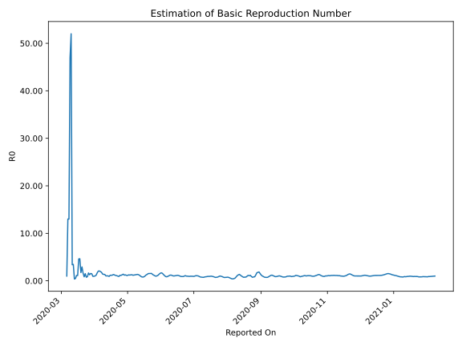

# Country Figures: Time Series for Basic Reproduction Number of Egypt 

| Reported On | &Delta; Confirmed | Total &Delta; Confirmed First Interval | Total &Delta; Confirmed Second Interval | Estimated Basic Reproduction Number R0 | 
|-------------|-------------------|----------------------------------------|-----------------------------------------|---------------------------------------------------|
| 2020-05-07 | 393 |  1395  |  1151  |  1.21  | 
| 2020-05-06 | 387 |  1306  |  1113  |  1.17  | 
| 2020-05-05 | 388 |  1276  |  1003  |  1.27  | 
| 2020-05-04 | 348 |  1197  |  949  |  1.26  | 
| 2020-05-03 | 272 |  1151  |  950  |  1.21  | 
| 2020-05-02 | 298 |  1113  |  891  |  1.25  | 
| 2020-05-01 | 358 |  1003  |  875  |  1.15  | 
| 2020-04-30 | 269 |  949  |  829  |  1.14  | 
| 2020-04-29 | 226 |  950  |  759  |  1.25  | 
| 2020-04-28 | 260 |  891  |  747  |  1.19  | 
| 2020-04-27 | 248 |  875  |  627  |  1.40  | 
| 2020-04-26 | 215 |  829  |  646  |  1.28  | 
| 2020-04-25 | 227 |  759  |  660  |  1.15  | 
| 2020-04-24 | 201 |  747  |  639  |  1.17  | 
| 2020-04-23 | 232 |  627  |  682  |  0.92  | 
| 2020-04-22 | 169 |  646  |  654  |  0.99  | 
| 2020-04-21 | 157 |  660  |  608  |  1.09  | 
| 2020-04-20 | 189 |  639  |  566  |  1.13  | 
| 2020-04-19 | 112 |  682  |  556  |  1.23  | 
| 2020-04-18 | 188 |  654  |  491  |  1.33  | 
| 2020-04-17 | 171 |  608  |  505  |  1.20  | 
| 2020-04-16 | 168 |  566  |  489  |  1.16  | 
| 2020-04-15 | 155 |  556  |  472  |  1.18  | 
| 2020-04-14 | 160 |  491  |  526  |  0.93  | 
| 2020-04-13 | 125 |  505  |  490  |  1.03  | 
| 2020-04-12 | 126 |  489  |  465  |  1.05  | 
| 2020-04-11 | 145 |  472  |  457  |  1.03  | 
| 2020-04-10 | 95 |  526  |  394  |  1.34  | 
| 2020-04-09 | 139 |  490  |  360  |  1.36  | 
| 2020-04-08 | 110 |  465  |  329  |  1.41  | 
| 2020-04-07 | 128 |  457  |  256  |  1.79  | 
| 2020-04-06 | 149 |  394  |  203  |  1.94  | 
| 2020-04-05 | 103 |  360  |  174  |  2.07  | 
| 2020-04-04 | 85 |  329  |  161  |  2.04  | 
| 2020-04-03 | 120 |  256  |  153  |  1.67  | 
| 2020-04-02 | 86 |  203  |  174  |  1.17  | 
| 2020-04-01 | 69 |  174  |  170  |  1.02  | 
| 2020-03-31 | 54 |  161  |  168  |  0.96  | 
| 2020-03-30 | 47 |  153  |  162  |  0.94  | 
| 2020-03-29 | 33 |  174  |  117  |  1.49  | 
| 2020-03-28 | 40 |  170  |  110  |  1.55  | 
| 2020-03-27 | 41 |  168  |  131  |  1.28  | 
| 2020-03-26 | 39 |  162  |  98  |  1.65  | 
| 2020-03-25 | 54 |  117  |  135  |  0.87  | 
| 2020-03-24 | 36 |  110  |  146  |  0.75  | 
| 2020-03-23 | 39 |  131  |  87  |  1.51  | 
| 2020-03-22 | 33 |  98  |  116  |  0.84  | 
| 2020-03-21 | 9 |  135  |  83  |  1.63  | 
| 2020-03-20 | 29 |  146  |  50  |  2.92  | 
| 2020-03-19 | 60 |  87  |  50  |  1.74  | 
| 2020-03-18 | 0 |  116  |  25  |  4.64  | 
| 2020-03-17 | 46 |  83  |  18  |  4.61  | 
| 2020-03-16 | 40 |  50  |  45  |  1.11  | 
| 2020-03-15 | 1 |  50  |  44  |  1.14  | 
| 2020-03-14 | 29 |  25  |  52  |  0.48  | 
| 2020-03-13 | 13 |  18  |  47  |  0.38  | 
| 2020-03-12 | 7 |  45  |  13  |  3.46  | 
| 2020-03-11 | 1 |  44  |  13  |  3.38  | 
| 2020-03-10 | 4 |  52  |  1  |  52.00  | 
| 2020-03-09 | 6 |  47  |  1  |  47.00  | 
| 2020-03-08 | 34 |  13  |  1  |  13.00  | 
| 2020-03-07 | 0 |  13  |  1  |  13.00  | 
| 2020-03-06 | 12 |  1  |  1  |  1.00  | 
| 2020-03-05 | 1 |  1  |  None  |  None  | 
| 2020-03-04 | 0 |  1  |  None  |  None  | 
| 2020-03-03 | 0 |  1  |  None  |  None  | 
| 2020-03-02 | 0 |  1  |  None  |  None  | 
| 2020-03-01 | 1 |  None  |  None  |  None  | 
| 2020-02-29 | 0 |  None  |  None  |  None  | 
| 2020-02-28 | 0 |  None  |  None  |  None  | 
| 2020-02-27 | 0 |  None  |  None  |  None  | 
| 2020-02-26 | 0 |  None  |  None  |  None  | 
| 2020-02-25 | 0 |  None  |  None  |  None  | 
| 2020-02-24 | 0 |  None  |  None  |  None  | 
| 2020-02-23 | 0 |  None  |  None  |  None  | 
| 2020-02-22 | 0 |  None  |  None  |  None  | 
| 2020-02-21 | 0 |  None  |  None  |  None  | 
| 2020-02-20 | 0 |  None  |  None  |  None  | 
| 2020-02-19 | 0 |  None  |  None  |  None  | 
| 2020-02-18 | 0 |  None  |  None  |  None  | 
| 2020-02-17 | 0 |  None  |  None  |  None  | 
| 2020-02-16 | 0 |  None  |  None  |  None  | 
| 2020-02-15 | 0 |  None  |  None  |  None  | 
| 2020-02-14 | None |  None  |  None  |  None  | 

