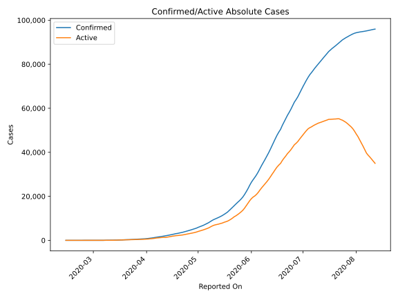
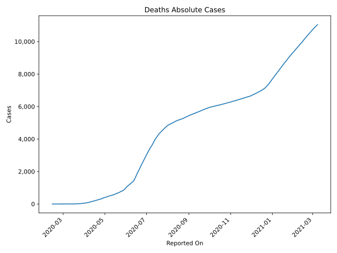
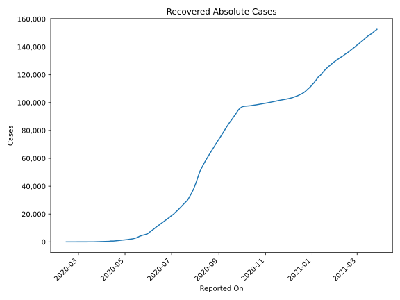
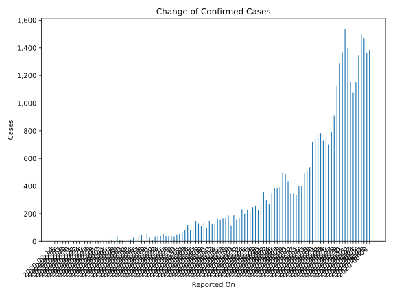
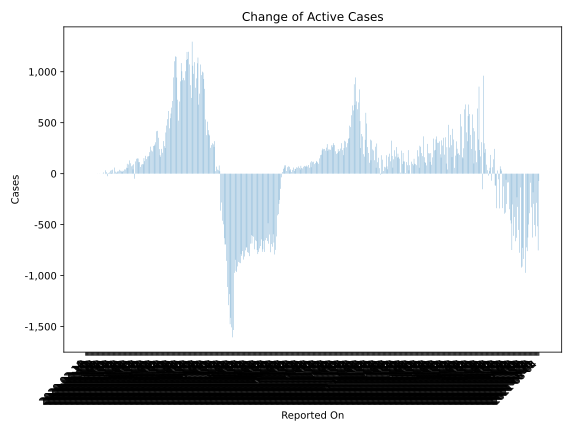
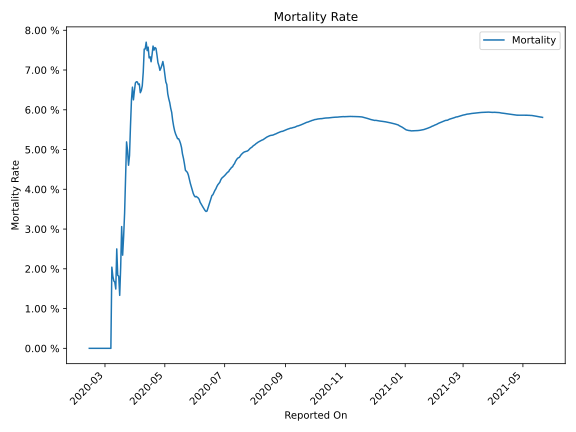

# Country Figures: Time Series for Egypt 

| Reported On | Confirmed | Deaths | Recovered | Active | Mortality | &Delta; Confirmed | &Delta; Deaths | &Delta; Recovered | &Delta; Active | % Active of Population |
|-------------|-----------|--------|-----------|--------|-----------|-------------------|----------------|-------------------|----------------|------------------------|
| 2020-04-25 | 4319 | 307 | 1114 | 2898 |  7.11 %  | 227 | 13 | 39 | 175 |  0.003 %  | 
| 2020-04-24 | 4092 | 294 | 1075 | 2723 |  7.18 %  | 201 | 7 | 71 | 123 |  0.003 %  | 
| 2020-04-23 | 3891 | 287 | 1004 | 2600 |  7.38 %  | 232 | 11 | 69 | 152 |  0.003 %  | 
| 2020-04-22 | 3659 | 276 | 935 | 2448 |  7.54 %  | 169 | 12 | 65 | 92 |  0.002 %  | 
| 2020-04-21 | 3490 | 264 | 870 | 2356 |  7.56 %  | 157 | 14 | 49 | 94 |  0.002 %  | 
| 2020-04-20 | 3333 | 250 | 821 | 2262 |  7.50 %  | 189 | 11 | 89 | 89 |  0.002 %  | 
| 2020-04-19 | 3144 | 239 | 732 | 2173 |  7.60 %  | 112 | 15 | 31 | 66 |  0.002 %  | 
| 2020-04-18 | 3032 | 224 | 701 | 2107 |  7.39 %  | 188 | 19 | 55 | 114 |  0.002 %  | 
| 2020-04-17 | 2844 | 205 | 646 | 1993 |  7.21 %  | 171 | 9 | 50 | 112 |  0.002 %  | 
| 2020-04-16 | 2673 | 196 | 596 | 1881 |  7.33 %  | 168 | 13 | 7 | 148 |  0.002 %  | 
| 2020-04-15 | 2505 | 183 | 589 | 1733 |  7.31 %  | 155 | 5 | 0 | 150 |  0.002 %  | 
| 2020-04-14 | 2350 | 178 | 589 | 1583 |  7.57 %  | 160 | 14 | 0 | 146 |  0.002 %  | 
| 2020-04-13 | 2190 | 164 | 589 | 1437 |  7.49 %  | 125 | 5 | 0 | 120 |  0.001 %  | 
| 2020-04-12 | 2065 | 159 | 589 | 1317 |  7.70 %  | 126 | 13 | 163 | -50 |  0.001 %  | 
| 2020-04-11 | 1939 | 146 | 426 | 1367 |  7.53 %  | 145 | 11 | 42 | 92 |  0.001 %  | 
| 2020-04-10 | 1794 | 135 | 384 | 1275 |  7.53 %  | 95 | 17 | 36 | 42 |  0.001 %  | 
| 2020-04-09 | 1699 | 118 | 348 | 1233 |  6.95 %  | 139 | 15 | 43 | 81 |  0.001 %  | 
| 2020-04-08 | 1560 | 103 | 305 | 1152 |  6.60 %  | 110 | 9 | 29 | 72 |  0.001 %  | 
| 2020-04-07 | 1450 | 94 | 276 | 1080 |  6.48 %  | 128 | 9 | 17 | 102 |  0.001 %  | 
| 2020-04-06 | 1322 | 85 | 259 | 978 |  6.43 %  | 149 | 7 | 12 | 130 |  0.001 %  | 
| 2020-04-05 | 1173 | 78 | 247 | 848 |  6.65 %  | 103 | 7 | 6 | 90 |  0.001 %  | 
| 2020-04-04 | 1070 | 71 | 241 | 758 |  6.64 %  | 85 | 5 | 25 | 55 |  0.001 %  | 
| 2020-04-03 | 985 | 66 | 216 | 703 |  6.70 %  | 120 | 8 | 15 | 97 |  0.001 %  | 
| 2020-04-02 | 865 | 58 | 201 | 606 |  6.71 %  | 86 | 6 | 22 | 58 |  0.001 %  | 
| 2020-04-01 | 779 | 52 | 179 | 548 |  6.68 %  | 69 | 6 | 22 | 41 |  0.001 %  | 
| 2020-03-31 | 710 | 46 | 157 | 507 |  6.48 %  | 54 | 5 | 7 | 42 |  0.001 %  | 
| 2020-03-30 | 656 | 41 | 150 | 465 |  6.25 %  | 47 | 1 | 18 | 28 |  0.000 %  | 
| 2020-03-29 | 609 | 40 | 132 | 437 |  6.57 %  | 33 | 4 | 11 | 18 |  0.000 %  | 
| 2020-03-28 | 576 | 36 | 121 | 419 |  6.25 %  | 40 | 6 | 5 | 29 |  0.000 %  | 
| 2020-03-27 | 536 | 30 | 116 | 390 |  5.60 %  | 41 | 6 | 14 | 21 |  0.000 %  | 
| 2020-03-26 | 495 | 24 | 102 | 369 |  4.85 %  | 39 | 3 | 7 | 29 |  0.000 %  | 
| 2020-03-25 | 456 | 21 | 95 | 340 |  4.61 %  | 54 | 1 | 15 | 38 |  0.000 %  | 
| 2020-03-24 | 402 | 20 | 80 | 302 |  4.98 %  | 36 | 1 | 12 | 23 |  0.000 %  | 
| 2020-03-23 | 366 | 19 | 68 | 279 |  5.19 %  | 39 | 5 | 12 | 22 |  0.000 %  | 
| 2020-03-22 | 327 | 14 | 56 | 257 |  4.28 %  | 33 | 4 | 15 | 14 |  0.000 %  | 
| 2020-03-21 | 294 | 10 | 41 | 243 |  3.40 %  | 9 | 2 | 2 | 5 |  0.000 %  | 
| 2020-03-20 | 285 | 8 | 39 | 238 |  2.81 %  | 29 | 2 | 7 | 20 |  0.000 %  | 
| 2020-03-19 | 256 | 6 | 32 | 218 |  2.34 %  | 60 | 0 | 0 | 60 |  0.000 %  | 
| 2020-03-18 | 196 | 6 | 32 | 158 |  3.06 %  | 0 | 2 | 0 | -2 |  0.000 %  | 
| 2020-03-17 | 196 | 4 | 32 | 160 |  2.04 %  | 46 | 2 | 5 | 39 |  0.000 %  | 
| 2020-03-16 | 150 | 2 | 27 | 121 |  1.33 %  | 40 | 0 | 6 | 34 |  0.000 %  | 
| 2020-03-15 | 110 | 2 | 21 | 87 |  1.82 %  | 1 | 0 | -6 | 7 |  0.000 %  | 
| 2020-03-14 | 109 | 2 | 27 | 80 |  1.83 %  | 29 | 0 | 0 | 29 |  0.000 %  | 
| 2020-03-13 | 80 | 2 | 27 | 51 |  2.50 %  | 13 | 1 | 0 | 12 |  0.000 %  | 
| 2020-03-12 | 67 | 1 | 27 | 39 |  1.49 %  | 7 | 0 | 0 | 7 |  0.000 %  | 
| 2020-03-11 | 60 | 1 | 27 | 32 |  1.67 %  | 1 | 0 | 26 | -25 |  0.000 %  | 
| 2020-03-10 | 59 | 1 | 1 | 57 |  1.69 %  | 4 | 0 | -11 | 15 |  0.000 %  | 
| 2020-03-09 | 55 | 1 | 12 | 42 |  1.82 %  | 6 | 0 | 11 | -5 |  0.000 %  | 
| 2020-03-08 | 49 | 1 | 1 | 47 |  2.04 %  | 34 | 1 | 0 | 33 |  0.000 %  | 
| 2020-03-07 | 15 | 0 | 1 | 14 |  None  | 0 | 0 | 0 | 0 |  0.000 %  | 
| 2020-03-06 | 15 | 0 | 1 | 14 |  None  | 12 | 0 | 0 | 12 |  0.000 %  | 
| 2020-03-05 | 3 | 0 | 1 | 2 |  None  | 1 | 0 | 0 | 1 |  0.000 %  | 
| 2020-03-04 | 2 | 0 | 1 | 1 |  None  | 0 | 0 | 0 | 0 |  0.000 %  | 
| 2020-03-03 | 2 | 0 | 1 | 1 |  None  | 0 | 0 | 0 | 0 |  0.000 %  | 
| 2020-03-02 | 2 | 0 | 1 | 1 |  None  | 0 | 0 | 0 | 0 |  0.000 %  | 
| 2020-03-01 | 2 | 0 | 1 | 1 |  None  | 1 | 0 | 0 | 1 |  0.000 %  | 
| 2020-02-29 | 1 | 0 | 1 | 0 |  None  | 0 | 0 | 0 | 0 |  n/a  | 
| 2020-02-28 | 1 | 0 | 1 | 0 |  None  | 0 | 0 | 1 | -1 |  n/a  | 
| 2020-02-27 | 1 | 0 | 0 | 1 |  None  | 0 | 0 | 0 | 0 |  0.000 %  | 
| 2020-02-26 | 1 | 0 | 0 | 1 |  None  | 0 | 0 | 0 | 0 |  0.000 %  | 
| 2020-02-25 | 1 | 0 | 0 | 1 |  None  | 0 | 0 | 0 | 0 |  0.000 %  | 
| 2020-02-24 | 1 | 0 | 0 | 1 |  None  | 0 | 0 | 0 | 0 |  0.000 %  | 
| 2020-02-23 | 1 | 0 | 0 | 1 |  None  | 0 | 0 | 0 | 0 |  0.000 %  | 
| 2020-02-22 | 1 | 0 | 0 | 1 |  None  | 0 | 0 | 0 | 0 |  0.000 %  | 
| 2020-02-21 | 1 | 0 | 0 | 1 |  None  | 0 | 0 | 0 | 0 |  0.000 %  | 
| 2020-02-20 | 1 | 0 | 0 | 1 |  None  | 0 | 0 | 0 | 0 |  0.000 %  | 
| 2020-02-19 | 1 | 0 | 0 | 1 |  None  | 0 | 0 | 0 | 0 |  0.000 %  | 
| 2020-02-18 | 1 | 0 | 0 | 1 |  None  | 0 | 0 | 0 | 0 |  0.000 %  | 
| 2020-02-17 | 1 | 0 | 0 | 1 |  None  | 0 | 0 | 0 | 0 |  0.000 %  | 
| 2020-02-16 | 1 | 0 | 0 | 1 |  None  | 0 | 0 | 0 | 0 |  0.000 %  | 
| 2020-02-15 | 1 | 0 | 0 | 1 |  None  | 0 | 0 | 0 | 0 |  0.000 %  | 
| 2020-02-14 | 1 | 0 | 0 | 1 |  None  | None | None | None | None |  0.000 %  | 

