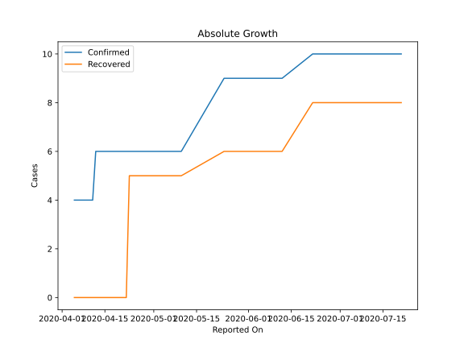
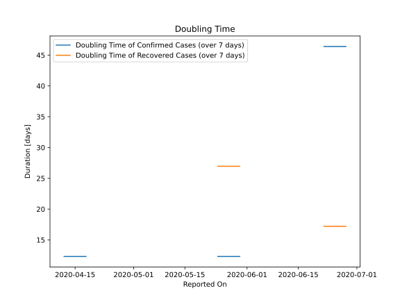

# Country Figures: Doubling Time of Infections for WesternSahara 

The doubling time below are calculated based on
* an exponential growth assumption
* for time difference of past seven (7) days.
The doubling time's unit is "days".

The first doubling time indicates the increase of confirmed (infected)
cases. There, the *higher* the number is, the better is to take control
of the disease.

The second doubling time indicates the increase of recovered (healed)
cases. There, the *lower* the number is, the better it is to take
control of the disease.

| Reported On | Confirmed | Doubling Time (Confirmed) | Recovered | Doubling Time (Recovered) |
|-------------|-----------|---------------------------|-----------|---------------------------|
| 2020-05-03 | 6 |  None  | 5 |  None  | 
| 2020-05-02 | 6 |  None  | 5 |  None  | 
| 2020-05-01 | 6 |  None  | 5 |  None  | 
| 2020-04-30 | 6 |  None  | 5 |  None  | 
| 2020-04-29 | 6 |  None  | 5 |  None  | 
| 2020-04-28 | 6 |  None  | 5 |  None  | 
| 2020-04-27 | 6 |  None  | 5 |  None  | 
| 2020-04-26 | 6 |  None  | 5 |  None  | 
| 2020-04-25 | 6 |  None  | 5 |  None  | 
| 2020-04-24 | 6 |  None  | 5 |  None  | 
| 2020-04-23 | 6 |  None  | 5 |  None  | 
| 2020-04-22 | 6 |  None  | 0 |  None  | 
| 2020-04-21 | 6 |  None  | 0 |  None  | 
| 2020-04-20 | 6 |  None  | 0 |  None  | 
| 2020-04-19 | 6 |  None  | 0 |  None  | 
| 2020-04-18 | 6 |  12.3 days  | 0 |  None  | 
| 2020-04-17 | 6 |  12.3 days  | 0 |  None  | 
| 2020-04-16 | 6 |  12.3 days  | 0 |  None  | 
| 2020-04-15 | 6 |  12.3 days  | 0 |  None  | 
| 2020-04-14 | 6 |  12.3 days  | 0 |  None  | 
| 2020-04-13 | 6 |  12.3 days  | 0 |  None  | 
| 2020-04-12 | 6 |  12.3 days  | 0 |  None  | 
| 2020-04-11 | 4 |  None  | 0 |  None  | 
| 2020-04-10 | 4 |  None  | 0 |  None  | 
| 2020-04-09 | 4 |  None  | 0 |  None  | 
| 2020-04-08 | 4 |  None  | 0 |  None  | 
| 2020-04-07 | 4 |  None  | 0 |  None  | 
| 2020-04-06 | 4 |  None  | 0 |  None  | 
| 2020-04-05 | 4 |  None  | 0 |  None  | 

