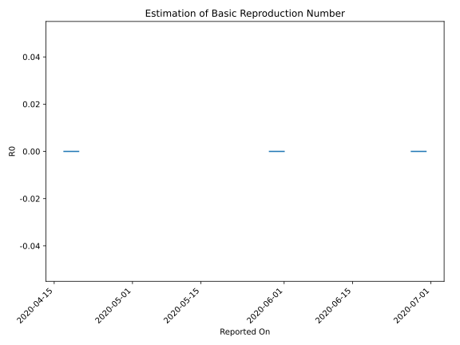

# Country Figures: Time Series for Basic Reproduction Number of WesternSahara 

| Reported On | &Delta; Confirmed | Total &Delta; Confirmed First Interval | Total &Delta; Confirmed Second Interval | Estimated Basic Reproduction Number R0 | 
|-------------|-------------------|----------------------------------------|-----------------------------------------|---------------------------------------------------|
| 2020-04-28 | 0 |  None  |  None  |  None  | 
| 2020-04-27 | 0 |  None  |  None  |  None  | 
| 2020-04-26 | 0 |  None  |  None  |  None  | 
| 2020-04-25 | 0 |  None  |  None  |  None  | 
| 2020-04-24 | 0 |  None  |  None  |  None  | 
| 2020-04-23 | 0 |  None  |  None  |  None  | 
| 2020-04-22 | 0 |  None  |  None  |  None  | 
| 2020-04-21 | 0 |  None  |  None  |  None  | 
| 2020-04-20 | 0 |  None  |  2  |  None  | 
| 2020-04-19 | 0 |  None  |  2  |  None  | 
| 2020-04-18 | 0 |  None  |  2  |  None  | 
| 2020-04-17 | 0 |  None  |  2  |  None  | 
| 2020-04-16 | 0 |  2  |  None  |  None  | 
| 2020-04-15 | 0 |  2  |  None  |  None  | 
| 2020-04-14 | 0 |  2  |  None  |  None  | 
| 2020-04-13 | 0 |  2  |  None  |  None  | 
| 2020-04-12 | 2 |  None  |  None  |  None  | 
| 2020-04-11 | 0 |  None  |  None  |  None  | 
| 2020-04-10 | 0 |  None  |  None  |  None  | 
| 2020-04-09 | 0 |  None  |  None  |  None  | 
| 2020-04-08 | 0 |  None  |  None  |  None  | 
| 2020-04-07 | 0 |  None  |  None  |  None  | 
| 2020-04-06 | 0 |  None  |  None  |  None  | 
| 2020-04-05 | None |  None  |  None  |  None  | 

