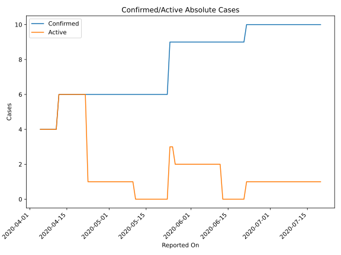
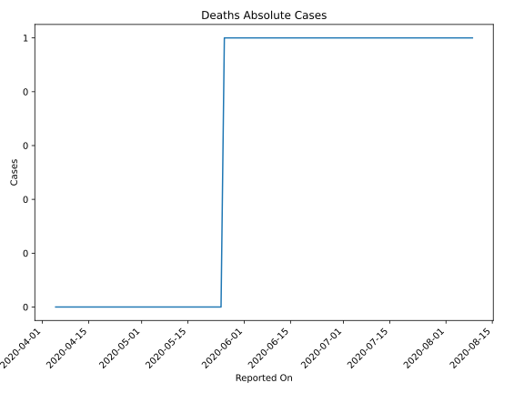
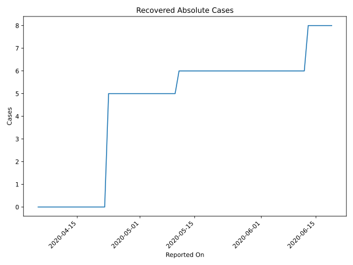
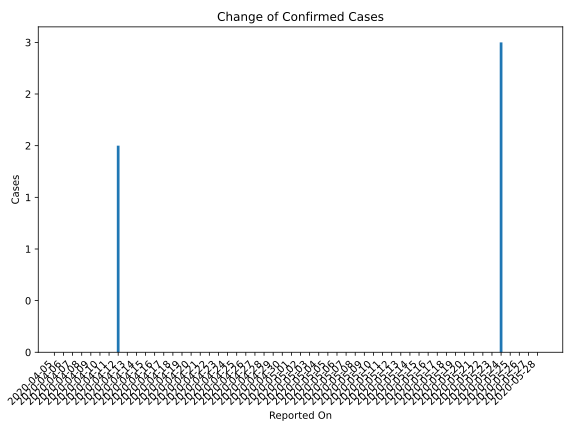
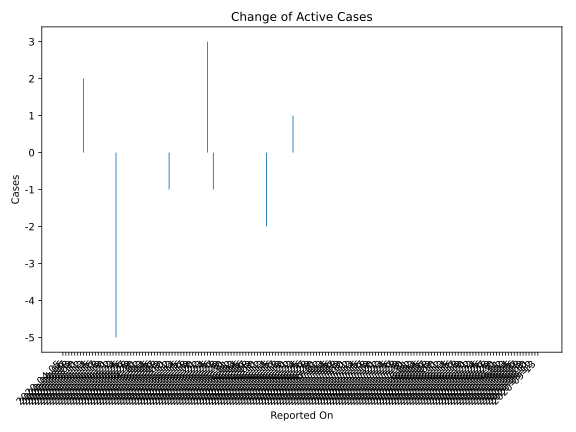
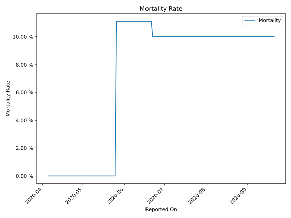

# Country Figures: Time Series for WesternSahara 

| Reported On | Confirmed | Deaths | Recovered | Active | Mortality | &Delta; Confirmed | &Delta; Deaths | &Delta; Recovered | &Delta; Active | % Active of Population |
|-------------|-----------|--------|-----------|--------|-----------|-------------------|----------------|-------------------|----------------|------------------------|
| 2020-05-03 | 6 | 0 | 5 | 1 |  None  | 0 | 0 | 0 | 0 |  n/a  | 
| 2020-05-02 | 6 | 0 | 5 | 1 |  None  | 0 | 0 | 0 | 0 |  n/a  | 
| 2020-05-01 | 6 | 0 | 5 | 1 |  None  | 0 | 0 | 0 | 0 |  n/a  | 
| 2020-04-30 | 6 | 0 | 5 | 1 |  None  | 0 | 0 | 0 | 0 |  n/a  | 
| 2020-04-29 | 6 | 0 | 5 | 1 |  None  | 0 | 0 | 0 | 0 |  n/a  | 
| 2020-04-28 | 6 | 0 | 5 | 1 |  None  | 0 | 0 | 0 | 0 |  n/a  | 
| 2020-04-27 | 6 | 0 | 5 | 1 |  None  | 0 | 0 | 0 | 0 |  n/a  | 
| 2020-04-26 | 6 | 0 | 5 | 1 |  None  | 0 | 0 | 0 | 0 |  n/a  | 
| 2020-04-25 | 6 | 0 | 5 | 1 |  None  | 0 | 0 | 0 | 0 |  n/a  | 
| 2020-04-24 | 6 | 0 | 5 | 1 |  None  | 0 | 0 | 0 | 0 |  n/a  | 
| 2020-04-23 | 6 | 0 | 5 | 1 |  None  | 0 | 0 | 5 | -5 |  n/a  | 
| 2020-04-22 | 6 | 0 | 0 | 6 |  None  | 0 | 0 | 0 | 0 |  n/a  | 
| 2020-04-21 | 6 | 0 | 0 | 6 |  None  | 0 | 0 | 0 | 0 |  n/a  | 
| 2020-04-20 | 6 | 0 | 0 | 6 |  None  | 0 | 0 | 0 | 0 |  n/a  | 
| 2020-04-19 | 6 | 0 | 0 | 6 |  None  | 0 | 0 | 0 | 0 |  n/a  | 
| 2020-04-18 | 6 | 0 | 0 | 6 |  None  | 0 | 0 | 0 | 0 |  n/a  | 
| 2020-04-17 | 6 | 0 | 0 | 6 |  None  | 0 | 0 | 0 | 0 |  n/a  | 
| 2020-04-16 | 6 | 0 | 0 | 6 |  None  | 0 | 0 | 0 | 0 |  n/a  | 
| 2020-04-15 | 6 | 0 | 0 | 6 |  None  | 0 | 0 | 0 | 0 |  n/a  | 
| 2020-04-14 | 6 | 0 | 0 | 6 |  None  | 0 | 0 | 0 | 0 |  n/a  | 
| 2020-04-13 | 6 | 0 | 0 | 6 |  None  | 0 | 0 | 0 | 0 |  n/a  | 
| 2020-04-12 | 6 | 0 | 0 | 6 |  None  | 2 | 0 | 0 | 2 |  n/a  | 
| 2020-04-11 | 4 | 0 | 0 | 4 |  None  | 0 | 0 | 0 | 0 |  n/a  | 
| 2020-04-10 | 4 | 0 | 0 | 4 |  None  | 0 | 0 | 0 | 0 |  n/a  | 
| 2020-04-09 | 4 | 0 | 0 | 4 |  None  | 0 | 0 | 0 | 0 |  n/a  | 
| 2020-04-08 | 4 | 0 | 0 | 4 |  None  | 0 | 0 | 0 | 0 |  n/a  | 
| 2020-04-07 | 4 | 0 | 0 | 4 |  None  | 0 | 0 | 0 | 0 |  n/a  | 
| 2020-04-06 | 4 | 0 | 0 | 4 |  None  | 0 | 0 | 0 | 0 |  n/a  | 
| 2020-04-05 | 4 | 0 | 0 | 4 |  None  | None | None | None | None |  n/a  | 

