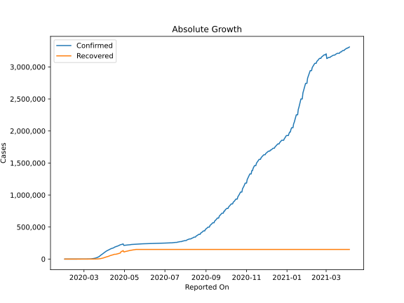
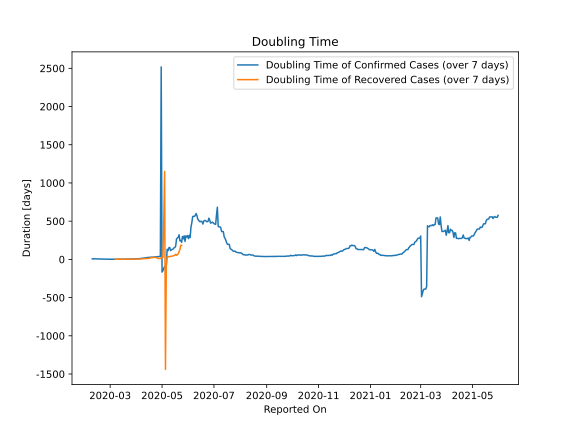

# Country Figures: Doubling Time of Infections for Spain 

The doubling time below are calculated based on
* an exponential growth assumption
* for time difference of past seven (7) days.
The doubling time's unit is "days".

The first doubling time indicates the increase of confirmed (infected)
cases. There, the *higher* the number is, the better is to take control
of the disease.

The second doubling time indicates the increase of recovered (healed)
cases. There, the *lower* the number is, the better it is to take
control of the disease.

| Reported On | Confirmed | Doubling Time (Confirmed) | Recovered | Doubling Time (Recovered) |
|-------------|-----------|---------------------------|-----------|---------------------------|
| 2020-04-06 | 136675 |  11.4 days  | 40437 |  5.9 days  | 
| 2020-04-05 | 131646 |  10.1 days  | 38080 |  5.4 days  | 
| 2020-04-04 | 126168 |  9.3 days  | 34219 |  5.1 days  | 
| 2020-04-03 | 119199 |  8.5 days  | 30513 |  4.4 days  | 
| 2020-04-02 | 112065 |  7.7 days  | 26743 |  4.0 days  | 
| 2020-04-01 | 104118 |  6.9 days  | 22647 |  3.7 days  | 
| 2020-03-31 | 95923 |  5.9 days  | 19259 |  3.3 days  | 
| 2020-03-30 | 87956 |  5.6 days  | 16780 |  3.3 days  | 
| 2020-03-29 | 80110 |  5.0 days  | 14709 |  2.8 days  | 
| 2020-03-28 | 73235 |  4.9 days  | 12285 |  3.1 days  | 
| 2020-03-27 | 65719 |  4.5 days  | 9357 |  3.1 days  | 
| 2020-03-26 | 57786 |  4.5 days  | 7015 |  3.0 days  | 
| 2020-03-25 | 49515 |  4.2 days  | 5367 |  3.4 days  | 
| 2020-03-24 | 39885 |  4.3 days  | 3794 |  4.1 days  | 
| 2020-03-23 | 35136 |  4.2 days  | 3355 |  3.0 days  | 
| 2020-03-22 | 28603 |  4.1 days  | 2125 |  3.8 days  | 
| 2020-03-21 | 25374 |  3.9 days  | 2125 |  3.8 days  | 
| 2020-03-20 | 20410 |  3.9 days  | 1588 |  2.6 days  | 
| 2020-03-19 | 17963 |  2.7 days  | 1107 |  3.0 days  | 
| 2020-03-18 | 13910 |  3.0 days  | 1081 |  3.1 days  | 
| 2020-03-17 | 11748 |  2.8 days  | 1028 |  1.7 days  | 
| 2020-03-16 | 9942 |  2.5 days  | 530 |  2.1 days  | 
| 2020-03-15 | 7798 |  2.3 days  | 517 |  2.0 days  | 
| 2020-03-14 | 6391 |  2.2 days  | 517 |  2.0 days  | 
| 2020-03-13 | 5232 |  2.2 days  | 193 |  1.4 days  | 
| 2020-03-12 | 2277 |  2.6 days  | 183 |  1.4 days  | 
| 2020-03-11 | 2277 |  2.4 days  | 183 |  1.4 days  | 
| 2020-03-10 | 1695 |  2.4 days  | 32 |  2.1 days  | 
| 2020-03-09 | 1073 |  2.5 days  | 32 |  2.1 days  | 
| 2020-03-08 | 673 |  2.7 days  | 30 |  2.1 days  | 
| 2020-03-07 | 500 |  2.3 days  | 30 |  2.1 days  | 
| 2020-03-06 | 400 |  2.2 days  | 2 |  None  | 
| 2020-03-05 | 259 |  2.0 days  | 2 |  None  | 
| 2020-03-04 | 222 |  2.0 days  | 2 |  None  | 
| 2020-03-03 | 165 |  1.8 days  | 2 |  None  | 
| 2020-03-02 | 120 |  1.5 days  | 2 |  None  | 
| 2020-03-01 | 84 |  1.6 days  | 2 |  None  | 
| 2020-02-29 | 45 |  1.9 days  | 2 |  None  | 
| 2020-02-28 | 32 |  2.1 days  | 2 |  None  | 
| 2020-02-27 | 15 |  2.7 days  | 2 |  None  | 
| 2020-02-26 | 13 |  2.9 days  | 2 |  None  | 
| 2020-02-25 | 6 |  3.0 days  | 2 |  None  | 
| 2020-02-14 | 2 |  7.3 days  | 0 |  None  | 
| 2020-02-13 | 2 |  7.3 days  | 0 |  None  | 
| 2020-02-12 | 2 |  7.3 days  | 0 |  None  | 
| 2020-02-11 | 2 |  7.3 days  | 0 |  None  | 
| 2020-02-10 | 2 |  7.3 days  | 0 |  None  | 
| 2020-02-09 | 2 |  7.3 days  | 0 |  None  | 
| 2020-02-08 | 1 |  None  | 0 |  None  | 
| 2020-02-07 | 1 |  None  | 0 |  None  | 
| 2020-02-06 | 1 |  None  | 0 |  None  | 
| 2020-02-05 | 1 |  None  | 0 |  None  | 
| 2020-02-04 | 1 |  None  | 0 |  None  | 
| 2020-02-03 | 1 |  None  | 0 |  None  | 
| 2020-02-02 | 1 |  None  | 0 |  None  | 
| 2020-02-01 | 1 |  None  | 0 |  None  | 

