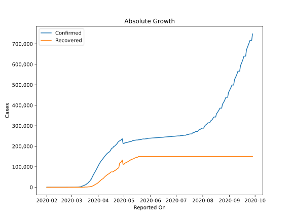
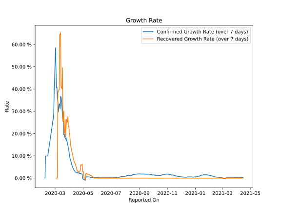

# Country Figures: Growth Rate for Spain 

The growth rates below are calculated based on
* an exponential growth assumption
* for time difference of past seven (7) days.
The growth rate is to be understood as on "growth per day".

The first growth rate indicates the increase of confirmed (infected) cases.

The second growth rate indicates the increase of recovered (healed) cases.

| Reported On | Confirmed | Growth Rate (Confirmed) | Recovered | Growth Rate (Recovered) |
|-------------|-----------|-------------------------|-----------|-------------------------|
| 2020-04-28 | 232128 |  1.83 %  | 123903 |  5.808 %  | 
| 2020-04-27 | 229422 |  1.95 %  | 120832 |  5.787 %  | 
| 2020-04-26 | 226629 |  1.88 %  | 117727 |  5.999 %  | 
| 2020-04-25 | 223759 |  2.21 %  | 95708 |  3.522 %  | 
| 2020-04-24 | 219764 |  2.02 %  | 92355 |  3.012 %  | 
| 2020-04-23 | 213024 |  2.02 %  | 89250 |  2.524 %  | 
| 2020-04-22 | 208389 |  2.28 %  | 85915 |  2.754 %  | 
| 2020-04-21 | 204178 |  2.41 %  | 82514 |  2.868 %  | 
| 2020-04-20 | 200210 |  2.33 %  | 80587 |  3.131 %  | 
| 2020-04-19 | 198674 |  2.50 %  | 77357 |  3.072 %  | 
| 2020-04-18 | 191726 |  2.32 %  | 74797 |  3.363 %  | 
| 2020-04-17 | 190839 |  2.67 %  | 74797 |  4.220 %  | 
| 2020-04-16 | 184948 |  2.69 %  | 74797 |  5.148 %  | 
| 2020-04-15 | 177644 |  2.59 %  | 70853 |  5.557 %  | 
| 2020-04-14 | 172541 |  2.79 %  | 67504 |  6.374 %  | 
| 2020-04-13 | 170099 |  3.13 %  | 64727 |  6.720 %  | 
| 2020-04-12 | 166831 |  3.38 %  | 62391 |  7.053 %  | 
| 2020-04-11 | 163027 |  3.66 %  | 59109 |  7.809 %  | 
| 2020-04-10 | 158273 |  4.05 %  | 55668 |  8.589 %  | 
| 2020-04-09 | 153222 |  4.47 %  | 52165 |  9.545 %  | 
| 2020-04-08 | 148220 |  5.05 %  | 48021 |  10.737 %  | 
| 2020-04-07 | 141942 |  5.60 %  | 43208 |  11.544 %  | 
| 2020-04-06 | 136675 |  6.30 %  | 40437 |  12.565 %  | 
| 2020-04-05 | 131646 |  7.10 %  | 38080 |  13.589 %  | 
| 2020-04-04 | 126168 |  7.77 %  | 34219 |  14.634 %  | 
| 2020-04-03 | 119199 |  8.51 %  | 30513 |  16.886 %  | 
| 2020-04-02 | 112065 |  9.46 %  | 26743 |  19.117 %  | 
| 2020-04-01 | 104118 |  10.62 %  | 22647 |  20.568 %  | 
| 2020-03-31 | 95923 |  12.54 %  | 19259 |  23.208 %  | 
| 2020-03-30 | 87956 |  13.11 %  | 16780 |  22.996 %  | 
| 2020-03-29 | 80110 |  14.71 %  | 14709 |  27.638 %  | 
| 2020-03-28 | 73235 |  15.14 %  | 12285 |  25.066 %  | 
| 2020-03-27 | 65719 |  16.71 %  | 9357 |  25.338 %  | 
| 2020-03-26 | 57786 |  16.69 %  | 7015 |  26.377 %  | 
| 2020-03-25 | 49515 |  18.14 %  | 5367 |  22.891 %  | 
| 2020-03-24 | 39885 |  17.46 %  | 3794 |  18.654 %  | 
| 2020-03-23 | 35136 |  18.04 %  | 3355 |  26.362 %  | 
| 2020-03-22 | 28603 |  18.57 %  | 2125 |  20.193 %  | 
| 2020-03-21 | 25374 |  19.70 %  | 2125 |  20.193 %  | 
| 2020-03-20 | 20410 |  19.45 %  | 1588 |  30.108 %  | 
| 2020-03-19 | 17963 |  29.51 %  | 1107 |  25.713 %  | 
| 2020-03-18 | 13910 |  25.85 %  | 1081 |  25.374 %  | 
| 2020-03-17 | 11748 |  27.66 %  | 1028 |  49.566 %  | 
| 2020-03-16 | 9942 |  31.80 %  | 530 |  40.102 %  | 
| 2020-03-15 | 7798 |  35.00 %  | 517 |  40.669 %  | 
| 2020-03-14 | 6391 |  36.40 %  | 517 |  40.669 %  | 
| 2020-03-13 | 5232 |  36.73 %  | 193 |  65.279 %  | 
| 2020-03-12 | 2277 |  31.05 %  | 183 |  64.519 %  | 
| 2020-03-11 | 2277 |  33.26 %  | 183 |  64.519 %  | 
| 2020-03-10 | 1695 |  33.28 %  | 32 |  39.608 %  | 
| 2020-03-09 | 1073 |  31.30 %  | 32 |  39.608 %  | 
| 2020-03-08 | 673 |  29.73 %  | 30 |  38.686 %  | 
| 2020-03-07 | 500 |  34.40 %  | 30 |  38.686 %  | 
| 2020-03-06 | 400 |  36.08 %  | 2 |  None  | 
| 2020-03-05 | 259 |  40.70 %  | 2 |  None  | 
| 2020-03-04 | 222 |  40.54 %  | 2 |  None  | 
| 2020-03-03 | 165 |  47.35 %  | 2 |  None  | 
| 2020-03-02 | 120 |  58.49 %  | 2 |  None  | 
| 2020-03-01 | 84 |  53.40 %  | 2 |  None  | 
| 2020-02-29 | 45 |  44.48 %  | 2 |  None  | 
| 2020-02-28 | 32 |  39.61 %  | 2 |  None  | 
| 2020-02-27 | 15 |  28.78 %  | 2 |  None  | 
| 2020-02-26 | 13 |  26.74 %  | 2 |  None  | 
| 2020-02-25 | 6 |  25.60 %  | 2 |  None  | 
| 2020-02-14 | 2 |  9.90 %  | 0 |  None  | 
| 2020-02-13 | 2 |  9.90 %  | 0 |  None  | 
| 2020-02-12 | 2 |  9.90 %  | 0 |  None  | 
| 2020-02-11 | 2 |  9.90 %  | 0 |  None  | 
| 2020-02-10 | 2 |  9.90 %  | 0 |  None  | 
| 2020-02-09 | 2 |  9.90 %  | 0 |  None  | 
| 2020-02-08 | 1 |  None  | 0 |  None  | 
| 2020-02-07 | 1 |  None  | 0 |  None  | 
| 2020-02-06 | 1 |  None  | 0 |  None  | 
| 2020-02-05 | 1 |  None  | 0 |  None  | 
| 2020-02-04 | 1 |  None  | 0 |  None  | 
| 2020-02-03 | 1 |  None  | 0 |  None  | 
| 2020-02-02 | 1 |  None  | 0 |  None  | 
| 2020-02-01 | 1 |  None  | 0 |  None  | 

