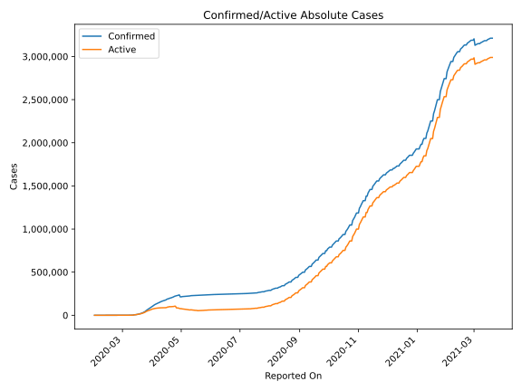
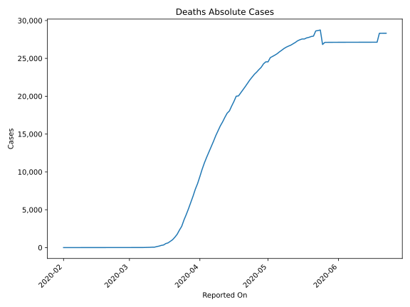
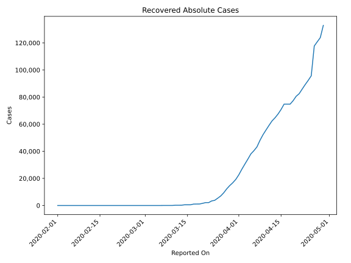
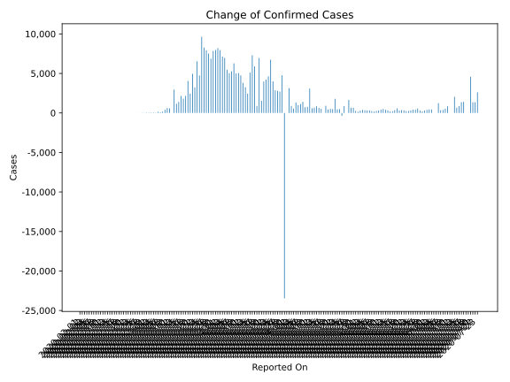
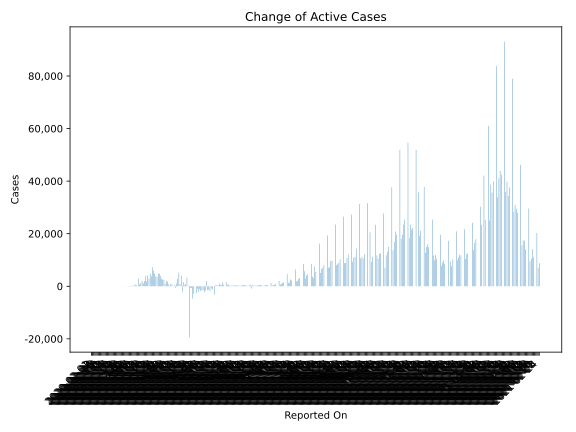
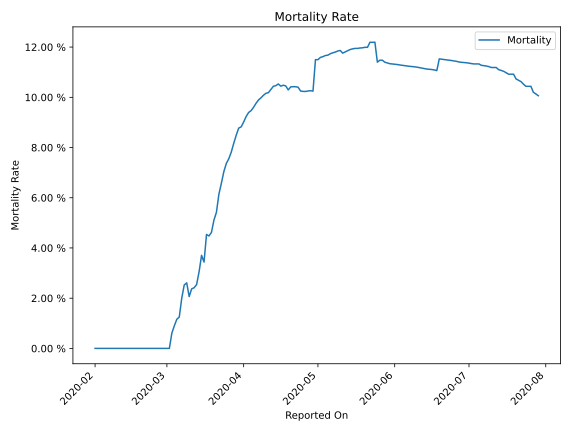

# Country Figures: Time Series for Spain 

| Reported On | Confirmed | Deaths | Recovered | Active | Mortality | &Delta; Confirmed | &Delta; Deaths | &Delta; Recovered | &Delta; Active | % Active of Population |
|-------------|-----------|--------|-----------|--------|-----------|-------------------|----------------|-------------------|----------------|------------------------|
| 2020-05-01 | 213435 | 24543 | 112050 | 76842 |  11.50 %  | 0 | 0 | 0 | 0 |  0.164 %  | 
| 2020-04-30 | 213435 | 24543 | 112050 | 76842 |  11.50 %  | -23464 | 268 | -20879 | -2853 |  0.164 %  | 
| 2020-04-29 | 236899 | 24275 | 132929 | 79695 |  10.25 %  | 4771 | 453 | 9026 | -4708 |  0.171 %  | 
| 2020-04-28 | 232128 | 23822 | 123903 | 84403 |  10.26 %  | 2706 | 301 | 3071 | -666 |  0.181 %  | 
| 2020-04-27 | 229422 | 23521 | 120832 | 85069 |  10.25 %  | 2793 | 331 | 3105 | -643 |  0.182 %  | 
| 2020-04-26 | 226629 | 23190 | 117727 | 85712 |  10.23 %  | 2870 | 288 | 22019 | -19437 |  0.183 %  | 
| 2020-04-25 | 223759 | 22902 | 95708 | 105149 |  10.24 %  | 3995 | 378 | 3353 | 264 |  0.225 %  | 
| 2020-04-24 | 219764 | 22524 | 92355 | 104885 |  10.25 %  | 6740 | 367 | 3105 | 3268 |  0.224 %  | 
| 2020-04-23 | 213024 | 22157 | 89250 | 101617 |  10.40 %  | 4635 | 440 | 3335 | 860 |  0.217 %  | 
| 2020-04-22 | 208389 | 21717 | 85915 | 100757 |  10.42 %  | 4211 | 435 | 3401 | 375 |  0.216 %  | 
| 2020-04-21 | 204178 | 21282 | 82514 | 100382 |  10.42 %  | 3968 | 430 | 1927 | 1611 |  0.215 %  | 
| 2020-04-20 | 200210 | 20852 | 80587 | 98771 |  10.42 %  | 1536 | 399 | 3230 | -2093 |  0.211 %  | 
| 2020-04-19 | 198674 | 20453 | 77357 | 100864 |  10.29 %  | 6948 | 410 | 2560 | 3978 |  0.216 %  | 
| 2020-04-18 | 191726 | 20043 | 74797 | 96886 |  10.45 %  | 887 | 41 | 0 | 846 |  0.207 %  | 
| 2020-04-17 | 190839 | 20002 | 74797 | 96040 |  10.48 %  | 5891 | 687 | 0 | 5204 |  0.206 %  | 
| 2020-04-16 | 184948 | 19315 | 74797 | 90836 |  10.44 %  | 7304 | 607 | 3944 | 2753 |  0.194 %  | 
| 2020-04-15 | 177644 | 18708 | 70853 | 88083 |  10.53 %  | 5103 | 652 | 3349 | 1102 |  0.189 %  | 
| 2020-04-14 | 172541 | 18056 | 67504 | 86981 |  10.46 %  | 2442 | 300 | 2777 | -635 |  0.186 %  | 
| 2020-04-13 | 170099 | 17756 | 64727 | 87616 |  10.44 %  | 3268 | 547 | 2336 | 385 |  0.188 %  | 
| 2020-04-12 | 166831 | 17209 | 62391 | 87231 |  10.32 %  | 3804 | 603 | 3282 | -81 |  0.187 %  | 
| 2020-04-11 | 163027 | 16606 | 59109 | 87312 |  10.19 %  | 4754 | 525 | 3441 | 788 |  0.187 %  | 
| 2020-04-10 | 158273 | 16081 | 55668 | 86524 |  10.16 %  | 5051 | 634 | 3503 | 914 |  0.185 %  | 
| 2020-04-09 | 153222 | 15447 | 52165 | 85610 |  10.08 %  | 5002 | 655 | 4144 | 203 |  0.183 %  | 
| 2020-04-08 | 148220 | 14792 | 48021 | 85407 |  9.98 %  | 6278 | 747 | 4813 | 718 |  0.183 %  | 
| 2020-04-07 | 141942 | 14045 | 43208 | 84689 |  9.89 %  | 5267 | 704 | 2771 | 1792 |  0.181 %  | 
| 2020-04-06 | 136675 | 13341 | 40437 | 82897 |  9.76 %  | 5029 | 700 | 2357 | 1972 |  0.177 %  | 
| 2020-04-05 | 131646 | 12641 | 38080 | 80925 |  9.60 %  | 5478 | 694 | 3861 | 923 |  0.173 %  | 
| 2020-04-04 | 126168 | 11947 | 34219 | 80002 |  9.47 %  | 6969 | 749 | 3706 | 2514 |  0.171 %  | 
| 2020-04-03 | 119199 | 11198 | 30513 | 77488 |  9.39 %  | 7134 | 850 | 3770 | 2514 |  0.166 %  | 
| 2020-04-02 | 112065 | 10348 | 26743 | 74974 |  9.23 %  | 7947 | 961 | 4096 | 2890 |  0.160 %  | 
| 2020-04-01 | 104118 | 9387 | 22647 | 72084 |  9.02 %  | 8195 | 923 | 3388 | 3884 |  0.154 %  | 
| 2020-03-31 | 95923 | 8464 | 19259 | 68200 |  8.82 %  | 7967 | 748 | 2479 | 4740 |  0.146 %  | 
| 2020-03-30 | 87956 | 7716 | 16780 | 63460 |  8.77 %  | 7846 | 913 | 2071 | 4862 |  0.136 %  | 
| 2020-03-29 | 80110 | 6803 | 14709 | 58598 |  8.49 %  | 6875 | 821 | 2424 | 3630 |  0.125 %  | 
| 2020-03-28 | 73235 | 5982 | 12285 | 54968 |  8.17 %  | 7516 | 844 | 2928 | 3744 |  0.118 %  | 
| 2020-03-27 | 65719 | 5138 | 9357 | 51224 |  7.82 %  | 7933 | 773 | 2342 | 4818 |  0.110 %  | 
| 2020-03-26 | 57786 | 4365 | 7015 | 46406 |  7.55 %  | 8271 | 718 | 1648 | 5905 |  0.099 %  | 
| 2020-03-25 | 49515 | 3647 | 5367 | 40501 |  7.37 %  | 9630 | 839 | 1573 | 7218 |  0.087 %  | 
| 2020-03-24 | 39885 | 2808 | 3794 | 33283 |  7.04 %  | 4749 | 497 | 439 | 3813 |  0.071 %  | 
| 2020-03-23 | 35136 | 2311 | 3355 | 29470 |  6.58 %  | 6533 | 555 | 1230 | 4748 |  0.063 %  | 
| 2020-03-22 | 28603 | 1756 | 2125 | 24722 |  6.14 %  | 3229 | 381 | 0 | 2848 |  0.053 %  | 
| 2020-03-21 | 25374 | 1375 | 2125 | 21874 |  5.42 %  | 4964 | 332 | 537 | 4095 |  0.047 %  | 
| 2020-03-20 | 20410 | 1043 | 1588 | 17779 |  5.11 %  | 2447 | 213 | 481 | 1753 |  0.038 %  | 
| 2020-03-19 | 17963 | 830 | 1107 | 16026 |  4.62 %  | 4053 | 207 | 26 | 3820 |  0.034 %  | 
| 2020-03-18 | 13910 | 623 | 1081 | 12206 |  4.48 %  | 2162 | 90 | 53 | 2019 |  0.026 %  | 
| 2020-03-17 | 11748 | 533 | 1028 | 10187 |  4.54 %  | 1806 | 191 | 498 | 1117 |  0.022 %  | 
| 2020-03-16 | 9942 | 342 | 530 | 9070 |  3.44 %  | 2144 | 53 | 13 | 2078 |  0.019 %  | 
| 2020-03-15 | 7798 | 289 | 517 | 6992 |  3.71 %  | 1407 | 94 | 0 | 1313 |  0.015 %  | 
| 2020-03-14 | 6391 | 195 | 517 | 5679 |  3.05 %  | 1159 | 62 | 324 | 773 |  0.012 %  | 
| 2020-03-13 | 5232 | 133 | 193 | 4906 |  2.54 %  | 2955 | 78 | 10 | 2867 |  0.011 %  | 
| 2020-03-12 | 2277 | 55 | 183 | 2039 |  2.42 %  | 0 | 1 | 0 | -1 |  0.004 %  | 
| 2020-03-11 | 2277 | 54 | 183 | 2040 |  2.37 %  | 582 | 19 | 151 | 412 |  0.004 %  | 
| 2020-03-10 | 1695 | 35 | 32 | 1628 |  2.06 %  | 622 | 7 | 0 | 615 |  0.003 %  | 
| 2020-03-09 | 1073 | 28 | 32 | 1013 |  2.61 %  | 400 | 11 | 2 | 387 |  0.002 %  | 
| 2020-03-08 | 673 | 17 | 30 | 626 |  2.53 %  | 173 | 7 | 0 | 166 |  0.001 %  | 
| 2020-03-07 | 500 | 10 | 30 | 460 |  2.00 %  | 100 | 5 | 28 | 67 |  0.001 %  | 
| 2020-03-06 | 400 | 5 | 2 | 393 |  1.25 %  | 141 | 2 | 0 | 139 |  0.001 %  | 
| 2020-03-05 | 259 | 3 | 2 | 254 |  1.16 %  | 37 | 1 | 0 | 36 |  0.001 %  | 
| 2020-03-04 | 222 | 2 | 2 | 218 |  0.90 %  | 57 | 1 | 0 | 56 |  0.000 %  | 
| 2020-03-03 | 165 | 1 | 2 | 162 |  0.61 %  | 45 | 1 | 0 | 44 |  0.000 %  | 
| 2020-03-02 | 120 | 0 | 2 | 118 |  None  | 36 | 0 | 0 | 36 |  0.000 %  | 
| 2020-03-01 | 84 | 0 | 2 | 82 |  None  | 39 | 0 | 0 | 39 |  0.000 %  | 
| 2020-02-29 | 45 | 0 | 2 | 43 |  None  | 13 | 0 | 0 | 13 |  0.000 %  | 
| 2020-02-28 | 32 | 0 | 2 | 30 |  None  | 17 | 0 | 0 | 17 |  0.000 %  | 
| 2020-02-27 | 15 | 0 | 2 | 13 |  None  | 2 | 0 | 0 | 2 |  0.000 %  | 
| 2020-02-26 | 13 | 0 | 2 | 11 |  None  | 7 | 0 | 0 | 7 |  0.000 %  | 
| 2020-02-25 | 6 | 0 | 2 | 4 |  None  | 4 | 0 | 0 | 4 |  0.000 %  | 
| 2020-02-24 | 2 | 0 | 2 | 0 |  None  | 0 | 0 | 0 | 0 |  n/a  | 
| 2020-02-23 | 2 | 0 | 2 | 0 |  None  | 0 | 0 | 0 | 0 |  n/a  | 
| 2020-02-22 | 2 | 0 | 2 | 0 |  None  | 0 | 0 | 0 | 0 |  n/a  | 
| 2020-02-21 | 2 | 0 | 2 | 0 |  None  | 0 | 0 | 0 | 0 |  n/a  | 
| 2020-02-20 | 2 | 0 | 2 | 0 |  None  | 0 | 0 | 0 | 0 |  n/a  | 
| 2020-02-19 | 2 | 0 | 2 | 0 |  None  | 0 | 0 | 0 | 0 |  n/a  | 
| 2020-02-18 | 2 | 0 | 2 | 0 |  None  | 0 | 0 | 0 | 0 |  n/a  | 
| 2020-02-17 | 2 | 0 | 2 | 0 |  None  | 0 | 0 | 0 | 0 |  n/a  | 
| 2020-02-16 | 2 | 0 | 2 | 0 |  None  | 0 | 0 | 0 | 0 |  n/a  | 
| 2020-02-15 | 2 | 0 | 2 | 0 |  None  | 0 | 0 | 2 | -2 |  n/a  | 
| 2020-02-14 | 2 | 0 | 0 | 2 |  None  | 0 | 0 | 0 | 0 |  0.000 %  | 
| 2020-02-13 | 2 | 0 | 0 | 2 |  None  | 0 | 0 | 0 | 0 |  0.000 %  | 
| 2020-02-12 | 2 | 0 | 0 | 2 |  None  | 0 | 0 | 0 | 0 |  0.000 %  | 
| 2020-02-11 | 2 | 0 | 0 | 2 |  None  | 0 | 0 | 0 | 0 |  0.000 %  | 
| 2020-02-10 | 2 | 0 | 0 | 2 |  None  | 0 | 0 | 0 | 0 |  0.000 %  | 
| 2020-02-09 | 2 | 0 | 0 | 2 |  None  | 1 | 0 | 0 | 1 |  0.000 %  | 
| 2020-02-08 | 1 | 0 | 0 | 1 |  None  | 0 | 0 | 0 | 0 |  0.000 %  | 
| 2020-02-07 | 1 | 0 | 0 | 1 |  None  | 0 | 0 | 0 | 0 |  0.000 %  | 
| 2020-02-06 | 1 | 0 | 0 | 1 |  None  | 0 | 0 | 0 | 0 |  0.000 %  | 
| 2020-02-05 | 1 | 0 | 0 | 1 |  None  | 0 | 0 | 0 | 0 |  0.000 %  | 
| 2020-02-04 | 1 | 0 | 0 | 1 |  None  | 0 | 0 | 0 | 0 |  0.000 %  | 
| 2020-02-03 | 1 | 0 | 0 | 1 |  None  | 0 | 0 | 0 | 0 |  0.000 %  | 
| 2020-02-02 | 1 | 0 | 0 | 1 |  None  | 0 | 0 | 0 | 0 |  0.000 %  | 
| 2020-02-01 | 1 | 0 | 0 | 1 |  None  | None | None | None | None |  0.000 %  | 

