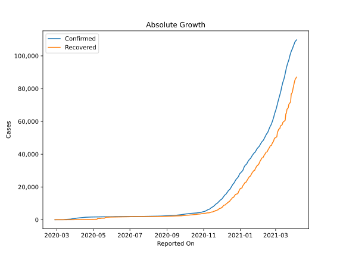
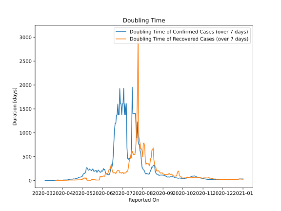

# Country Figures: Doubling Time of Infections for Estonia 

The doubling time below are calculated based on
* an exponential growth assumption
* for time difference of past seven (7) days.
The doubling time's unit is "days".

The first doubling time indicates the increase of confirmed (infected)
cases. There, the *higher* the number is, the better is to take control
of the disease.

The second doubling time indicates the increase of recovered (healed)
cases. There, the *lower* the number is, the better it is to take
control of the disease.

| Reported On | Confirmed | Doubling Time (Confirmed) | Recovered | Doubling Time (Recovered) |
|-------------|-----------|---------------------------|-----------|---------------------------|
| 2020-04-18 | 1512 |  33.1 days  | 162 |  9.1 days  | 
| 2020-04-17 | 1459 |  33.1 days  | 145 |  11.3 days  | 
| 2020-04-16 | 1434 |  28.5 days  | 133 |  10.6 days  | 
| 2020-04-15 | 1400 |  29.4 days  | 117 |  10.3 days  | 
| 2020-04-14 | 1373 |  27.6 days  | 115 |  9.8 days  | 
| 2020-04-13 | 1332 |  26.7 days  | 102 |  10.1 days  | 
| 2020-04-12 | 1309 |  27.8 days  | 98 |  10.9 days  | 
| 2020-04-11 | 1304 |  21.7 days  | 93 |  11.0 days  | 
| 2020-04-10 | 1258 |  18.4 days  | 93 |  7.7 days  | 
| 2020-04-09 | 1207 |  14.6 days  | 83 |  8.3 days  | 
| 2020-04-08 | 1185 |  11.9 days  | 72 |  6.6 days  | 
| 2020-04-07 | 1149 |  11.5 days  | 69 |  5.3 days  | 
| 2020-04-06 | 1108 |  11.4 days  | 62 |  4.6 days  | 
| 2020-04-05 | 1097 |  10.5 days  | 62 |  4.6 days  | 
| 2020-04-04 | 1039 |  10.5 days  | 59 |  4.8 days  | 
| 2020-04-03 | 961 |  9.8 days  | 48 |  3.6 days  | 
| 2020-04-02 | 858 |  10.7 days  | 45 |  3.1 days  | 
| 2020-04-01 | 779 |  7.7 days  | 33 |  3.8 days  | 
| 2020-03-31 | 745 |  7.2 days  | 26 |  4.0 days  | 
| 2020-03-30 | 715 |  7.2 days  | 20 |  3.3 days  | 
| 2020-03-29 | 679 |  7.0 days  | 20 |  3.3 days  | 
| 2020-03-28 | 645 |  6.8 days  | 20 |  1.9 days  | 
| 2020-03-27 | 575 |  7.2 days  | 11 |  2.4 days  | 
| 2020-03-26 | 538 |  7.3 days  | 8 |  2.7 days  | 
| 2020-03-25 | 404 |  11.2 days  | 8 |  2.7 days  | 
| 2020-03-24 | 369 |  10.2 days  | 7 |  2.8 days  | 
| 2020-03-23 | 352 |  9.3 days  | 4 |  3.8 days  | 
| 2020-03-22 | 326 |  7.9 days  | 4 |  3.8 days  | 
| 2020-03-21 | 306 |  5.3 days  | 1 |  None  | 
| 2020-03-20 | 283 |  4.1 days  | 1 |  None  | 
| 2020-03-19 | 267 |  2.1 days  | 1 |  None  | 
| 2020-03-18 | 258 |  2.1 days  | 1 |  None  | 
| 2020-03-17 | 225 |  2.0 days  | 1 |  None  | 
| 2020-03-16 | 205 |  1.9 days  | 1 |  None  | 
| 2020-03-15 | 171 |  2.0 days  | 1 |  None  | 
| 2020-03-14 | 115 |  2.3 days  | 0 |  None  | 
| 2020-03-13 | 79 |  2.7 days  | 0 |  None  | 
| 2020-03-12 | 16 |  3.2 days  | 0 |  None  | 
| 2020-03-11 | 16 |  2.7 days  | 0 |  None  | 
| 2020-03-10 | 12 |  3.0 days  | 0 |  None  | 
| 2020-03-09 | 10 |  2.4 days  | 0 |  None  | 
| 2020-03-08 | 10 |  2.4 days  | 0 |  None  | 
| 2020-03-07 | 10 |  2.4 days  | 0 |  None  | 
| 2020-03-06 | 10 |  2.4 days  | 0 |  None  | 
| 2020-03-05 | 3 |  4.8 days  | 0 |  None  | 
| 2020-03-04 | 2 |  None  | 0 |  None  | 
| 2020-03-03 | 2 |  None  | 0 |  None  | 
| 2020-03-02 | 1 |  None  | 0 |  None  | 
| 2020-03-01 | 1 |  None  | 0 |  None  | 
| 2020-02-29 | 1 |  None  | 0 |  None  | 
| 2020-02-28 | 1 |  None  | 0 |  None  | 
| 2020-02-27 | 1 |  None  | 0 |  None  | 

