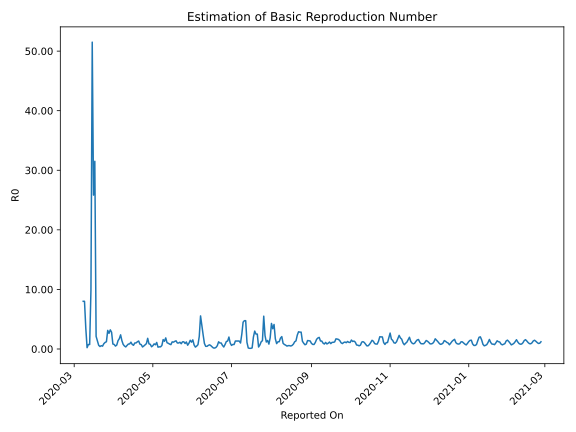

# Country Figures: Time Series for Basic Reproduction Number of Estonia 

| Reported On | &Delta; Confirmed | Total &Delta; Confirmed First Interval | Total &Delta; Confirmed Second Interval | Estimated Basic Reproduction Number R0 | 
|-------------|-------------------|----------------------------------------|-----------------------------------------|---------------------------------------------------|
| 2020-05-06 | 2 |  17  |  47  |  0.36  | 
| 2020-05-05 | 8 |  14  |  46  |  0.30  | 
| 2020-05-04 | 3 |  34  |  31  |  1.10  | 
| 2020-05-03 | 1 |  39  |  55  |  0.71  | 
| 2020-05-02 | 5 |  47  |  55  |  0.85  | 
| 2020-05-01 | 5 |  46  |  84  |  0.55  | 
| 2020-04-30 | 23 |  31  |  83  |  0.37  | 
| 2020-04-29 | 6 |  55  |  70  |  0.79  | 
| 2020-04-28 | 13 |  55  |  64  |  0.86  | 
| 2020-04-27 | 4 |  84  |  47  |  1.79  | 
| 2020-04-26 | 8 |  83  |  93  |  0.89  | 
| 2020-04-25 | 30 |  70  |  101  |  0.69  | 
| 2020-04-24 | 13 |  64  |  128  |  0.50  | 
| 2020-04-23 | 33 |  47  |  139  |  0.34  | 
| 2020-04-22 | 7 |  93  |  127  |  0.73  | 
| 2020-04-21 | 17 |  101  |  125  |  0.81  | 
| 2020-04-20 | 7 |  128  |  96  |  1.33  | 
| 2020-04-19 | 16 |  139  |  115  |  1.21  | 
| 2020-04-18 | 53 |  127  |  125  |  1.02  | 
| 2020-04-17 | 25 |  125  |  124  |  1.01  | 
| 2020-04-16 | 34 |  96  |  155  |  0.62  | 
| 2020-04-15 | 27 |  115  |  150  |  0.77  | 
| 2020-04-14 | 41 |  125  |  110  |  1.14  | 
| 2020-04-13 | 23 |  124  |  146  |  0.85  | 
| 2020-04-12 | 5 |  155  |  188  |  0.82  | 
| 2020-04-11 | 46 |  150  |  250  |  0.60  | 
| 2020-04-10 | 51 |  110  |  318  |  0.35  | 
| 2020-04-09 | 22 |  146  |  294  |  0.50  | 
| 2020-04-08 | 36 |  188  |  246  |  0.76  | 
| 2020-04-07 | 41 |  250  |  179  |  1.40  | 
| 2020-04-06 | 11 |  318  |  134  |  2.37  | 
| 2020-04-05 | 58 |  294  |  170  |  1.73  | 
| 2020-04-04 | 78 |  246  |  177  |  1.39  | 
| 2020-04-03 | 103 |  179  |  275  |  0.65  | 
| 2020-04-02 | 79 |  134  |  276  |  0.49  | 
| 2020-04-01 | 34 |  170  |  223  |  0.76  | 
| 2020-03-31 | 30 |  177  |  212  |  0.83  | 
| 2020-03-30 | 36 |  275  |  98  |  2.81  | 
| 2020-03-29 | 34 |  276  |  86  |  3.21  | 
| 2020-03-28 | 70 |  223  |  85  |  2.62  | 
| 2020-03-27 | 37 |  212  |  68  |  3.12  | 
| 2020-03-26 | 134 |  98  |  81  |  1.21  | 
| 2020-03-25 | 35 |  86  |  78  |  1.10  | 
| 2020-03-24 | 17 |  85  |  96  |  0.89  | 
| 2020-03-23 | 26 |  68  |  143  |  0.48  | 
| 2020-03-22 | 20 |  81  |  146  |  0.55  | 
| 2020-03-21 | 23 |  78  |  189  |  0.41  | 
| 2020-03-20 | 16 |  96  |  155  |  0.62  | 
| 2020-03-19 | 9 |  143  |  103  |  1.39  | 
| 2020-03-18 | 33 |  146  |  69  |  2.12  | 
| 2020-03-17 | 20 |  189  |  6  |  31.50  | 
| 2020-03-16 | 34 |  155  |  6  |  25.83  | 
| 2020-03-15 | 56 |  103  |  2  |  51.50  | 
| 2020-03-14 | 36 |  69  |  7  |  9.86  | 
| 2020-03-13 | 63 |  6  |  8  |  0.75  | 
| 2020-03-12 | 0 |  6  |  8  |  0.75  | 
| 2020-03-11 | 4 |  2  |  9  |  0.22  | 
| 2020-03-10 | 2 |  7  |  2  |  3.50  | 
| 2020-03-09 | 0 |  8  |  1  |  8.00  | 
| 2020-03-08 | 0 |  8  |  1  |  8.00  | 
| 2020-03-07 | 0 |  9  |  None  |  None  | 
| 2020-03-06 | 7 |  2  |  None  |  None  | 
| 2020-03-05 | 1 |  1  |  None  |  None  | 
| 2020-03-04 | 0 |  1  |  None  |  None  | 
| 2020-03-03 | 1 |  None  |  None  |  None  | 
| 2020-03-02 | 0 |  None  |  None  |  None  | 
| 2020-03-01 | 0 |  None  |  None  |  None  | 
| 2020-02-29 | 0 |  None  |  None  |  None  | 
| 2020-02-28 | 0 |  None  |  None  |  None  | 
| 2020-02-27 | None |  None  |  None  |  None  | 

