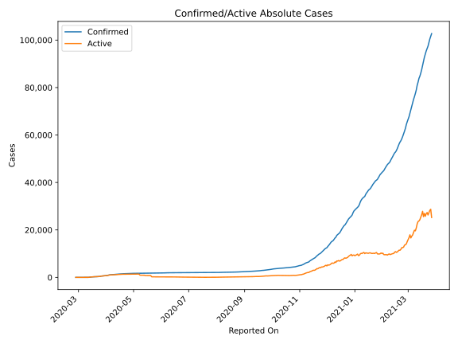
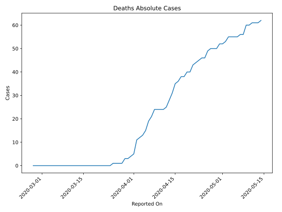
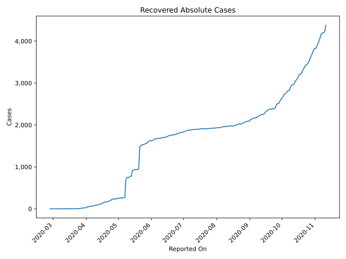
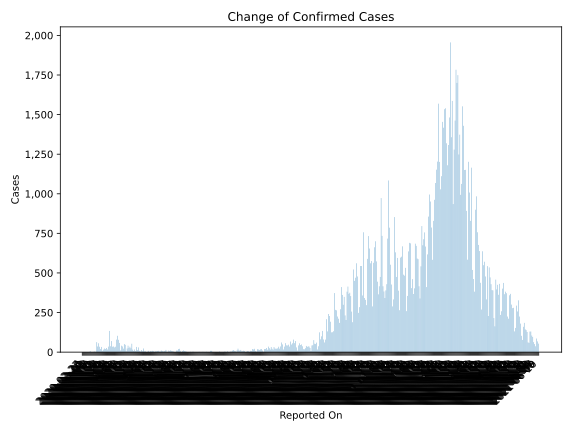
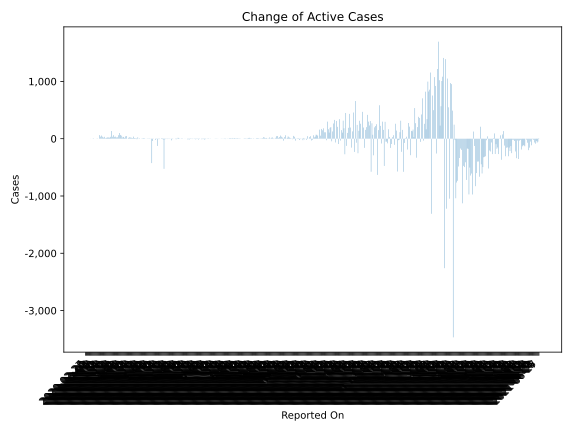
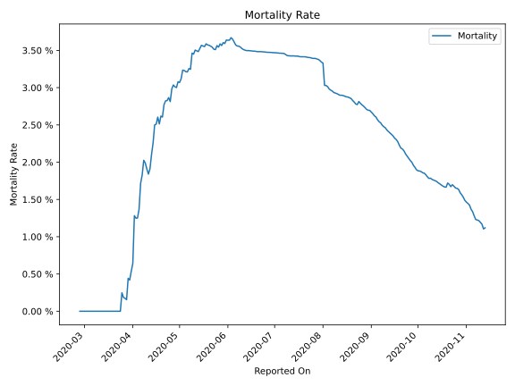

# Country Figures: Time Series for Estonia 

| Reported On | Confirmed | Deaths | Recovered | Active | Mortality | &Delta; Confirmed | &Delta; Deaths | &Delta; Recovered | &Delta; Active | % Active of Population |
|-------------|-----------|--------|-----------|--------|-----------|-------------------|----------------|-------------------|----------------|------------------------|
| 2020-05-08 | 1725 | 56 | 704 | 965 |  3.25 %  | 5 | 0 | 431 | -426 |  0.073 %  | 
| 2020-05-07 | 1720 | 56 | 273 | 1391 |  3.26 %  | 7 | 1 | 9 | -3 |  0.105 %  | 
| 2020-05-06 | 1713 | 55 | 264 | 1394 |  3.21 %  | 2 | 0 | 3 | -1 |  0.106 %  | 
| 2020-05-05 | 1711 | 55 | 261 | 1395 |  3.21 %  | 8 | 0 | 2 | 6 |  0.106 %  | 
| 2020-05-04 | 1703 | 55 | 259 | 1389 |  3.23 %  | 3 | 0 | 0 | 3 |  0.105 %  | 
| 2020-05-03 | 1700 | 55 | 259 | 1386 |  3.24 %  | 1 | 2 | 3 | -4 |  0.105 %  | 
| 2020-05-02 | 1699 | 53 | 256 | 1390 |  3.12 %  | 5 | 1 | 3 | 1 |  0.105 %  | 
| 2020-05-01 | 1694 | 52 | 253 | 1389 |  3.07 %  | 5 | 0 | 4 | 1 |  0.105 %  | 
| 2020-04-30 | 1689 | 52 | 249 | 1388 |  3.08 %  | 23 | 2 | 13 | 8 |  0.105 %  | 
| 2020-04-29 | 1666 | 50 | 236 | 1380 |  3.00 %  | 6 | 0 | -4 | 10 |  0.104 %  | 
| 2020-04-28 | 1660 | 50 | 240 | 1370 |  3.01 %  | 13 | 0 | 7 | 6 |  0.104 %  | 
| 2020-04-27 | 1647 | 50 | 233 | 1364 |  3.04 %  | 4 | 1 | 0 | 3 |  0.103 %  | 
| 2020-04-26 | 1643 | 49 | 233 | 1361 |  2.98 %  | 8 | 3 | 5 | 0 |  0.103 %  | 
| 2020-04-25 | 1635 | 46 | 228 | 1361 |  2.81 %  | 30 | 0 | 22 | 8 |  0.103 %  | 
| 2020-04-24 | 1605 | 46 | 206 | 1353 |  2.87 %  | 13 | 1 | 14 | -2 |  0.102 %  | 
| 2020-04-23 | 1592 | 45 | 192 | 1355 |  2.83 %  | 33 | 1 | 8 | 24 |  0.103 %  | 
| 2020-04-22 | 1559 | 44 | 184 | 1331 |  2.82 %  | 7 | 1 | 15 | -9 |  0.101 %  | 
| 2020-04-21 | 1552 | 43 | 169 | 1340 |  2.77 %  | 17 | 3 | 4 | 10 |  0.101 %  | 
| 2020-04-20 | 1535 | 40 | 165 | 1330 |  2.61 %  | 7 | 0 | 1 | 6 |  0.101 %  | 
| 2020-04-19 | 1528 | 40 | 164 | 1324 |  2.62 %  | 16 | 2 | 2 | 12 |  0.100 %  | 
| 2020-04-18 | 1512 | 38 | 162 | 1312 |  2.51 %  | 53 | 0 | 17 | 36 |  0.099 %  | 
| 2020-04-17 | 1459 | 38 | 145 | 1276 |  2.60 %  | 25 | 2 | 12 | 11 |  0.097 %  | 
| 2020-04-16 | 1434 | 36 | 133 | 1265 |  2.51 %  | 34 | 1 | 16 | 17 |  0.096 %  | 
| 2020-04-15 | 1400 | 35 | 117 | 1248 |  2.50 %  | 27 | 4 | 2 | 21 |  0.094 %  | 
| 2020-04-14 | 1373 | 31 | 115 | 1227 |  2.26 %  | 41 | 3 | 13 | 25 |  0.093 %  | 
| 2020-04-13 | 1332 | 28 | 102 | 1202 |  2.10 %  | 23 | 3 | 4 | 16 |  0.091 %  | 
| 2020-04-12 | 1309 | 25 | 98 | 1186 |  1.91 %  | 5 | 1 | 5 | -1 |  0.090 %  | 
| 2020-04-11 | 1304 | 24 | 93 | 1187 |  1.84 %  | 46 | 0 | 0 | 46 |  0.090 %  | 
| 2020-04-10 | 1258 | 24 | 93 | 1141 |  1.91 %  | 51 | 0 | 10 | 41 |  0.086 %  | 
| 2020-04-09 | 1207 | 24 | 83 | 1100 |  1.99 %  | 22 | 0 | 11 | 11 |  0.083 %  | 
| 2020-04-08 | 1185 | 24 | 72 | 1089 |  2.03 %  | 36 | 3 | 3 | 30 |  0.082 %  | 
| 2020-04-07 | 1149 | 21 | 69 | 1059 |  1.83 %  | 41 | 2 | 7 | 32 |  0.080 %  | 
| 2020-04-06 | 1108 | 19 | 62 | 1027 |  1.71 %  | 11 | 4 | 0 | 7 |  0.078 %  | 
| 2020-04-05 | 1097 | 15 | 62 | 1020 |  1.37 %  | 58 | 2 | 3 | 53 |  0.077 %  | 
| 2020-04-04 | 1039 | 13 | 59 | 967 |  1.25 %  | 78 | 1 | 11 | 66 |  0.073 %  | 
| 2020-04-03 | 961 | 12 | 48 | 901 |  1.25 %  | 103 | 1 | 3 | 99 |  0.068 %  | 
| 2020-04-02 | 858 | 11 | 45 | 802 |  1.28 %  | 79 | 6 | 12 | 61 |  0.061 %  | 
| 2020-04-01 | 779 | 5 | 33 | 741 |  0.64 %  | 34 | 1 | 7 | 26 |  0.056 %  | 
| 2020-03-31 | 745 | 4 | 26 | 715 |  0.54 %  | 30 | 1 | 6 | 23 |  0.054 %  | 
| 2020-03-30 | 715 | 3 | 20 | 692 |  0.42 %  | 36 | 0 | 0 | 36 |  0.052 %  | 
| 2020-03-29 | 679 | 3 | 20 | 656 |  0.44 %  | 34 | 2 | 0 | 32 |  0.050 %  | 
| 2020-03-28 | 645 | 1 | 20 | 624 |  0.16 %  | 70 | 0 | 9 | 61 |  0.047 %  | 
| 2020-03-27 | 575 | 1 | 11 | 563 |  0.17 %  | 37 | 0 | 3 | 34 |  0.043 %  | 
| 2020-03-26 | 538 | 1 | 8 | 529 |  0.19 %  | 134 | 0 | 0 | 134 |  0.040 %  | 
| 2020-03-25 | 404 | 1 | 8 | 395 |  0.25 %  | 35 | 1 | 1 | 33 |  0.030 %  | 
| 2020-03-24 | 369 | 0 | 7 | 362 |  None  | 17 | 0 | 3 | 14 |  0.027 %  | 
| 2020-03-23 | 352 | 0 | 4 | 348 |  None  | 26 | 0 | 0 | 26 |  0.026 %  | 
| 2020-03-22 | 326 | 0 | 4 | 322 |  None  | 20 | 0 | 3 | 17 |  0.024 %  | 
| 2020-03-21 | 306 | 0 | 1 | 305 |  None  | 23 | 0 | 0 | 23 |  0.023 %  | 
| 2020-03-20 | 283 | 0 | 1 | 282 |  None  | 16 | 0 | 0 | 16 |  0.021 %  | 
| 2020-03-19 | 267 | 0 | 1 | 266 |  None  | 9 | 0 | 0 | 9 |  0.020 %  | 
| 2020-03-18 | 258 | 0 | 1 | 257 |  None  | 33 | 0 | 0 | 33 |  0.019 %  | 
| 2020-03-17 | 225 | 0 | 1 | 224 |  None  | 20 | 0 | 0 | 20 |  0.017 %  | 
| 2020-03-16 | 205 | 0 | 1 | 204 |  None  | 34 | 0 | 0 | 34 |  0.015 %  | 
| 2020-03-15 | 171 | 0 | 1 | 170 |  None  | 56 | 0 | 1 | 55 |  0.013 %  | 
| 2020-03-14 | 115 | 0 | 0 | 115 |  None  | 36 | 0 | 0 | 36 |  0.009 %  | 
| 2020-03-13 | 79 | 0 | 0 | 79 |  None  | 63 | 0 | 0 | 63 |  0.006 %  | 
| 2020-03-12 | 16 | 0 | 0 | 16 |  None  | 0 | 0 | 0 | 0 |  0.001 %  | 
| 2020-03-11 | 16 | 0 | 0 | 16 |  None  | 4 | 0 | 0 | 4 |  0.001 %  | 
| 2020-03-10 | 12 | 0 | 0 | 12 |  None  | 2 | 0 | 0 | 2 |  0.001 %  | 
| 2020-03-09 | 10 | 0 | 0 | 10 |  None  | 0 | 0 | 0 | 0 |  0.001 %  | 
| 2020-03-08 | 10 | 0 | 0 | 10 |  None  | 0 | 0 | 0 | 0 |  0.001 %  | 
| 2020-03-07 | 10 | 0 | 0 | 10 |  None  | 0 | 0 | 0 | 0 |  0.001 %  | 
| 2020-03-06 | 10 | 0 | 0 | 10 |  None  | 7 | 0 | 0 | 7 |  0.001 %  | 
| 2020-03-05 | 3 | 0 | 0 | 3 |  None  | 1 | 0 | 0 | 1 |  0.000 %  | 
| 2020-03-04 | 2 | 0 | 0 | 2 |  None  | 0 | 0 | 0 | 0 |  0.000 %  | 
| 2020-03-03 | 2 | 0 | 0 | 2 |  None  | 1 | 0 | 0 | 1 |  0.000 %  | 
| 2020-03-02 | 1 | 0 | 0 | 1 |  None  | 0 | 0 | 0 | 0 |  0.000 %  | 
| 2020-03-01 | 1 | 0 | 0 | 1 |  None  | 0 | 0 | 0 | 0 |  0.000 %  | 
| 2020-02-29 | 1 | 0 | 0 | 1 |  None  | 0 | 0 | 0 | 0 |  0.000 %  | 
| 2020-02-28 | 1 | 0 | 0 | 1 |  None  | 0 | 0 | 0 | 0 |  0.000 %  | 
| 2020-02-27 | 1 | 0 | 0 | 1 |  None  | None | None | None | None |  0.000 %  | 

