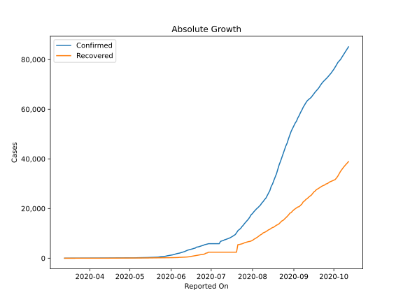
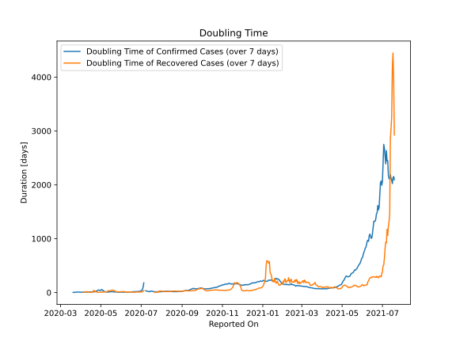

# Country Figures: Doubling Time of Infections for Ethiopia 

The doubling time below are calculated based on
* an exponential growth assumption
* for time difference of past seven (7) days.
The doubling time's unit is "days".

The first doubling time indicates the increase of confirmed (infected)
cases. There, the *higher* the number is, the better is to take control
of the disease.

The second doubling time indicates the increase of recovered (healed)
cases. There, the *lower* the number is, the better it is to take
control of the disease.

| Reported On | Confirmed | Doubling Time (Confirmed) | Recovered | Doubling Time (Recovered) |
|-------------|-----------|---------------------------|-----------|---------------------------|
| 2020-05-05 | 145 |  34.9 days  | 91 |  8.4 days  | 
| 2020-05-04 | 140 |  40.3 days  | 75 |  12.3 days  | 
| 2020-05-03 | 135 |  52.5 days  | 75 |  8.4 days  | 
| 2020-05-02 | 133 |  56.6 days  | 69 |  5.9 days  | 
| 2020-05-01 | 133 |  38.2 days  | 66 |  5.3 days  | 
| 2020-04-30 | 131 |  40.2 days  | 59 |  5.0 days  | 
| 2020-04-29 | 130 |  42.9 days  | 58 |  5.1 days  | 
| 2020-04-28 | 126 |  48.8 days  | 50 |  4.6 days  | 
| 2020-04-27 | 124 |  44.2 days  | 50 |  4.6 days  | 
| 2020-04-26 | 123 |  37.7 days  | 41 |  5.5 days  | 
| 2020-04-25 | 122 |  32.7 days  | 29 |  8.5 days  | 
| 2020-04-24 | 117 |  24.9 days  | 25 |  9.8 days  | 
| 2020-04-23 | 116 |  21.3 days  | 21 |  14.8 days  | 
| 2020-04-22 | 116 |  15.9 days  | 21 |  14.8 days  | 
| 2020-04-21 | 114 |  15.1 days  | 16 |  36.7 days  | 
| 2020-04-20 | 111 |  12.3 days  | 16 |  36.7 days  | 
| 2020-04-19 | 108 |  11.9 days  | 16 |  10.7 days  | 
| 2020-04-18 | 105 |  11.9 days  | 16 |  10.7 days  | 
| 2020-04-17 | 96 |  12.8 days  | 15 |  4.0 days  | 
| 2020-04-16 | 92 |  10.1 days  | 15 |  4.0 days  | 
| 2020-04-15 | 85 |  11.5 days  | 15 |  4.0 days  | 
| 2020-04-14 | 82 |  11.0 days  | 14 |  4.2 days  | 
| 2020-04-13 | 74 |  9.7 days  | 14 |  4.2 days  | 
| 2020-04-12 | 71 |  10.0 days  | 10 |  5.6 days  | 
| 2020-04-11 | 69 |  8.5 days  | 10 |  5.6 days  | 
| 2020-04-10 | 65 |  8.2 days  | 4 |  17.2 days  | 
| 2020-04-09 | 56 |  7.7 days  | 4 |  17.2 days  | 
| 2020-04-08 | 55 |  7.9 days  | 4 |  7.3 days  | 
| 2020-04-07 | 52 |  7.3 days  | 4 |  7.3 days  | 
| 2020-04-06 | 44 |  7.8 days  | 4 |  None  | 
| 2020-04-05 | 43 |  7.1 days  | 4 |  3.8 days  | 
| 2020-04-04 | 38 |  5.9 days  | 4 |  3.8 days  | 
| 2020-04-03 | 35 |  6.5 days  | 3 |  None  | 
| 2020-04-02 | 29 |  5.8 days  | 3 |  None  | 
| 2020-04-01 | 29 |  5.8 days  | 2 |  None  | 
| 2020-03-31 | 26 |  6.6 days  | 2 |  None  | 
| 2020-03-30 | 23 |  6.9 days  | 4 |  None  | 
| 2020-03-29 | 21 |  7.8 days  | 1 |  None  | 
| 2020-03-28 | 16 |  8.8 days  | 1 |  None  | 
| 2020-03-27 | 16 |  8.8 days  | 0 |  None  | 
| 2020-03-26 | 12 |  7.3 days  | 0 |  None  | 
| 2020-03-25 | 12 |  7.3 days  | 0 |  None  | 
| 2020-03-24 | 12 |  5.9 days  | 0 |  None  | 
| 2020-03-23 | 11 |  6.5 days  | 0 |  None  | 
| 2020-03-22 | 11 |  2.4 days  | 0 |  None  | 
| 2020-03-21 | 9 |  2.5 days  | 0 |  None  | 
| 2020-03-20 | 9 |  2.5 days  | 0 |  None  | 
| 2020-03-19 | 6 |  None  | 0 |  None  | 
| 2020-03-18 | 6 |  None  | 0 |  None  | 
| 2020-03-17 | 5 |  None  | 0 |  None  | 
| 2020-03-16 | 5 |  None  | 0 |  None  | 
| 2020-03-15 | 1 |  None  | 0 |  None  | 
| 2020-03-14 | 1 |  None  | 0 |  None  | 
| 2020-03-13 | 1 |  None  | 0 |  None  | 

