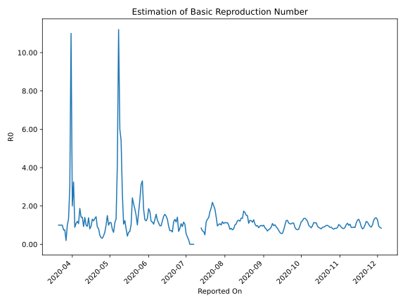

# Country Figures: Time Series for Basic Reproduction Number of Ethiopia 

| Reported On | &Delta; Confirmed | Total &Delta; Confirmed First Interval | Total &Delta; Confirmed Second Interval | Estimated Basic Reproduction Number R0 | 
|-------------|-------------------|----------------------------------------|-----------------------------------------|---------------------------------------------------|
| 2020-05-04 | 5 |  5  |  8  |  0.62  | 
| 2020-05-03 | 2 |  7  |  9  |  0.78  | 
| 2020-05-02 | 0 |  9  |  8  |  1.12  | 
| 2020-05-01 | 2 |  8  |  7  |  1.14  | 
| 2020-04-30 | 1 |  8  |  8  |  1.00  | 
| 2020-04-29 | 4 |  9  |  6  |  1.50  | 
| 2020-04-28 | 2 |  8  |  8  |  1.00  | 
| 2020-04-27 | 1 |  7  |  11  |  0.64  | 
| 2020-04-26 | 1 |  8  |  18  |  0.44  | 
| 2020-04-25 | 5 |  6  |  19  |  0.32  | 
| 2020-04-24 | 1 |  8  |  23  |  0.35  | 
| 2020-04-23 | 0 |  11  |  23  |  0.48  | 
| 2020-04-22 | 2 |  18  |  22  |  0.82  | 
| 2020-04-21 | 3 |  19  |  21  |  0.90  | 
| 2020-04-20 | 3 |  23  |  16  |  1.44  | 
| 2020-04-19 | 3 |  23  |  17  |  1.35  | 
| 2020-04-18 | 9 |  22  |  18  |  1.22  | 
| 2020-04-17 | 4 |  21  |  16  |  1.31  | 
| 2020-04-16 | 7 |  16  |  17  |  0.94  | 
| 2020-04-15 | 3 |  17  |  21  |  0.81  | 
| 2020-04-14 | 8 |  18  |  13  |  1.38  | 
| 2020-04-13 | 3 |  16  |  17  |  0.94  | 
| 2020-04-12 | 2 |  17  |  17  |  1.00  | 
| 2020-04-11 | 4 |  21  |  15  |  1.40  | 
| 2020-04-10 | 9 |  13  |  14  |  0.93  | 
| 2020-04-09 | 1 |  17  |  12  |  1.42  | 
| 2020-04-08 | 3 |  17  |  12  |  1.42  | 
| 2020-04-07 | 8 |  15  |  8  |  1.88  | 
| 2020-04-06 | 1 |  14  |  13  |  1.08  | 
| 2020-04-05 | 5 |  12  |  10  |  1.20  | 
| 2020-04-04 | 3 |  12  |  11  |  1.09  | 
| 2020-04-03 | 6 |  8  |  9  |  0.89  | 
| 2020-04-02 | 0 |  13  |  4  |  3.25  | 
| 2020-04-01 | 3 |  10  |  5  |  2.00  | 
| 2020-03-31 | 3 |  11  |  1  |  11.00  | 
| 2020-03-30 | 2 |  9  |  3  |  3.00  | 
| 2020-03-29 | 5 |  4  |  3  |  1.33  | 
| 2020-03-28 | 0 |  5  |  5  |  1.00  | 
| 2020-03-27 | 4 |  1  |  5  |  0.20  | 
| 2020-03-26 | 0 |  3  |  4  |  0.75  | 
| 2020-03-25 | 0 |  3  |  4  |  0.75  | 
| 2020-03-24 | 1 |  5  |  5  |  1.00  | 
| 2020-03-23 | 0 |  5  |  5  |  1.00  | 
| 2020-03-22 | 2 |  4  |  4  |  1.00  | 
| 2020-03-21 | 0 |  4  |  4  |  1.00  | 
| 2020-03-20 | 3 |  5  |  None  |  None  | 
| 2020-03-19 | 0 |  5  |  None  |  None  | 
| 2020-03-18 | 1 |  4  |  None  |  None  | 
| 2020-03-17 | 0 |  4  |  None  |  None  | 
| 2020-03-16 | 4 |  None  |  None  |  None  | 
| 2020-03-15 | 0 |  None  |  None  |  None  | 
| 2020-03-14 | 0 |  None  |  None  |  None  | 
| 2020-03-13 | None |  None  |  None  |  None  | 

