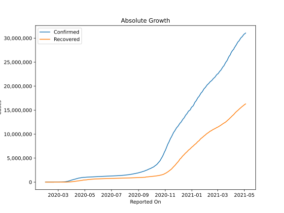

# Country Figures: Doubling Time of Infections for European Union 27 

The doubling time below are calculated based on
* an exponential growth assumption
* for time difference of past seven (7) days.
The doubling time's unit is "days".

The first doubling time indicates the increase of confirmed (infected)
cases. There, the *higher* the number is, the better is to take control
of the disease.

The second doubling time indicates the increase of recovered (healed)
cases. There, the *lower* the number is, the better it is to take
control of the disease.

| Reported On | Confirmed | Doubling Time (Confirmed) | Recovered | Doubling Time (Recovered) |
|-------------|-----------|---------------------------|-----------|---------------------------|
| 2020-04-30 | 987392 |  75.4 days  | 432073 |  21.5 days  | 
| 2020-04-29 | 1002786 |  49.2 days  | 440927 |  17.1 days  | 
| 2020-04-28 | 993177 |  47.0 days  | 419216 |  17.5 days  | 
| 2020-04-27 | 981053 |  44.8 days  | 407884 |  15.2 days  | 
| 2020-04-26 | 968868 |  43.9 days  | 398931 |  14.6 days  | 
| 2020-04-25 | 957439 |  38.9 days  | 371275 |  16.4 days  | 
| 2020-04-24 | 943389 |  39.0 days  | 362844 |  16.0 days  | 
| 2020-04-23 | 925559 |  37.1 days  | 343703 |  16.3 days  | 
| 2020-04-22 | 907965 |  31.8 days  | 330208 |  15.1 days  | 
| 2020-04-21 | 895066 |  29.3 days  | 315780 |  14.6 days  | 
| 2020-04-20 | 879557 |  31.3 days  | 294550 |  15.5 days  | 
| 2020-04-19 | 866698 |  29.6 days  | 283800 |  15.3 days  | 
| 2020-04-18 | 844283 |  29.4 days  | 274424 |  14.5 days  | 
| 2020-04-17 | 832064 |  26.4 days  | 266345 |  13.3 days  | 
| 2020-04-16 | 811022 |  24.2 days  | 253812 |  12.9 days  | 
| 2020-04-15 | 778065 |  24.4 days  | 237583 |  12.0 days  | 
| 2020-04-14 | 756754 |  22.8 days  | 224776 |  10.0 days  | 
| 2020-04-13 | 751940 |  19.0 days  | 214061 |  8.9 days  | 
| 2020-04-12 | 734138 |  18.0 days  | 204966 |  8.8 days  | 
| 2020-04-11 | 714385 |  17.1 days  | 194894 |  8.4 days  | 
| 2020-04-10 | 690849 |  14.2 days  | 182974 |  8.0 days  | 
| 2020-04-09 | 661944 |  13.4 days  | 172446 |  7.4 days  | 
| 2020-04-08 | 635941 |  12.6 days  | 156585 |  6.9 days  | 
| 2020-04-07 | 609980 |  11.7 days  | 136146 |  6.8 days  | 
| 2020-04-06 | 580106 |  11.0 days  | 121208 |  6.6 days  | 
| 2020-04-05 | 557909 |  10.2 days  | 115595 |  5.7 days  | 
| 2020-04-04 | 535228 |  9.5 days  | 106690 |  5.4 days  | 
| 2020-04-03 | 486554 |  9.3 days  | 97320 |  5.0 days  | 
| 2020-04-02 | 456303 |  8.6 days  | 87035 |  4.8 days  | 
| 2020-04-01 | 427786 |  7.7 days  | 74916 |  4.5 days  | 
| 2020-03-31 | 397932 |  7.2 days  | 64393 |  4.4 days  | 
| 2020-03-30 | 367558 |  6.9 days  | 55947 |  3.9 days  | 
| 2020-03-29 | 341199 |  6.3 days  | 46881 |  3.9 days  | 
| 2020-03-28 | 315888 |  6.1 days  | 40689 |  3.5 days  | 
| 2020-03-27 | 283902 |  5.8 days  | 34239 |  3.2 days  | 
| 2020-03-26 | 253349 |  5.5 days  | 29160 |  3.3 days  | 
| 2020-03-25 | 222193 |  5.2 days  | 23061 |  3.7 days  | 
| 2020-03-24 | 195699 |  5.1 days  | 19391 |  3.5 days  | 
| 2020-03-23 | 175102 |  4.9 days  | 14099 |  3.8 days  | 
| 2020-03-22 | 152162 |  4.7 days  | 12081 |  3.8 days  | 
| 2020-03-21 | 135462 |  4.5 days  | 8857 |  4.3 days  | 
| 2020-03-20 | 116745 |  4.4 days  | 6330 |  4.0 days  | 
| 2020-03-19 | 99233 |  3.6 days  | 5798 |  3.5 days  | 
| 2020-03-18 | 82379 |  4.0 days  | 5339 |  3.7 days  | 
| 2020-03-17 | 69972 |  3.8 days  | 4123 |  3.3 days  | 
| 2020-03-16 | 60003 |  3.7 days  | 3423 |  3.7 days  | 
| 2020-03-15 | 49819 |  3.6 days  | 2956 |  3.7 days  | 
| 2020-03-14 | 42478 |  3.4 days  | 2576 |  3.9 days  | 
| 2020-03-13 | 34987 |  3.3 days  | 1711 |  4.7 days  | 
| 2020-03-12 | 22101 |  3.8 days  | 1280 |  5.0 days  | 
| 2020-03-11 | 21528 |  3.2 days  | 1280 |  3.7 days  | 
| 2020-03-10 | 16932 |  3.2 days  | 798 |  3.7 days  | 
| 2020-03-09 | 13952 |  3.2 days  | 795 |  3.6 days  | 
| 2020-03-08 | 11296 |  3.2 days  | 688 |  3.0 days  | 
| 2020-03-07 | 8934 |  3.0 days  | 655 |  2.6 days  | 
| 2020-03-06 | 6936 |  2.9 days  | 558 |  2.8 days  | 
| 2020-03-05 | 5352 |  2.8 days  | 447 |  3.1 days  | 
| 2020-03-04 | 4052 |  2.7 days  | 309 |  2.5 days  | 
| 2020-03-03 | 3191 |  2.6 days  | 192 |  2.9 days  | 
| 2020-03-02 | 2602 |  2.4 days  | 181 |  2.7 days  | 
| 2020-03-01 | 2112 |  2.3 days  | 115 |  3.4 days  | 
| 2020-02-29 | 1403 |  2.1 days  | 78 |  4.3 days  | 
| 2020-02-28 | 1054 |  1.9 days  | 77 |  4.2 days  | 
| 2020-02-27 | 777 |  1.9 days  | 76 |  4.0 days  | 
| 2020-02-26 | 523 |  2.1 days  | 33 |  10.0 days  | 
| 2020-02-25 | 365 |  2.4 days  | 30 |  12.3 days  | 
| 2020-02-24 | 262 |  2.8 days  | 23 |  5.5 days  | 
| 2020-02-23 | 188 |  3.3 days  | 24 |  4.8 days  | 
| 2020-02-22 | 95 |  5.3 days  | 23 |  4.9 days  | 
| 2020-02-21 | 53 |  12.0 days  | 22 |  3.2 days  | 
| 2020-02-20 | 36 |  172.6 days  | 20 |  3.3 days  | 
| 2020-02-19 | 36 |  172.6 days  | 20 |  2.9 days  | 
| 2020-02-18 | 36 |  172.6 days  | 20 |  None  | 
| 2020-02-17 | 36 |  56.1 days  | 9 |  None  | 
| 2020-02-16 | 36 |  56.1 days  | 8 |  None  | 
| 2020-02-15 | 36 |  32.8 days  | 8 |  None  | 
| 2020-02-14 | 35 |  16.7 days  | 4 |  None  | 
| 2020-02-13 | 35 |  13.2 days  | 4 |  None  | 
| 2020-02-12 | 35 |  13.2 days  | 3 |  None  | 
| 2020-02-11 | 35 |  13.2 days  | 0 |  None  | 
| 2020-02-10 | 33 |  13.8 days  | 0 |  None  | 
| 2020-02-09 | 33 |  11.1 days  | 0 |  None  | 
| 2020-02-08 | 31 |  10.3 days  | 0 |  None  | 
| 2020-02-07 | 26 |  None  | 0 |  None  | 
| 2020-02-06 | 24 |  None  | 0 |  None  | 
| 2020-02-05 | 24 |  None  | 0 |  None  | 
| 2020-02-04 | 24 |  None  | 0 |  None  | 
| 2020-02-03 | 23 |  None  | 0 |  None  | 
| 2020-02-02 | 21 |  None  | 0 |  None  | 
| 2020-02-01 | 19 |  None  | 0 |  None  | 

