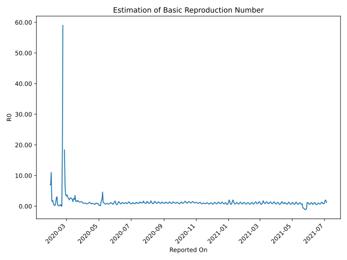

# Country Figures: Time Series for Basic Reproduction Number of European Union 27 

| Reported On | &Delta; Confirmed | Total &Delta; Confirmed First Interval | Total &Delta; Confirmed Second Interval | Estimated Basic Reproduction Number R0 | 
|-------------|-------------------|----------------------------------------|-----------------------------------------|---------------------------------------------------|
| 2020-05-09 | 6080 |  33977  |  27169  |  1.25  | 
| 2020-05-08 | 8514 |  30916  |  6322  |  4.89  | 
| 2020-05-07 | 8188 |  28631  |  10028  |  2.86  | 
| 2020-05-06 | 10240 |  28085  |  12458  |  2.25  | 
| 2020-05-05 | 7035 |  27169  |  18524  |  1.47  | 
| 2020-05-04 | 5453 |  6322  |  45347  |  0.14  | 
| 2020-05-03 | 5903 |  10028  |  49788  |  0.20  | 
| 2020-05-02 | 9694 |  12458  |  55494  |  0.22  | 
| 2020-05-01 | 6119 |  18524  |  60903  |  0.30  | 
| 2020-04-30 | -15394 |  45347  |  62373  |  0.73  | 
| 2020-04-29 | 9609 |  49788  |  63832  |  0.78  | 
| 2020-04-28 | 12124 |  55494  |  58861  |  0.94  | 
| 2020-04-27 | 12185 |  60903  |  63682  |  0.96  | 
| 2020-04-26 | 11429 |  62373  |  63002  |  0.99  | 
| 2020-04-25 | 14050 |  63832  |  68535  |  0.93  | 
| 2020-04-24 | 17830 |  58861  |  88633  |  0.66  | 
| 2020-04-23 | 17594 |  63682  |  87529  |  0.73  | 
| 2020-04-22 | 12899 |  63002  |  80124  |  0.79  | 
| 2020-04-21 | 15509 |  68535  |  76884  |  0.89  | 
| 2020-04-20 | 12859 |  88633  |  63680  |  1.39  | 
| 2020-04-19 | 22415 |  87529  |  65905  |  1.33  | 
| 2020-04-18 | 12219 |  80124  |  89996  |  0.89  | 
| 2020-04-17 | 21042 |  76884  |  98197  |  0.78  | 
| 2020-04-16 | 32957 |  63680  |  104405  |  0.61  | 
| 2020-04-15 | 21311 |  65905  |  110743  |  0.60  | 
| 2020-04-14 | 4814 |  89996  |  104035  |  0.87  | 
| 2020-04-13 | 17802 |  98197  |  100713  |  0.98  | 
| 2020-04-12 | 19753 |  104405  |  123426  |  0.85  | 
| 2020-04-11 | 23536 |  110743  |  123803  |  0.89  | 
| 2020-04-10 | 28905 |  104035  |  130123  |  0.80  | 
| 2020-04-09 | 26003 |  100713  |  137296  |  0.73  | 
| 2020-04-08 | 25961 |  123426  |  118996  |  1.04  | 
| 2020-04-07 | 29874 |  123803  |  115104  |  1.08  | 
| 2020-04-06 | 22197 |  130123  |  111898  |  1.16  | 
| 2020-04-05 | 22681 |  137296  |  114030  |  1.20  | 
| 2020-04-04 | 48674 |  118996  |  114209  |  1.04  | 
| 2020-04-03 | 30251 |  115104  |  119006  |  0.97  | 
| 2020-04-02 | 28517 |  111898  |  120189  |  0.93  | 
| 2020-04-01 | 29854 |  114030  |  108800  |  1.05  | 
| 2020-03-31 | 30374 |  114209  |  101187  |  1.13  | 
| 2020-03-30 | 26359 |  119006  |  86731  |  1.37  | 
| 2020-03-29 | 25311 |  120189  |  78954  |  1.52  | 
| 2020-03-28 | 31986 |  108800  |  75869  |  1.43  | 
| 2020-03-27 | 30553 |  101187  |  69783  |  1.45  | 
| 2020-03-26 | 31156 |  86731  |  65490  |  1.32  | 
| 2020-03-25 | 26494 |  78954  |  56742  |  1.39  | 
| 2020-03-24 | 20597 |  75869  |  49414  |  1.54  | 
| 2020-03-23 | 22940 |  69783  |  39901  |  1.75  | 
| 2020-03-22 | 16700 |  65490  |  34985  |  1.87  | 
| 2020-03-21 | 18717 |  56742  |  37902  |  1.50  | 
| 2020-03-20 | 17512 |  49414  |  28291  |  1.75  | 
| 2020-03-19 | 16854 |  39901  |  25546  |  1.56  | 
| 2020-03-18 | 12407 |  34985  |  21035  |  1.66  | 
| 2020-03-17 | 9969 |  37902  |  10805  |  3.51  | 
| 2020-03-16 | 10184 |  28291  |  12594  |  2.25  | 
| 2020-03-15 | 7341 |  25546  |  9996  |  2.56  | 
| 2020-03-14 | 7491 |  21035  |  8600  |  2.45  | 
| 2020-03-13 | 12886 |  10805  |  7244  |  1.49  | 
| 2020-03-12 | 573 |  12594  |  5743  |  2.19  | 
| 2020-03-11 | 4596 |  9996  |  4334  |  2.31  | 
| 2020-03-10 | 2980 |  8600  |  3240  |  2.65  | 
| 2020-03-09 | 2656 |  7244  |  2649  |  2.73  | 
| 2020-03-08 | 2362 |  5743  |  2137  |  2.69  | 
| 2020-03-07 | 1998 |  4334  |  1825  |  2.37  | 
| 2020-03-06 | 1584 |  3240  |  1589  |  2.04  | 
| 2020-03-05 | 1300 |  2649  |  1038  |  2.55  | 
| 2020-03-04 | 861 |  2137  |  792  |  2.70  | 
| 2020-03-03 | 589 |  1825  |  589  |  3.10  | 
| 2020-03-02 | 490 |  1589  |  428  |  3.71  | 
| 2020-03-01 | 709 |  1038  |  312  |  3.33  | 
| 2020-02-29 | 349 |  792  |  226  |  3.50  | 
| 2020-02-28 | 277 |  589  |  152  |  3.88  | 
| 2020-02-27 | 254 |  428  |  59  |  7.25  | 
| 2020-02-26 | 158 |  312  |  17  |  18.35  | 
| 2020-02-25 | 103 |  226  |  None  |  None  | 
| 2020-02-24 | 74 |  152  |  None  |  None  | 
| 2020-02-23 | 93 |  59  |  1  |  59.00  | 
| 2020-02-22 | 42 |  17  |  1  |  17.00  | 
| 2020-02-21 | 17 |  None  |  1  |  None  | 
| 2020-02-20 | 0 |  None  |  1  |  None  | 
| 2020-02-19 | 0 |  1  |  2  |  0.50  | 
| 2020-02-18 | 0 |  1  |  2  |  0.50  | 
| 2020-02-17 | 0 |  1  |  4  |  0.25  | 
| 2020-02-16 | 0 |  1  |  9  |  0.11  | 
| 2020-02-15 | 1 |  2  |  9  |  0.22  | 
| 2020-02-14 | 0 |  2  |  9  |  0.22  | 
| 2020-02-13 | 0 |  4  |  7  |  0.57  | 
| 2020-02-12 | 0 |  9  |  3  |  3.00  | 
| 2020-02-11 | 2 |  9  |  3  |  3.00  | 
| 2020-02-10 | 0 |  9  |  5  |  1.80  | 
| 2020-02-09 | 2 |  7  |  10  |  0.70  | 
| 2020-02-08 | 5 |  3  |  13  |  0.23  | 
| 2020-02-07 | 2 |  3  |  11  |  0.27  | 
| 2020-02-06 | 0 |  5  |  11  |  0.45  | 
| 2020-02-05 | 0 |  10  |  11  |  0.91  | 
| 2020-02-04 | 1 |  13  |  7  |  1.86  | 
| 2020-02-03 | 2 |  11  |  7  |  1.57  | 
| 2020-02-02 | 2 |  11  |  6  |  1.83  | 
| 2020-02-01 | 5 |  11  |  1  |  11.00  | 
| 2020-01-31 | 4 |  7  |  1  |  7.00  | 
| 2020-01-30 | 0 |  7  |  1  |  7.00  | 
| 2020-01-29 | 2 |  6  |  None  |  None  | 
| 2020-01-28 | 5 |  1  |  None  |  None  | 
| 2020-01-27 | 0 |  1  |  None  |  None  | 
| 2020-01-26 | 0 |  1  |  None  |  None  | 
| 2020-01-25 | 1 |  None  |  None  |  None  | 
| 2020-01-24 | None |  None  |  None  |  None  | 

