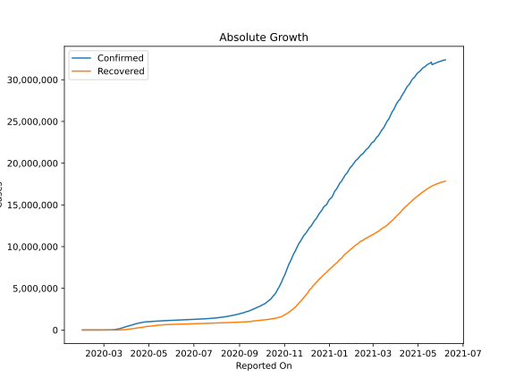
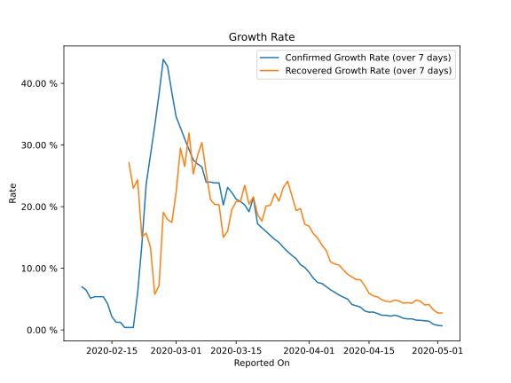

# Country Figures: Growth Rate for European Union 27 

The growth rates below are calculated based on
* an exponential growth assumption
* for time difference of past seven (7) days.
The growth rate is to be understood as on "growth per day".

The first growth rate indicates the increase of confirmed (infected) cases.

The second growth rate indicates the increase of recovered (healed) cases.

| Reported On | Confirmed | Growth Rate (Confirmed) | Recovered | Growth Rate (Recovered) |
|-------------|-----------|-------------------------|-----------|-------------------------|
| 2020-04-28 | 993177 |  1.49 %  | 419216 |  4.048 %  | 
| 2020-04-27 | 981053 |  1.56 %  | 407884 |  4.650 %  | 
| 2020-04-26 | 968868 |  1.59 %  | 398931 |  4.865 %  | 
| 2020-04-25 | 957439 |  1.80 %  | 371275 |  4.318 %  | 
| 2020-04-24 | 943389 |  1.79 %  | 362844 |  4.417 %  | 
| 2020-04-23 | 925559 |  1.89 %  | 343703 |  4.331 %  | 
| 2020-04-22 | 907965 |  2.21 %  | 330208 |  4.703 %  | 
| 2020-04-21 | 895066 |  2.40 %  | 315780 |  4.856 %  | 
| 2020-04-20 | 879557 |  2.24 %  | 294550 |  4.560 %  | 
| 2020-04-19 | 866698 |  2.37 %  | 283800 |  4.649 %  | 
| 2020-04-18 | 844283 |  2.39 %  | 274424 |  4.889 %  | 
| 2020-04-17 | 832064 |  2.66 %  | 266345 |  5.364 %  | 
| 2020-04-16 | 811022 |  2.90 %  | 253812 |  5.522 %  | 
| 2020-04-15 | 778065 |  2.88 %  | 237583 |  5.956 %  | 
| 2020-04-14 | 756754 |  3.08 %  | 224776 |  7.163 %  | 
| 2020-04-13 | 751940 |  3.71 %  | 214061 |  8.125 %  | 
| 2020-04-12 | 734138 |  3.92 %  | 204966 |  8.182 %  | 
| 2020-04-11 | 714385 |  4.12 %  | 194894 |  8.608 %  | 
| 2020-04-10 | 690849 |  5.01 %  | 182974 |  9.019 %  | 
| 2020-04-09 | 661944 |  5.31 %  | 172446 |  9.768 %  | 
| 2020-04-08 | 635941 |  5.66 %  | 156585 |  10.532 %  | 
| 2020-04-07 | 609980 |  6.10 %  | 136146 |  10.696 %  | 
| 2020-04-06 | 580106 |  6.52 %  | 121208 |  11.044 %  | 
| 2020-04-05 | 557909 |  7.02 %  | 115595 |  12.893 %  | 
| 2020-04-04 | 535228 |  7.53 %  | 106690 |  13.771 %  | 
| 2020-04-03 | 486554 |  7.70 %  | 97320 |  14.923 %  | 
| 2020-04-02 | 456303 |  8.41 %  | 87035 |  15.622 %  | 
| 2020-04-01 | 427786 |  9.36 %  | 74916 |  16.832 %  | 
| 2020-03-31 | 397932 |  10.14 %  | 64393 |  17.146 %  | 
| 2020-03-30 | 367558 |  10.59 %  | 55947 |  19.690 %  | 
| 2020-03-29 | 341199 |  11.54 %  | 46881 |  19.371 %  | 
| 2020-03-28 | 315888 |  12.10 %  | 40689 |  21.782 %  | 
| 2020-03-27 | 283902 |  12.69 %  | 34239 |  24.115 %  | 
| 2020-03-26 | 253349 |  13.39 %  | 29160 |  23.075 %  | 
| 2020-03-25 | 222193 |  14.17 %  | 23061 |  20.901 %  | 
| 2020-03-24 | 195699 |  14.69 %  | 19391 |  22.118 %  | 
| 2020-03-23 | 175102 |  15.30 %  | 14099 |  20.223 %  | 
| 2020-03-22 | 152162 |  15.95 %  | 12081 |  20.111 %  | 
| 2020-03-21 | 135462 |  16.57 %  | 8857 |  17.642 %  | 
| 2020-03-20 | 116745 |  17.21 %  | 6330 |  18.689 %  | 
| 2020-03-19 | 99233 |  21.45 %  | 5798 |  21.581 %  | 
| 2020-03-18 | 82379 |  19.17 %  | 5339 |  20.403 %  | 
| 2020-03-17 | 69972 |  20.27 %  | 4123 |  23.460 %  | 
| 2020-03-16 | 60003 |  20.84 %  | 3423 |  20.856 %  | 
| 2020-03-15 | 49819 |  21.20 %  | 2956 |  20.826 %  | 
| 2020-03-14 | 42478 |  22.27 %  | 2576 |  19.562 %  | 
| 2020-03-13 | 34987 |  23.12 %  | 1711 |  16.007 %  | 
| 2020-03-12 | 22101 |  20.26 %  | 1280 |  15.029 %  | 
| 2020-03-11 | 21528 |  23.86 %  | 1280 |  20.304 %  | 
| 2020-03-10 | 16932 |  23.84 %  | 798 |  20.352 %  | 
| 2020-03-09 | 13952 |  23.99 %  | 795 |  21.141 %  | 
| 2020-03-08 | 11296 |  23.95 %  | 688 |  25.555 %  | 
| 2020-03-07 | 8934 |  26.45 %  | 655 |  30.399 %  | 
| 2020-03-06 | 6936 |  26.92 %  | 558 |  28.294 %  | 
| 2020-03-05 | 5352 |  27.57 %  | 447 |  25.312 %  | 
| 2020-03-04 | 4052 |  29.25 %  | 309 |  31.955 %  | 
| 2020-03-03 | 3191 |  30.97 %  | 192 |  26.519 %  | 
| 2020-03-02 | 2602 |  32.80 %  | 181 |  29.471 %  | 
| 2020-03-01 | 2112 |  34.56 %  | 115 |  22.384 %  | 
| 2020-02-29 | 1403 |  38.46 %  | 78 |  17.446 %  | 
| 2020-02-28 | 1054 |  42.72 %  | 77 |  17.897 %  | 
| 2020-02-27 | 777 |  43.88 %  | 76 |  19.071 %  | 
| 2020-02-26 | 523 |  38.23 %  | 33 |  7.154 %  | 
| 2020-02-25 | 365 |  33.09 %  | 30 |  5.792 %  | 
| 2020-02-24 | 262 |  28.35 %  | 23 |  13.404 %  | 
| 2020-02-23 | 188 |  23.61 %  | 24 |  15.694 %  | 
| 2020-02-22 | 95 |  13.86 %  | 23 |  15.086 %  | 
| 2020-02-21 | 53 |  5.93 %  | 22 |  24.354 %  | 
| 2020-02-20 | 36 |  0.40 %  | 20 |  22.992 %  | 
| 2020-02-19 | 36 |  0.40 %  | 20 |  27.102 %  | 
| 2020-02-18 | 36 |  0.40 %  | 20 |  None  | 
| 2020-02-17 | 36 |  1.24 %  | 9 |  None  | 
| 2020-02-16 | 36 |  1.24 %  | 8 |  None  | 
| 2020-02-15 | 36 |  2.14 %  | 8 |  None  | 
| 2020-02-14 | 35 |  4.25 %  | 4 |  None  | 
| 2020-02-13 | 35 |  5.39 %  | 4 |  None  | 
| 2020-02-12 | 35 |  5.39 %  | 3 |  None  | 
| 2020-02-11 | 35 |  5.39 %  | 0 |  None  | 
| 2020-02-10 | 33 |  5.16 %  | 0 |  None  | 
| 2020-02-09 | 33 |  6.46 %  | 0 |  None  | 
| 2020-02-08 | 31 |  6.99 %  | 0 |  None  | 
| 2020-02-07 | 26 |  None  | 0 |  None  | 
| 2020-02-06 | 24 |  None  | 0 |  None  | 
| 2020-02-05 | 24 |  None  | 0 |  None  | 
| 2020-02-04 | 24 |  None  | 0 |  None  | 
| 2020-02-03 | 23 |  None  | 0 |  None  | 
| 2020-02-02 | 21 |  None  | 0 |  None  | 
| 2020-02-01 | 19 |  None  | 0 |  None  | 

