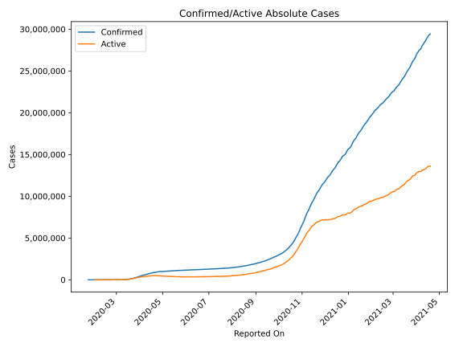
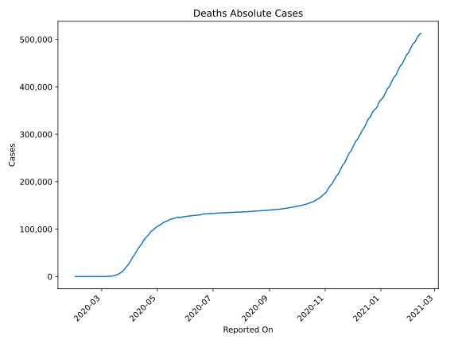
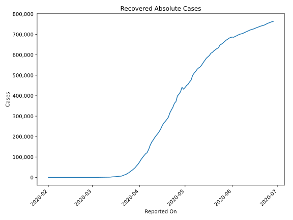
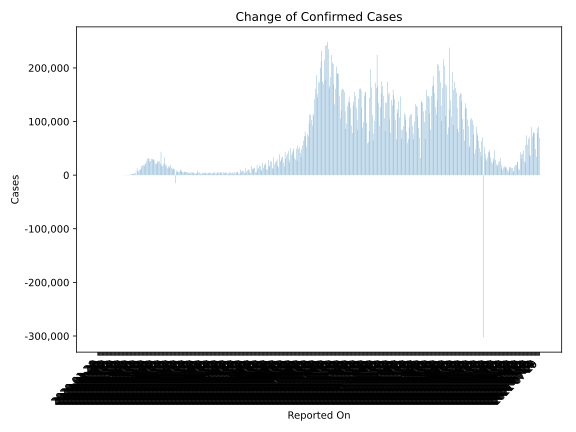
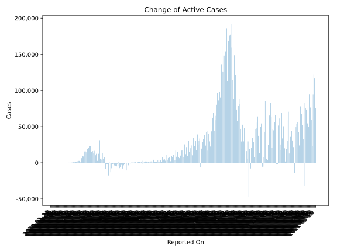
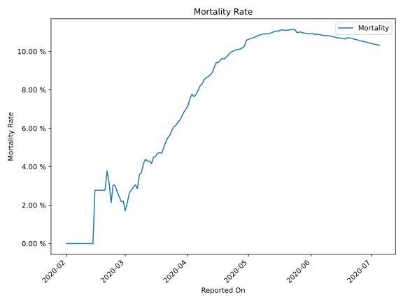

# Country Figures: Time Series for European Union 27 

| Reported On | Confirmed | Deaths | Recovered | Active | Mortality | &Delta; Confirmed | &Delta; Deaths | &Delta; Recovered | &Delta; Active | % Active of Population |
|-------------|-----------|--------|-----------|--------|-----------|-------------------|----------------|-------------------|----------------|------------------------|
| 2020-05-01 | 993511 | 105527 | 440174 | 447810 |  10.62 %  | 6119 | 1006 | 8101 | -2988 |  0.100 %  | 
| 2020-04-30 | 987392 | 104521 | 432073 | 450798 |  10.59 %  | -15394 | 1451 | -8854 | -7991 |  0.101 %  | 
| 2020-04-29 | 1002786 | 103070 | 440927 | 458789 |  10.28 %  | 9609 | 1947 | 21711 | -14049 |  0.103 %  | 
| 2020-04-28 | 993177 | 101123 | 419216 | 472838 |  10.18 %  | 12124 | 1687 | 11332 | -895 |  0.106 %  | 
| 2020-04-27 | 981053 | 99436 | 407884 | 473733 |  10.14 %  | 12185 | 1614 | 8953 | 1618 |  0.106 %  | 
| 2020-04-26 | 968868 | 97822 | 398931 | 472115 |  10.10 %  | 11429 | 1251 | 27656 | -17478 |  0.106 %  | 
| 2020-04-25 | 957439 | 96571 | 371275 | 489593 |  10.09 %  | 14050 | 1857 | 8431 | 3762 |  0.110 %  | 
| 2020-04-24 | 943389 | 94714 | 362844 | 485831 |  10.04 %  | 17830 | 2175 | 19141 | -3486 |  0.109 %  | 
| 2020-04-23 | 925559 | 92539 | 343703 | 489317 |  10.00 %  | 17594 | 2338 | 13495 | 1761 |  0.110 %  | 
| 2020-04-22 | 907965 | 90201 | 330208 | 487556 |  9.93 %  | 12899 | 2422 | 14428 | -3951 |  0.109 %  | 
| 2020-04-21 | 895066 | 87779 | 315780 | 491507 |  9.81 %  | 15509 | 2414 | 21230 | -8135 |  0.110 %  | 
| 2020-04-20 | 879557 | 85365 | 294550 | 499642 |  9.71 %  | 12859 | 2135 | 10750 | -26 |  0.112 %  | 
| 2020-04-19 | 866698 | 83230 | 283800 | 499668 |  9.60 %  | 22415 | 1887 | 9376 | 11152 |  0.112 %  | 
| 2020-04-18 | 844283 | 81343 | 274424 | 488516 |  9.63 %  | 12219 | 1976 | 8079 | 2164 |  0.109 %  | 
| 2020-04-17 | 832064 | 79367 | 266345 | 486352 |  9.54 %  | 21042 | 3030 | 12533 | 5479 |  0.109 %  | 
| 2020-04-16 | 811022 | 76337 | 253812 | 480873 |  9.41 %  | 32957 | 3037 | 16229 | 13691 |  0.108 %  | 
| 2020-04-15 | 778065 | 73300 | 237583 | 467182 |  9.42 %  | 21311 | 4001 | 12807 | 4503 |  0.105 %  | 
| 2020-04-14 | 756754 | 69299 | 224776 | 462679 |  9.16 %  | 4814 | 2449 | 10715 | -8350 |  0.104 %  | 
| 2020-04-13 | 751940 | 66850 | 214061 | 471029 |  8.89 %  | 17802 | 2422 | 9095 | 6285 |  0.105 %  | 
| 2020-04-12 | 734138 | 64428 | 204966 | 464744 |  8.78 %  | 19753 | 2413 | 10072 | 7268 |  0.104 %  | 
| 2020-04-11 | 714385 | 62015 | 194894 | 457476 |  8.68 %  | 23536 | 2411 | 11920 | 9205 |  0.102 %  | 
| 2020-04-10 | 690849 | 59604 | 182974 | 448271 |  8.63 %  | 28905 | 3195 | 10528 | 15182 |  0.100 %  | 
| 2020-04-09 | 661944 | 56409 | 172446 | 433089 |  8.52 %  | 26003 | 3583 | 15861 | 6559 |  0.097 %  | 
| 2020-04-08 | 635941 | 52826 | 156585 | 426530 |  8.31 %  | 25961 | 2814 | 20439 | 2708 |  0.096 %  | 
| 2020-04-07 | 609980 | 50012 | 136146 | 423822 |  8.20 %  | 29874 | 3877 | 14938 | 11059 |  0.095 %  | 
| 2020-04-06 | 580106 | 46135 | 121208 | 412763 |  7.95 %  | 22197 | 2890 | 5613 | 13694 |  0.092 %  | 
| 2020-04-05 | 557909 | 43245 | 115595 | 399069 |  7.75 %  | 22681 | 2328 | 8905 | 11448 |  0.089 %  | 
| 2020-04-04 | 535228 | 40917 | 106690 | 387621 |  7.64 %  | 48674 | 3106 | 9370 | 36198 |  0.087 %  | 
| 2020-04-03 | 486554 | 37811 | 97320 | 351423 |  7.77 %  | 30251 | 3391 | 10285 | 16575 |  0.079 %  | 
| 2020-04-02 | 456303 | 34420 | 87035 | 334848 |  7.54 %  | 28517 | 3807 | 12119 | 12591 |  0.075 %  | 
| 2020-04-01 | 427786 | 30613 | 74916 | 322257 |  7.16 %  | 29854 | 2740 | 10523 | 16591 |  0.072 %  | 
| 2020-03-31 | 397932 | 27873 | 64393 | 305666 |  7.00 %  | 30374 | 2734 | 8446 | 19194 |  0.068 %  | 
| 2020-03-30 | 367558 | 25139 | 55947 | 286472 |  6.84 %  | 26359 | 2573 | 9066 | 14720 |  0.064 %  | 
| 2020-03-29 | 341199 | 22566 | 46881 | 271752 |  6.61 %  | 25311 | 2274 | 6192 | 16845 |  0.061 %  | 
| 2020-03-28 | 315888 | 20292 | 40689 | 254907 |  6.42 %  | 31986 | 2395 | 6450 | 23141 |  0.057 %  | 
| 2020-03-27 | 283902 | 17897 | 34239 | 231766 |  6.30 %  | 30553 | 2333 | 5079 | 23141 |  0.052 %  | 
| 2020-03-26 | 253349 | 15564 | 29160 | 208625 |  6.14 %  | 31156 | 2065 | 6099 | 22992 |  0.047 %  | 
| 2020-03-25 | 222193 | 13499 | 23061 | 185633 |  6.08 %  | 26494 | 2002 | 3670 | 20822 |  0.042 %  | 
| 2020-03-24 | 195699 | 11497 | 19391 | 164811 |  5.87 %  | 20597 | 1665 | 5292 | 13640 |  0.037 %  | 
| 2020-03-23 | 175102 | 9832 | 14099 | 151171 |  5.62 %  | 22940 | 1458 | 2018 | 19464 |  0.034 %  | 
| 2020-03-22 | 152162 | 8374 | 12081 | 131707 |  5.50 %  | 16700 | 1229 | 3224 | 12247 |  0.029 %  | 
| 2020-03-21 | 135462 | 7145 | 8857 | 119460 |  5.27 %  | 18717 | 1344 | 2527 | 14846 |  0.027 %  | 
| 2020-03-20 | 116745 | 5801 | 6330 | 104614 |  4.97 %  | 17512 | 1129 | 532 | 15851 |  0.023 %  | 
| 2020-03-19 | 99233 | 4672 | 5798 | 88763 |  4.71 %  | 16854 | 783 | 459 | 15612 |  0.020 %  | 
| 2020-03-18 | 82379 | 3889 | 5339 | 73151 |  4.72 %  | 12407 | 595 | 1216 | 10596 |  0.016 %  | 
| 2020-03-17 | 69972 | 3294 | 4123 | 62555 |  4.71 %  | 9969 | 572 | 700 | 8697 |  0.014 %  | 
| 2020-03-16 | 60003 | 2722 | 3423 | 53858 |  4.54 %  | 10184 | 478 | 467 | 9239 |  0.012 %  | 
| 2020-03-15 | 49819 | 2244 | 2956 | 44619 |  4.50 %  | 7341 | 476 | 380 | 6485 |  0.010 %  | 
| 2020-03-14 | 42478 | 1768 | 2576 | 38134 |  4.16 %  | 7491 | 263 | 865 | 6363 |  0.009 %  | 
| 2020-03-13 | 34987 | 1505 | 1711 | 31771 |  4.30 %  | 12886 | 558 | 431 | 11897 |  0.007 %  | 
| 2020-03-12 | 22101 | 947 | 1280 | 19874 |  4.28 %  | 573 | 3 | 0 | 570 |  0.004 %  | 
| 2020-03-11 | 21528 | 944 | 1280 | 19304 |  4.38 %  | 4596 | 239 | 482 | 3875 |  0.004 %  | 
| 2020-03-10 | 16932 | 705 | 798 | 15429 |  4.16 %  | 2980 | 190 | 3 | 2787 |  0.003 %  | 
| 2020-03-09 | 13952 | 515 | 795 | 12642 |  3.69 %  | 2656 | 110 | 107 | 2439 |  0.003 %  | 
| 2020-03-08 | 11296 | 405 | 688 | 10203 |  3.59 %  | 2362 | 150 | 33 | 2179 |  0.002 %  | 
| 2020-03-07 | 8934 | 255 | 655 | 8024 |  2.85 %  | 1998 | 43 | 97 | 1858 |  0.002 %  | 
| 2020-03-06 | 6936 | 212 | 558 | 6166 |  3.06 %  | 1584 | 55 | 111 | 1418 |  0.001 %  | 
| 2020-03-05 | 5352 | 157 | 447 | 4748 |  2.93 %  | 1300 | 44 | 138 | 1118 |  0.001 %  | 
| 2020-03-04 | 4052 | 113 | 309 | 3630 |  2.79 %  | 861 | 29 | 117 | 715 |  0.001 %  | 
| 2020-03-03 | 3191 | 84 | 192 | 2915 |  2.63 %  | 589 | 29 | 11 | 549 |  0.001 %  | 
| 2020-03-02 | 2602 | 55 | 181 | 2366 |  2.11 %  | 490 | 19 | 66 | 405 |  0.001 %  | 
| 2020-03-01 | 2112 | 36 | 115 | 1961 |  1.70 %  | 709 | 5 | 37 | 667 |  0.000 %  | 
| 2020-02-29 | 1403 | 31 | 78 | 1294 |  2.21 %  | 349 | 8 | 1 | 340 |  0.000 %  | 
| 2020-02-28 | 1054 | 23 | 77 | 954 |  2.18 %  | 277 | 4 | 1 | 272 |  0.000 %  | 
| 2020-02-27 | 777 | 19 | 76 | 682 |  2.45 %  | 254 | 5 | 43 | 206 |  0.000 %  | 
| 2020-02-26 | 523 | 14 | 33 | 476 |  2.68 %  | 158 | 3 | 3 | 152 |  0.000 %  | 
| 2020-02-25 | 365 | 11 | 30 | 324 |  3.01 %  | 103 | 3 | 7 | 93 |  0.000 %  | 
| 2020-02-24 | 262 | 8 | 23 | 231 |  3.05 %  | 74 | 4 | -1 | 71 |  0.000 %  | 
| 2020-02-23 | 188 | 4 | 24 | 160 |  2.13 %  | 93 | 1 | 1 | 91 |  0.000 %  | 
| 2020-02-22 | 95 | 3 | 23 | 69 |  3.16 %  | 42 | 1 | 1 | 40 |  0.000 %  | 
| 2020-02-21 | 53 | 2 | 22 | 29 |  3.77 %  | 17 | 1 | 2 | 14 |  0.000 %  | 
| 2020-02-20 | 36 | 1 | 20 | 15 |  2.78 %  | 0 | 0 | 0 | 0 |  0.000 %  | 
| 2020-02-19 | 36 | 1 | 20 | 15 |  2.78 %  | 0 | 0 | 0 | 0 |  0.000 %  | 
| 2020-02-18 | 36 | 1 | 20 | 15 |  2.78 %  | 0 | 0 | 11 | -11 |  0.000 %  | 
| 2020-02-17 | 36 | 1 | 9 | 26 |  2.78 %  | 0 | 0 | 1 | -1 |  0.000 %  | 
| 2020-02-16 | 36 | 1 | 8 | 27 |  2.78 %  | 0 | 0 | 0 | 0 |  0.000 %  | 
| 2020-02-15 | 36 | 1 | 8 | 27 |  2.78 %  | 1 | 1 | 4 | -4 |  0.000 %  | 
| 2020-02-14 | 35 | 0 | 4 | 31 |  None  | 0 | 0 | 0 | 0 |  0.000 %  | 
| 2020-02-13 | 35 | 0 | 4 | 31 |  None  | 0 | 0 | 1 | -1 |  0.000 %  | 
| 2020-02-12 | 35 | 0 | 3 | 32 |  None  | 0 | 0 | 3 | -3 |  0.000 %  | 
| 2020-02-11 | 35 | 0 | 0 | 35 |  None  | 2 | 0 | 0 | 2 |  0.000 %  | 
| 2020-02-10 | 33 | 0 | 0 | 33 |  None  | 0 | 0 | 0 | 0 |  0.000 %  | 
| 2020-02-09 | 33 | 0 | 0 | 33 |  None  | 2 | 0 | 0 | 2 |  0.000 %  | 
| 2020-02-08 | 31 | 0 | 0 | 31 |  None  | 5 | 0 | 0 | 5 |  0.000 %  | 
| 2020-02-07 | 26 | 0 | 0 | 26 |  None  | 2 | 0 | 0 | 2 |  0.000 %  | 
| 2020-02-06 | 24 | 0 | 0 | 24 |  None  | 0 | 0 | 0 | 0 |  0.000 %  | 
| 2020-02-05 | 24 | 0 | 0 | 24 |  None  | 0 | 0 | 0 | 0 |  0.000 %  | 
| 2020-02-04 | 24 | 0 | 0 | 24 |  None  | 1 | 0 | 0 | 1 |  0.000 %  | 
| 2020-02-03 | 23 | 0 | 0 | 23 |  None  | 2 | 0 | 0 | 2 |  0.000 %  | 
| 2020-02-02 | 21 | 0 | 0 | 21 |  None  | 2 | 0 | 0 | 2 |  0.000 %  | 
| 2020-02-01 | 19 | 0 | 0 | 19 |  None  | 5 | None | None | None |  0.000 %  | 
| 2020-01-31 | 14 | None | None | None |  None  | 4 | None | None | None |  n/a  | 
| 2020-01-30 | 10 | None | None | None |  None  | 0 | None | None | None |  n/a  | 
| 2020-01-29 | 10 | None | None | None |  None  | 2 | None | None | None |  n/a  | 
| 2020-01-28 | 8 | None | None | None |  None  | 5 | None | None | None |  n/a  | 
| 2020-01-27 | 3 | None | None | None |  None  | 0 | None | None | None |  n/a  | 
| 2020-01-26 | 3 | None | None | None |  None  | 0 | None | None | None |  n/a  | 
| 2020-01-25 | 3 | None | None | None |  None  | 1 | None | None | None |  n/a  | 
| 2020-01-24 | 2 | None | None | None |  None  | None | None | None | None |  n/a  | 

