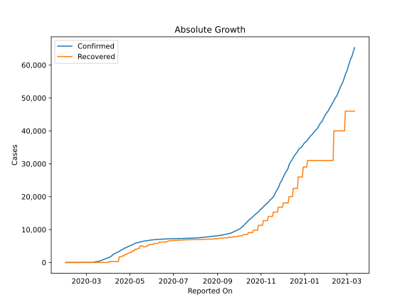
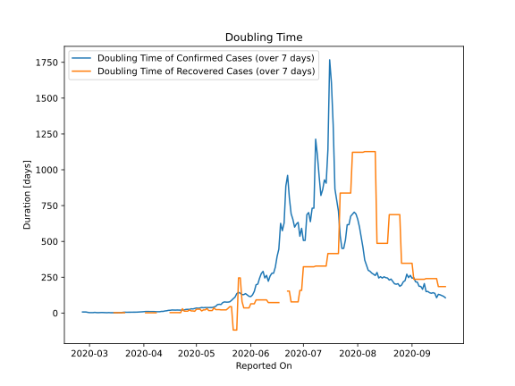

# Country Figures: Doubling Time of Infections for Finland 

The doubling time below are calculated based on
* an exponential growth assumption
* for time difference of past seven (7) days.
The doubling time's unit is "days".

The first doubling time indicates the increase of confirmed (infected)
cases. There, the *higher* the number is, the better is to take control
of the disease.

The second doubling time indicates the increase of recovered (healed)
cases. There, the *lower* the number is, the better it is to take
control of the disease.

| Reported On | Confirmed | Doubling Time (Confirmed) | Recovered | Doubling Time (Recovered) |
|-------------|-----------|---------------------------|-----------|---------------------------|
| 2020-04-15 | 3237 |  18.8 days  | 300 |  None  | 
| 2020-04-14 | 3161 |  15.8 days  | 300 |  None  | 
| 2020-04-13 | 3064 |  14.5 days  | 300 |  None  | 
| 2020-04-12 | 2974 |  11.5 days  | 300 |  None  | 
| 2020-04-11 | 2905 |  11.5 days  | 300 |  None  | 
| 2020-04-10 | 2769 |  9.3 days  | 300 |  None  | 
| 2020-04-09 | 2605 |  9.3 days  | 300 |  None  | 
| 2020-04-08 | 2487 |  9.3 days  | 300 |  1.8 days  | 
| 2020-04-07 | 2308 |  10.3 days  | 300 |  1.8 days  | 
| 2020-04-06 | 2176 |  10.5 days  | 300 |  1.8 days  | 
| 2020-04-05 | 1927 |  11.3 days  | 300 |  1.8 days  | 
| 2020-04-04 | 1882 |  10.5 days  | 300 |  1.8 days  | 
| 2020-04-03 | 1615 |  11.4 days  | 300 |  1.8 days  | 
| 2020-04-02 | 1518 |  10.9 days  | 300 |  1.8 days  | 
| 2020-04-01 | 1446 |  10.1 days  | 10 |  None  | 
| 2020-03-31 | 1418 |  8.7 days  | 10 |  None  | 
| 2020-03-30 | 1352 |  7.7 days  | 10 |  None  | 
| 2020-03-29 | 1240 |  7.4 days  | 10 |  None  | 
| 2020-03-28 | 1167 |  6.4 days  | 10 |  None  | 
| 2020-03-27 | 1041 |  6.1 days  | 10 |  None  | 
| 2020-03-26 | 958 |  5.9 days  | 10 |  None  | 
| 2020-03-25 | 880 |  5.4 days  | 10 |  None  | 
| 2020-03-24 | 792 |  5.7 days  | 10 |  None  | 
| 2020-03-23 | 700 |  5.6 days  | 10 |  None  | 
| 2020-03-22 | 626 |  5.5 days  | 10 |  None  | 
| 2020-03-21 | 523 |  6.1 days  | 10 |  2.4 days  | 
| 2020-03-20 | 450 |  4.9 days  | 10 |  2.4 days  | 
| 2020-03-19 | 400 |  2.9 days  | 10 |  2.4 days  | 
| 2020-03-18 | 336 |  3.1 days  | 10 |  2.4 days  | 
| 2020-03-17 | 321 |  2.7 days  | 10 |  2.4 days  | 
| 2020-03-16 | 277 |  2.5 days  | 10 |  2.4 days  | 
| 2020-03-15 | 244 |  2.4 days  | 10 |  2.4 days  | 
| 2020-03-14 | 225 |  2.1 days  | 1 |  None  | 
| 2020-03-13 | 155 |  2.4 days  | 1 |  None  | 
| 2020-03-12 | 59 |  3.4 days  | 1 |  None  | 
| 2020-03-11 | 59 |  2.5 days  | 1 |  None  | 
| 2020-03-10 | 40 |  2.9 days  | 1 |  None  | 
| 2020-03-09 | 30 |  3.3 days  | 1 |  None  | 
| 2020-03-08 | 23 |  3.9 days  | 1 |  None  | 
| 2020-03-07 | 15 |  3.3 days  | 1 |  None  | 
| 2020-03-06 | 15 |  2.7 days  | 1 |  None  | 
| 2020-03-05 | 12 |  3.0 days  | 1 |  None  | 
| 2020-03-04 | 6 |  4.8 days  | 1 |  None  | 
| 2020-03-03 | 6 |  3.0 days  | 1 |  None  | 
| 2020-03-02 | 6 |  3.0 days  | 1 |  None  | 
| 2020-03-01 | 6 |  3.0 days  | 1 |  None  | 
| 2020-02-29 | 3 |  4.8 days  | 1 |  None  | 
| 2020-02-28 | 2 |  7.3 days  | 1 |  None  | 
| 2020-02-27 | 2 |  7.3 days  | 1 |  None  | 
| 2020-02-26 | 2 |  7.3 days  | 1 |  None  | 
| 2020-02-11 | 1 |  None  | 0 |  None  | 
| 2020-02-10 | 1 |  None  | 0 |  None  | 
| 2020-02-09 | 1 |  None  | 0 |  None  | 
| 2020-02-08 | 1 |  None  | 0 |  None  | 
| 2020-02-07 | 1 |  None  | 0 |  None  | 
| 2020-02-06 | 1 |  None  | 0 |  None  | 
| 2020-02-05 | 1 |  None  | 0 |  None  | 
| 2020-02-04 | 1 |  None  | 0 |  None  | 
| 2020-02-03 | 1 |  None  | 0 |  None  | 
| 2020-02-02 | 1 |  None  | 0 |  None  | 
| 2020-02-01 | 1 |  None  | 0 |  None  | 

