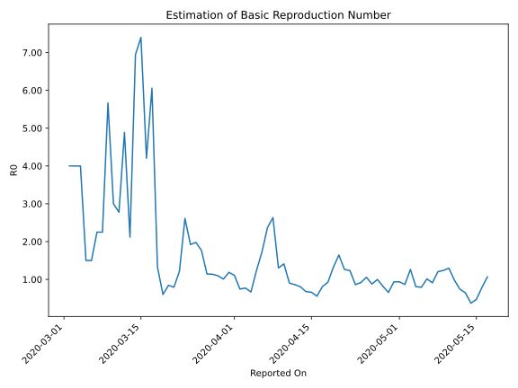

# Country Figures: Time Series for Basic Reproduction Number of Finland 

| Reported On | &Delta; Confirmed | Total &Delta; Confirmed First Interval | Total &Delta; Confirmed Second Interval | Estimated Basic Reproduction Number R0 | 
|-------------|-------------------|----------------------------------------|-----------------------------------------|---------------------------------------------------|
| 2020-05-04 | 73 |  348  |  431  |  0.81  | 
| 2020-05-03 | 78 |  436  |  345  |  1.26  | 
| 2020-05-02 | 125 |  356  |  411  |  0.87  | 
| 2020-05-01 | 56 |  419  |  447  |  0.94  | 
| 2020-04-30 | 89 |  431  |  461  |  0.93  | 
| 2020-04-29 | 166 |  345  |  527  |  0.65  | 
| 2020-04-28 | 45 |  411  |  501  |  0.82  | 
| 2020-04-27 | 119 |  447  |  448  |  1.00  | 
| 2020-04-26 | 101 |  461  |  525  |  0.88  | 
| 2020-04-25 | 80 |  527  |  499  |  1.06  | 
| 2020-04-24 | 111 |  501  |  546  |  0.92  | 
| 2020-04-23 | 155 |  448  |  520  |  0.86  | 
| 2020-04-22 | 115 |  525  |  425  |  1.24  | 
| 2020-04-21 | 146 |  499  |  395  |  1.26  | 
| 2020-04-20 | 85 |  546  |  332  |  1.64  | 
| 2020-04-19 | 102 |  520  |  392  |  1.33  | 
| 2020-04-18 | 192 |  425  |  459  |  0.93  | 
| 2020-04-17 | 120 |  395  |  487  |  0.81  | 
| 2020-04-16 | 132 |  332  |  597  |  0.56  | 
| 2020-04-15 | 76 |  392  |  593  |  0.66  | 
| 2020-04-14 | 97 |  459  |  678  |  0.68  | 
| 2020-04-13 | 90 |  487  |  605  |  0.80  | 
| 2020-04-12 | 69 |  597  |  693  |  0.86  | 
| 2020-04-11 | 136 |  593  |  658  |  0.90  | 
| 2020-04-10 | 164 |  678  |  481  |  1.41  | 
| 2020-04-09 | 118 |  605  |  464  |  1.30  | 
| 2020-04-08 | 179 |  693  |  263  |  2.63  | 
| 2020-04-07 | 132 |  658  |  278  |  2.37  | 
| 2020-04-06 | 249 |  481  |  279  |  1.72  | 
| 2020-04-05 | 45 |  464  |  377  |  1.23  | 
| 2020-04-04 | 267 |  263  |  394  |  0.67  | 
| 2020-04-03 | 97 |  278  |  360  |  0.77  | 
| 2020-04-02 | 72 |  279  |  375  |  0.74  | 
| 2020-04-01 | 28 |  377  |  341  |  1.11  | 
| 2020-03-31 | 66 |  394  |  332  |  1.19  | 
| 2020-03-30 | 112 |  360  |  357  |  1.01  | 
| 2020-03-29 | 73 |  375  |  342  |  1.10  | 
| 2020-03-28 | 126 |  341  |  300  |  1.14  | 
| 2020-03-27 | 83 |  332  |  290  |  1.14  | 
| 2020-03-26 | 78 |  357  |  202  |  1.77  | 
| 2020-03-25 | 88 |  342  |  173  |  1.98  | 
| 2020-03-24 | 92 |  300  |  156  |  1.92  | 
| 2020-03-23 | 74 |  290  |  111  |  2.61  | 
| 2020-03-22 | 103 |  202  |  166  |  1.22  | 
| 2020-03-21 | 73 |  173  |  218  |  0.79  | 
| 2020-03-20 | 50 |  156  |  185  |  0.84  | 
| 2020-03-19 | 64 |  111  |  185  |  0.60  | 
| 2020-03-18 | 15 |  166  |  125  |  1.33  | 
| 2020-03-17 | 44 |  218  |  36  |  6.06  | 
| 2020-03-16 | 33 |  185  |  44  |  4.20  | 
| 2020-03-15 | 19 |  185  |  25  |  7.40  | 
| 2020-03-14 | 70 |  125  |  18  |  6.94  | 
| 2020-03-13 | 96 |  36  |  17  |  2.12  | 
| 2020-03-12 | 0 |  44  |  9  |  4.89  | 
| 2020-03-11 | 19 |  25  |  9  |  2.78  | 
| 2020-03-10 | 10 |  18  |  6  |  3.00  | 
| 2020-03-09 | 7 |  17  |  3  |  5.67  | 
| 2020-03-08 | 8 |  9  |  4  |  2.25  | 
| 2020-03-07 | 0 |  9  |  4  |  2.25  | 
| 2020-03-06 | 3 |  6  |  4  |  1.50  | 
| 2020-03-05 | 6 |  3  |  2  |  1.50  | 
| 2020-03-04 | 0 |  4  |  1  |  4.00  | 
| 2020-03-03 | 0 |  4  |  1  |  4.00  | 
| 2020-03-02 | 0 |  4  |  1  |  4.00  | 
| 2020-03-01 | 3 |  2  |  None  |  None  | 
| 2020-02-29 | 1 |  1  |  None  |  None  | 
| 2020-02-28 | 0 |  1  |  None  |  None  | 
| 2020-02-27 | 0 |  1  |  None  |  None  | 
| 2020-02-26 | 1 |  None  |  None  |  None  | 
| 2020-02-25 | 0 |  None  |  None  |  None  | 
| 2020-02-24 | 0 |  None  |  None  |  None  | 
| 2020-02-23 | 0 |  None  |  None  |  None  | 
| 2020-02-22 | 0 |  None  |  None  |  None  | 
| 2020-02-21 | 0 |  None  |  None  |  None  | 
| 2020-02-20 | 0 |  None  |  None  |  None  | 
| 2020-02-19 | 0 |  None  |  None  |  None  | 
| 2020-02-18 | 0 |  None  |  None  |  None  | 
| 2020-02-17 | 0 |  None  |  None  |  None  | 
| 2020-02-16 | 0 |  None  |  None  |  None  | 
| 2020-02-15 | 0 |  None  |  None  |  None  | 
| 2020-02-14 | 0 |  None  |  None  |  None  | 
| 2020-02-13 | 0 |  None  |  None  |  None  | 
| 2020-02-12 | 0 |  None  |  None  |  None  | 
| 2020-02-11 | 0 |  None  |  None  |  None  | 
| 2020-02-10 | 0 |  None  |  None  |  None  | 
| 2020-02-09 | 0 |  None  |  None  |  None  | 
| 2020-02-08 | 0 |  None  |  None  |  None  | 
| 2020-02-07 | 0 |  None  |  None  |  None  | 
| 2020-02-06 | 0 |  None  |  None  |  None  | 
| 2020-02-05 | 0 |  None  |  None  |  None  | 
| 2020-02-04 | 0 |  None  |  None  |  None  | 
| 2020-02-03 | 0 |  None  |  None  |  None  | 
| 2020-02-02 | 0 |  None  |  None  |  None  | 
| 2020-02-01 | 0 |  None  |  None  |  None  | 
| 2020-01-31 | 0 |  None  |  None  |  None  | 
| 2020-01-30 | 0 |  None  |  None  |  None  | 
| 2020-01-29 | None |  None  |  None  |  None  | 

