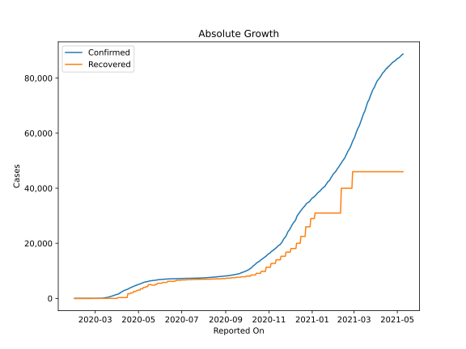
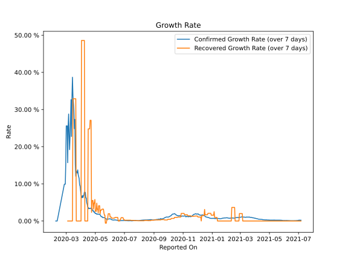

# Country Figures: Growth Rate for Finland 

The growth rates below are calculated based on
* an exponential growth assumption
* for time difference of past seven (7) days.
The growth rate is to be understood as on "growth per day".

The first growth rate indicates the increase of confirmed (infected) cases.

The second growth rate indicates the increase of recovered (healed) cases.

| Reported On | Confirmed | Growth Rate (Confirmed) | Recovered | Growth Rate (Recovered) |
|-------------|-----------|-------------------------|-----------|-------------------------|
| 2020-04-18 | 3681 |  3.38 %  | 1700 |  24.780 %  | 
| 2020-04-17 | 3489 |  3.30 %  | 1700 |  24.780 %  | 
| 2020-04-16 | 3369 |  3.67 %  | 1700 |  24.780 %  | 
| 2020-04-15 | 3237 |  3.77 %  | 300 |  None  | 
| 2020-04-14 | 3161 |  4.49 %  | 300 |  None  | 
| 2020-04-13 | 3064 |  4.89 %  | 300 |  None  | 
| 2020-04-12 | 2974 |  6.20 %  | 300 |  None  | 
| 2020-04-11 | 2905 |  6.20 %  | 300 |  None  | 
| 2020-04-10 | 2769 |  7.70 %  | 300 |  None  | 
| 2020-04-09 | 2605 |  7.71 %  | 300 |  None  | 
| 2020-04-08 | 2487 |  7.75 %  | 300 |  48.589 %  | 
| 2020-04-07 | 2308 |  6.96 %  | 300 |  48.589 %  | 
| 2020-04-06 | 2176 |  6.80 %  | 300 |  48.589 %  | 
| 2020-04-05 | 1927 |  6.30 %  | 300 |  48.589 %  | 
| 2020-04-04 | 1882 |  6.83 %  | 300 |  48.589 %  | 
| 2020-04-03 | 1615 |  6.27 %  | 300 |  48.589 %  | 
| 2020-04-02 | 1518 |  6.58 %  | 300 |  48.589 %  | 
| 2020-04-01 | 1446 |  7.09 %  | 10 |  None  | 
| 2020-03-31 | 1418 |  8.32 %  | 10 |  None  | 
| 2020-03-30 | 1352 |  9.40 %  | 10 |  None  | 
| 2020-03-29 | 1240 |  9.76 %  | 10 |  None  | 
| 2020-03-28 | 1167 |  11.47 %  | 10 |  None  | 
| 2020-03-27 | 1041 |  11.98 %  | 10 |  None  | 
| 2020-03-26 | 958 |  12.48 %  | 10 |  None  | 
| 2020-03-25 | 880 |  13.75 %  | 10 |  None  | 
| 2020-03-24 | 792 |  12.90 %  | 10 |  None  | 
| 2020-03-23 | 700 |  13.24 %  | 10 |  None  | 
| 2020-03-22 | 626 |  13.46 %  | 10 |  None  | 
| 2020-03-21 | 523 |  12.05 %  | 10 |  32.894 %  | 
| 2020-03-20 | 450 |  15.23 %  | 10 |  32.894 %  | 
| 2020-03-19 | 400 |  27.34 %  | 10 |  32.894 %  | 
| 2020-03-18 | 336 |  24.85 %  | 10 |  32.894 %  | 
| 2020-03-17 | 321 |  29.75 %  | 10 |  32.894 %  | 
| 2020-03-16 | 277 |  31.75 %  | 10 |  32.894 %  | 
| 2020-03-15 | 244 |  33.74 %  | 10 |  32.894 %  | 
| 2020-03-14 | 225 |  38.69 %  | 1 |  None  | 
| 2020-03-13 | 155 |  33.36 %  | 1 |  None  | 
| 2020-03-12 | 59 |  22.75 %  | 1 |  None  | 
| 2020-03-11 | 59 |  32.65 %  | 1 |  None  | 
| 2020-03-10 | 40 |  27.10 %  | 1 |  None  | 
| 2020-03-09 | 30 |  22.99 %  | 1 |  None  | 
| 2020-03-08 | 23 |  19.20 %  | 1 |  None  | 
| 2020-03-07 | 15 |  22.99 %  | 1 |  None  | 
| 2020-03-06 | 15 |  28.78 %  | 1 |  None  | 
| 2020-03-05 | 12 |  25.60 %  | 1 |  None  | 
| 2020-03-04 | 6 |  15.69 %  | 1 |  None  | 
| 2020-03-03 | 6 |  25.60 %  | 1 |  None  | 
| 2020-03-02 | 6 |  25.60 %  | 1 |  None  | 
| 2020-03-01 | 6 |  25.60 %  | 1 |  None  | 
| 2020-02-29 | 3 |  15.69 %  | 1 |  None  | 
| 2020-02-28 | 2 |  9.90 %  | 1 |  None  | 
| 2020-02-27 | 2 |  9.90 %  | 1 |  None  | 
| 2020-02-26 | 2 |  9.90 %  | 1 |  None  | 
| 2020-02-11 | 1 |  None  | 0 |  None  | 
| 2020-02-10 | 1 |  None  | 0 |  None  | 
| 2020-02-09 | 1 |  None  | 0 |  None  | 
| 2020-02-08 | 1 |  None  | 0 |  None  | 
| 2020-02-07 | 1 |  None  | 0 |  None  | 
| 2020-02-06 | 1 |  None  | 0 |  None  | 
| 2020-02-05 | 1 |  None  | 0 |  None  | 
| 2020-02-04 | 1 |  None  | 0 |  None  | 
| 2020-02-03 | 1 |  None  | 0 |  None  | 
| 2020-02-02 | 1 |  None  | 0 |  None  | 
| 2020-02-01 | 1 |  None  | 0 |  None  | 

