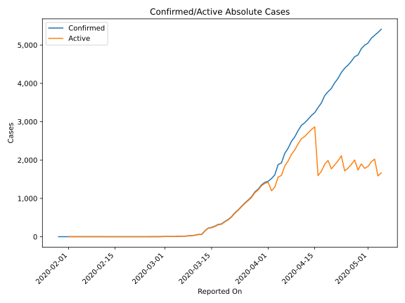
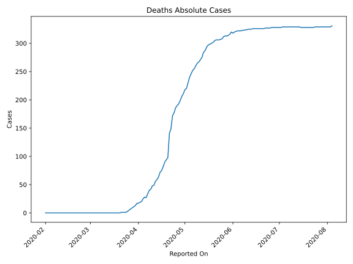
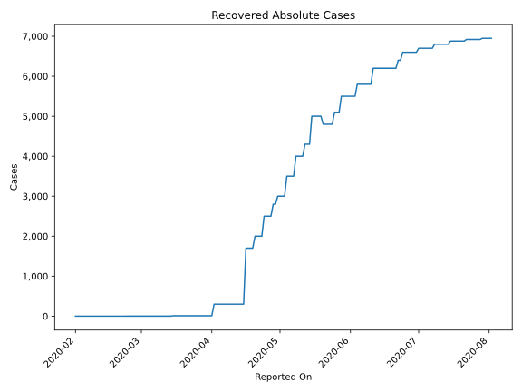
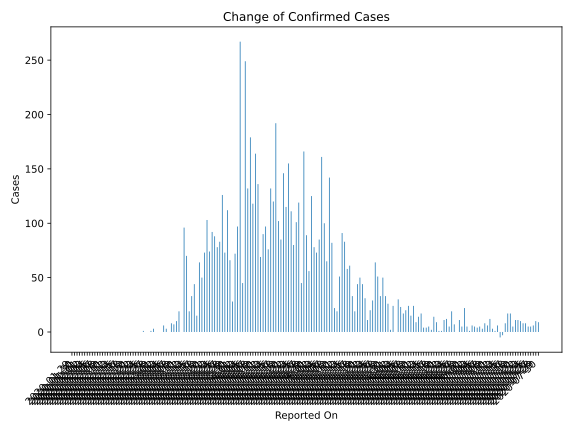
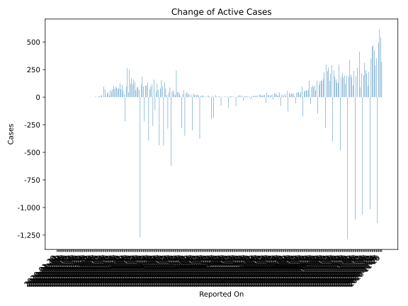
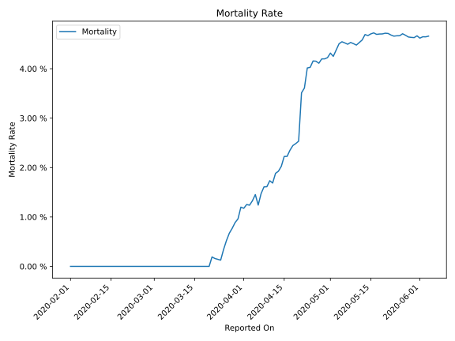

# Country Figures: Time Series for Finland 

| Reported On | Confirmed | Deaths | Recovered | Active | Mortality | &Delta; Confirmed | &Delta; Deaths | &Delta; Recovered | &Delta; Active | % Active of Population |
|-------------|-----------|--------|-----------|--------|-----------|-------------------|----------------|-------------------|----------------|------------------------|
| 2020-04-12 | 2974 | 56 | 300 | 2618 |  1.88 %  | 69 | 7 | 0 | 62 |  0.047 %  | 
| 2020-04-11 | 2905 | 49 | 300 | 2556 |  1.69 %  | 136 | 1 | 0 | 135 |  0.046 %  | 
| 2020-04-10 | 2769 | 48 | 300 | 2421 |  1.73 %  | 164 | 6 | 0 | 158 |  0.044 %  | 
| 2020-04-09 | 2605 | 42 | 300 | 2263 |  1.61 %  | 118 | 2 | 0 | 116 |  0.041 %  | 
| 2020-04-08 | 2487 | 40 | 300 | 2147 |  1.61 %  | 179 | 6 | 0 | 173 |  0.039 %  | 
| 2020-04-07 | 2308 | 34 | 300 | 1974 |  1.47 %  | 132 | 7 | 0 | 125 |  0.036 %  | 
| 2020-04-06 | 2176 | 27 | 300 | 1849 |  1.24 %  | 249 | -1 | 0 | 250 |  0.034 %  | 
| 2020-04-05 | 1927 | 28 | 300 | 1599 |  1.45 %  | 45 | 3 | 0 | 42 |  0.029 %  | 
| 2020-04-04 | 1882 | 25 | 300 | 1557 |  1.33 %  | 267 | 5 | 0 | 262 |  0.028 %  | 
| 2020-04-03 | 1615 | 20 | 300 | 1295 |  1.24 %  | 97 | 1 | 0 | 96 |  0.023 %  | 
| 2020-04-02 | 1518 | 19 | 300 | 1199 |  1.25 %  | 72 | 2 | 290 | -220 |  0.022 %  | 
| 2020-04-01 | 1446 | 17 | 10 | 1419 |  1.18 %  | 28 | 0 | 0 | 28 |  0.026 %  | 
| 2020-03-31 | 1418 | 17 | 10 | 1391 |  1.20 %  | 66 | 4 | 0 | 62 |  0.025 %  | 
| 2020-03-30 | 1352 | 13 | 10 | 1329 |  0.96 %  | 112 | 2 | 0 | 110 |  0.024 %  | 
| 2020-03-29 | 1240 | 11 | 10 | 1219 |  0.89 %  | 73 | 2 | 0 | 71 |  0.022 %  | 
| 2020-03-28 | 1167 | 9 | 10 | 1148 |  0.77 %  | 126 | 2 | 0 | 124 |  0.021 %  | 
| 2020-03-27 | 1041 | 7 | 10 | 1024 |  0.67 %  | 83 | 2 | 0 | 81 |  0.019 %  | 
| 2020-03-26 | 958 | 5 | 10 | 943 |  0.52 %  | 78 | 2 | 0 | 76 |  0.017 %  | 
| 2020-03-25 | 880 | 3 | 10 | 867 |  0.34 %  | 88 | 2 | 0 | 86 |  0.016 %  | 
| 2020-03-24 | 792 | 1 | 10 | 781 |  0.13 %  | 92 | 0 | 0 | 92 |  0.014 %  | 
| 2020-03-23 | 700 | 1 | 10 | 689 |  0.14 %  | 74 | 0 | 0 | 74 |  0.012 %  | 
| 2020-03-22 | 626 | 1 | 10 | 615 |  0.16 %  | 103 | 0 | 0 | 103 |  0.011 %  | 
| 2020-03-21 | 523 | 1 | 10 | 512 |  0.19 %  | 73 | 1 | 0 | 72 |  0.009 %  | 
| 2020-03-20 | 450 | 0 | 10 | 440 |  None  | 50 | 0 | 0 | 50 |  0.008 %  | 
| 2020-03-19 | 400 | 0 | 10 | 390 |  None  | 64 | 0 | 0 | 64 |  0.007 %  | 
| 2020-03-18 | 336 | 0 | 10 | 326 |  None  | 15 | 0 | 0 | 15 |  0.006 %  | 
| 2020-03-17 | 321 | 0 | 10 | 311 |  None  | 44 | 0 | 0 | 44 |  0.006 %  | 
| 2020-03-16 | 277 | 0 | 10 | 267 |  None  | 33 | 0 | 0 | 33 |  0.005 %  | 
| 2020-03-15 | 244 | 0 | 10 | 234 |  None  | 19 | 0 | 9 | 10 |  0.004 %  | 
| 2020-03-14 | 225 | 0 | 1 | 224 |  None  | 70 | 0 | 0 | 70 |  0.004 %  | 
| 2020-03-13 | 155 | 0 | 1 | 154 |  None  | 96 | 0 | 0 | 96 |  0.003 %  | 
| 2020-03-12 | 59 | 0 | 1 | 58 |  None  | 0 | 0 | 0 | 0 |  0.001 %  | 
| 2020-03-11 | 59 | 0 | 1 | 58 |  None  | 19 | 0 | 0 | 19 |  0.001 %  | 
| 2020-03-10 | 40 | 0 | 1 | 39 |  None  | 10 | 0 | 0 | 10 |  0.001 %  | 
| 2020-03-09 | 30 | 0 | 1 | 29 |  None  | 7 | 0 | 0 | 7 |  0.001 %  | 
| 2020-03-08 | 23 | 0 | 1 | 22 |  None  | 8 | 0 | 0 | 8 |  0.000 %  | 
| 2020-03-07 | 15 | 0 | 1 | 14 |  None  | 0 | 0 | 0 | 0 |  0.000 %  | 
| 2020-03-06 | 15 | 0 | 1 | 14 |  None  | 3 | 0 | 0 | 3 |  0.000 %  | 
| 2020-03-05 | 12 | 0 | 1 | 11 |  None  | 6 | 0 | 0 | 6 |  0.000 %  | 
| 2020-03-04 | 6 | 0 | 1 | 5 |  None  | 0 | 0 | 0 | 0 |  0.000 %  | 
| 2020-03-03 | 6 | 0 | 1 | 5 |  None  | 0 | 0 | 0 | 0 |  0.000 %  | 
| 2020-03-02 | 6 | 0 | 1 | 5 |  None  | 0 | 0 | 0 | 0 |  0.000 %  | 
| 2020-03-01 | 6 | 0 | 1 | 5 |  None  | 3 | 0 | 0 | 3 |  0.000 %  | 
| 2020-02-29 | 3 | 0 | 1 | 2 |  None  | 1 | 0 | 0 | 1 |  0.000 %  | 
| 2020-02-28 | 2 | 0 | 1 | 1 |  None  | 0 | 0 | 0 | 0 |  0.000 %  | 
| 2020-02-27 | 2 | 0 | 1 | 1 |  None  | 0 | 0 | 0 | 0 |  0.000 %  | 
| 2020-02-26 | 2 | 0 | 1 | 1 |  None  | 1 | 0 | 0 | 1 |  0.000 %  | 
| 2020-02-25 | 1 | 0 | 1 | 0 |  None  | 0 | 0 | 0 | 0 |  n/a  | 
| 2020-02-24 | 1 | 0 | 1 | 0 |  None  | 0 | 0 | 0 | 0 |  n/a  | 
| 2020-02-23 | 1 | 0 | 1 | 0 |  None  | 0 | 0 | 0 | 0 |  n/a  | 
| 2020-02-22 | 1 | 0 | 1 | 0 |  None  | 0 | 0 | 0 | 0 |  n/a  | 
| 2020-02-21 | 1 | 0 | 1 | 0 |  None  | 0 | 0 | 0 | 0 |  n/a  | 
| 2020-02-20 | 1 | 0 | 1 | 0 |  None  | 0 | 0 | 0 | 0 |  n/a  | 
| 2020-02-19 | 1 | 0 | 1 | 0 |  None  | 0 | 0 | 0 | 0 |  n/a  | 
| 2020-02-18 | 1 | 0 | 1 | 0 |  None  | 0 | 0 | 0 | 0 |  n/a  | 
| 2020-02-17 | 1 | 0 | 1 | 0 |  None  | 0 | 0 | 0 | 0 |  n/a  | 
| 2020-02-16 | 1 | 0 | 1 | 0 |  None  | 0 | 0 | 0 | 0 |  n/a  | 
| 2020-02-15 | 1 | 0 | 1 | 0 |  None  | 0 | 0 | 0 | 0 |  n/a  | 
| 2020-02-14 | 1 | 0 | 1 | 0 |  None  | 0 | 0 | 0 | 0 |  n/a  | 
| 2020-02-13 | 1 | 0 | 1 | 0 |  None  | 0 | 0 | 0 | 0 |  n/a  | 
| 2020-02-12 | 1 | 0 | 1 | 0 |  None  | 0 | 0 | 1 | -1 |  n/a  | 
| 2020-02-11 | 1 | 0 | 0 | 1 |  None  | 0 | 0 | 0 | 0 |  0.000 %  | 
| 2020-02-10 | 1 | 0 | 0 | 1 |  None  | 0 | 0 | 0 | 0 |  0.000 %  | 
| 2020-02-09 | 1 | 0 | 0 | 1 |  None  | 0 | 0 | 0 | 0 |  0.000 %  | 
| 2020-02-08 | 1 | 0 | 0 | 1 |  None  | 0 | 0 | 0 | 0 |  0.000 %  | 
| 2020-02-07 | 1 | 0 | 0 | 1 |  None  | 0 | 0 | 0 | 0 |  0.000 %  | 
| 2020-02-06 | 1 | 0 | 0 | 1 |  None  | 0 | 0 | 0 | 0 |  0.000 %  | 
| 2020-02-05 | 1 | 0 | 0 | 1 |  None  | 0 | 0 | 0 | 0 |  0.000 %  | 
| 2020-02-04 | 1 | 0 | 0 | 1 |  None  | 0 | 0 | 0 | 0 |  0.000 %  | 
| 2020-02-03 | 1 | 0 | 0 | 1 |  None  | 0 | 0 | 0 | 0 |  0.000 %  | 
| 2020-02-02 | 1 | 0 | 0 | 1 |  None  | 0 | 0 | 0 | 0 |  0.000 %  | 
| 2020-02-01 | 1 | 0 | 0 | 1 |  None  | 0 | None | None | None |  0.000 %  | 
| 2020-01-31 | 1 | None | None | None |  None  | 0 | None | None | None |  n/a  | 
| 2020-01-30 | 1 | None | None | None |  None  | 0 | None | None | None |  n/a  | 
| 2020-01-29 | 1 | None | None | None |  None  | None | None | None | None |  n/a  | 

