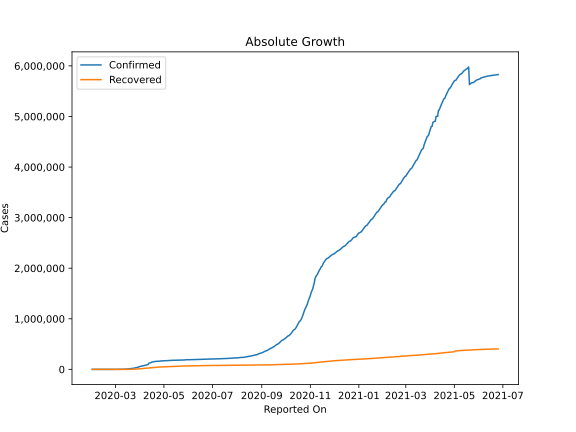
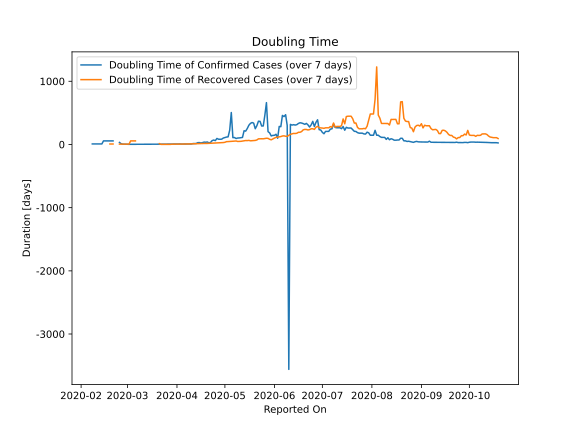

# Country Figures: Doubling Time of Infections for France 

The doubling time below are calculated based on
* an exponential growth assumption
* for time difference of past seven (7) days.
The doubling time's unit is "days".

The first growth rate indicates the increase of confirmed (infected) cases.

The second growth rate indicates the increase of recovered (healed) cases.

| Reported On | Confirmed | Doubling Time (Confirmed) | Recovered | Doubling Time (Recovered) |
|-------------|-----------|---------------------------|-----------|---------------------------|
| 2020-04-03 | 65202 |  7.6 days  | 14135 |  5.7 days  | 
| 2020-04-02 | 59929 |  7.2 days  | 12548 |  5.6 days  | 
| 2020-04-01 | 57749 |  6.3 days  | 11053 |  5.0 days  | 
| 2020-03-31 | 52827 |  6.1 days  | 9513 |  4.9 days  | 
| 2020-03-30 | 45170 |  6.3 days  | 7964 |  4.1 days  | 
| 2020-03-29 | 40708 |  5.6 days  | 7226 |  4.4 days  | 
| 2020-03-28 | 38105 |  5.3 days  | 5724 |  1.2 days  | 
| 2020-03-27 | 33402 |  5.4 days  | 5707 |  1.1 days  | 
| 2020-03-26 | 29551 |  5.2 days  | 4955 |  1.1 days  | 
| 2020-03-25 | 25600 |  5.0 days  | 3907 |  1.2 days  | 
| 2020-03-24 | 22622 |  4.8 days  | 3288 |  1.2 days  | 
| 2020-03-23 | 20123 |  4.7 days  | 2207 |  1.2 days  | 
| 2020-03-22 | 16214 |  4.1 days  | 2201 |  1.2 days  | 
| 2020-03-21 | 14456 |  4.5 days  | 18 |  12.3 days  | 
| 2020-03-20 | 12752 |  4.2 days  | 12 |  None  | 
| 2020-03-19 | 10967 |  3.4 days  | 12 |  None  | 
| 2020-03-18 | 9121 |  3.9 days  | 12 |  None  | 
| 2020-03-17 | 7715 |  3.7 days  | 12 |  None  | 
| 2020-03-16 | 6683 |  3.2 days  | 12 |  None  | 
| 2020-03-15 | 4525 |  3.8 days  | 12 |  None  | 
| 2020-03-14 | 4501 |  3.5 days  | 12 |  None  | 
| 2020-03-13 | 3681 |  3.1 days  | 12 |  None  | 
| 2020-03-12 | 2293 |  3.0 days  | 12 |  None  | 
| 2020-03-11 | 2293 |  2.7 days  | 12 |  None  | 
| 2020-03-10 | 1792 |  2.6 days  | 12 |  None  | 
| 2020-03-09 | 1217 |  3.0 days  | 12 |  None  | 
| 2020-03-08 | 1136 |  2.6 days  | 12 |  None  | 
| 2020-03-07 | 959 |  2.5 days  | 12 |  None  | 
| 2020-03-06 | 656 |  2.3 days  | 12 |  56.1 days  | 
| 2020-03-05 | 380 |  2.4 days  | 12 |  56.1 days  | 
| 2020-03-04 | 288 |  2.1 days  | 12 |  56.1 days  | 
| 2020-03-03 | 204 |  2.1 days  | 12 |  56.1 days  | 
| 2020-03-02 | 191 |  2.1 days  | 12 |  4.8 days  | 
| 2020-03-01 | 130 |  2.4 days  | 12 |  4.8 days  | 
| 2020-02-29 | 100 |  2.6 days  | 12 |  4.8 days  | 
| 2020-02-28 | 57 |  3.4 days  | 11 |  5.1 days  | 
| 2020-02-27 | 38 |  4.5 days  | 11 |  5.1 days  | 
| 2020-02-26 | 18 |  12.3 days  | 11 |  5.1 days  | 
| 2020-02-25 | 14 |  31.8 days  | 11 |  5.1 days  | 
| 2020-02-24 | 12 |  None  | 4 |  None  | 
| 2020-02-23 | 12 |  None  | 4 |  None  | 
| 2020-02-22 | 12 |  None  | 4 |  None  | 
| 2020-02-21 | 12 |  56.1 days  | 4 |  7.3 days  | 
| 2020-02-20 | 12 |  56.1 days  | 4 |  7.3 days  | 
| 2020-02-19 | 12 |  56.1 days  | 4 |  7.3 days  | 
| 2020-02-18 | 12 |  56.1 days  | 4 |  None  | 
| 2020-02-17 | 12 |  56.1 days  | 4 |  None  | 
| 2020-02-16 | 12 |  56.1 days  | 4 |  None  | 
| 2020-02-15 | 12 |  56.1 days  | 4 |  None  | 
| 2020-02-14 | 11 |  8.3 days  | 2 |  None  | 
| 2020-02-13 | 11 |  8.3 days  | 2 |  None  | 
| 2020-02-12 | 11 |  8.3 days  | 2 |  None  | 
| 2020-02-11 | 11 |  8.3 days  | 0 |  None  | 
| 2020-02-10 | 11 |  8.3 days  | 0 |  None  | 
| 2020-02-09 | 11 |  8.3 days  | 0 |  None  | 
| 2020-02-08 | 11 |  8.3 days  | 0 |  None  | 
| 2020-02-07 | 6 |  None  | 0 |  None  | 
| 2020-02-06 | 6 |  None  | 0 |  None  | 
| 2020-02-05 | 6 |  None  | 0 |  None  | 
| 2020-02-04 | 6 |  None  | 0 |  None  | 
| 2020-02-03 | 6 |  None  | 0 |  None  | 
| 2020-02-02 | 6 |  None  | 0 |  None  | 
| 2020-02-01 | 6 |  None  | 0 |  None  | 

