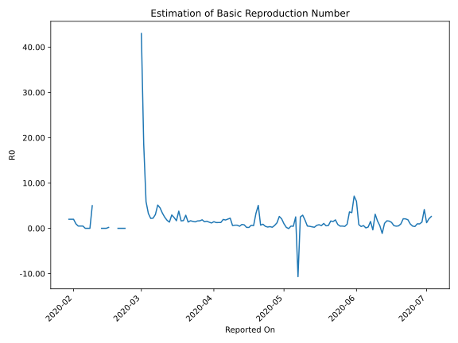

# Country Figures: Time Series for Basic Reproduction Number of France 

| Reported On | &Delta; Confirmed | Total &Delta; Confirmed First Interval | Total &Delta; Confirmed Second Interval | Estimated Basic Reproduction Number R0 | 
|-------------|-------------------|----------------------------------------|-----------------------------------------|---------------------------------------------------|
| 2020-04-30 | 756 |  4899  |  2347  |  2.09  | 
| 2020-04-29 | -2510 |  9101  |  3472  |  2.62  | 
| 2020-04-28 | 3090 |  6503  |  5363  |  1.21  | 
| 2020-04-27 | 3743 |  5095  |  7976  |  0.64  | 
| 2020-04-26 | 576 |  2347  |  10167  |  0.23  | 
| 2020-04-25 | 1692 |  3472  |  9389  |  0.37  | 
| 2020-04-24 | 492 |  5363  |  19515  |  0.27  | 
| 2020-04-23 | 2335 |  7976  |  17788  |  0.45  | 
| 2020-04-22 | -2172 |  10167  |  11255  |  0.90  | 
| 2020-04-21 | 2817 |  9389  |  13421  |  0.70  | 
| 2020-04-20 | 2383 |  19515  |  3855  |  5.06  | 
| 2020-04-19 | 4948 |  17788  |  5430  |  3.28  | 
| 2020-04-18 | 19 |  11255  |  19094  |  0.59  | 
| 2020-04-17 | 2039 |  13421  |  19711  |  0.68  | 
| 2020-04-16 | 12509 |  3855  |  20662  |  0.19  | 
| 2020-04-15 | 3221 |  5430  |  26968  |  0.20  | 
| 2020-04-14 | -6514 |  19094  |  25008  |  0.76  | 
| 2020-04-13 | 4205 |  19711  |  23111  |  0.85  | 
| 2020-04-12 | 2943 |  20662  |  44863  |  0.46  | 
| 2020-04-11 | 4796 |  26968  |  39034  |  0.69  | 
| 2020-04-10 | 7150 |  25008  |  36024  |  0.69  | 
| 2020-04-09 | 4822 |  23111  |  38021  |  0.61  | 
| 2020-04-08 | 3894 |  44863  |  20032  |  2.24  | 
| 2020-04-07 | 11102 |  39034  |  19221  |  2.03  | 
| 2020-04-06 | 5190 |  36024  |  19644  |  1.83  | 
| 2020-04-05 | 2925 |  38021  |  19425  |  1.96  | 
| 2020-04-04 | 25646 |  20032  |  15619  |  1.28  | 
| 2020-04-03 | 5273 |  19221  |  15108  |  1.27  | 
| 2020-04-02 | 2180 |  19644  |  15483  |  1.27  | 
| 2020-04-01 | 4922 |  19425  |  13279  |  1.46  | 
| 2020-03-31 | 7657 |  15619  |  13337  |  1.17  | 
| 2020-03-30 | 4462 |  15108  |  11144  |  1.36  | 
| 2020-03-29 | 2603 |  15483  |  9870  |  1.57  | 
| 2020-03-28 | 4703 |  13279  |  9156  |  1.45  | 
| 2020-03-27 | 3851 |  13337  |  7093  |  1.88  | 
| 2020-03-26 | 3951 |  11144  |  6741  |  1.65  | 
| 2020-03-25 | 2978 |  9870  |  6069  |  1.63  | 
| 2020-03-24 | 2499 |  9156  |  6442  |  1.42  | 
| 2020-03-23 | 3909 |  7093  |  4620  |  1.54  | 
| 2020-03-22 | 1758 |  6741  |  4034  |  1.67  | 
| 2020-03-21 | 1704 |  6069  |  4390  |  1.38  | 
| 2020-03-20 | 1785 |  6442  |  2232  |  2.89  | 
| 2020-03-19 | 1846 |  4620  |  2709  |  1.71  | 
| 2020-03-18 | 1406 |  4034  |  2464  |  1.64  | 
| 2020-03-17 | 1032 |  4390  |  1157  |  3.79  | 
| 2020-03-16 | 2158 |  2232  |  1334  |  1.67  | 
| 2020-03-15 | 24 |  2709  |  1136  |  2.38  | 
| 2020-03-14 | 820 |  2464  |  837  |  2.94  | 
| 2020-03-13 | 1388 |  1157  |  848  |  1.36  | 
| 2020-03-12 | 0 |  1334  |  755  |  1.77  | 
| 2020-03-11 | 501 |  1136  |  465  |  2.44  | 
| 2020-03-10 | 575 |  837  |  250  |  3.35  | 
| 2020-03-09 | 81 |  848  |  188  |  4.51  | 
| 2020-03-08 | 177 |  755  |  147  |  5.14  | 
| 2020-03-07 | 303 |  465  |  153  |  3.04  | 
| 2020-03-06 | 276 |  250  |  112  |  2.23  | 
| 2020-03-05 | 92 |  188  |  86  |  2.19  | 
| 2020-03-04 | 84 |  147  |  45  |  3.27  | 
| 2020-03-03 | 13 |  153  |  26  |  5.88  | 
| 2020-03-02 | 61 |  112  |  6  |  18.67  | 
| 2020-03-01 | 30 |  86  |  2  |  43.00  | 
| 2020-02-29 | 43 |  45  |  None  |  None  | 
| 2020-02-28 | 19 |  26  |  None  |  None  | 
| 2020-02-27 | 20 |  6  |  None  |  None  | 
| 2020-02-26 | 4 |  2  |  None  |  None  | 
| 2020-02-25 | 2 |  None  |  None  |  None  | 
| 2020-02-24 | 0 |  None  |  None  |  None  | 
| 2020-02-23 | 0 |  None  |  1  |  None  | 
| 2020-02-22 | 0 |  None  |  1  |  None  | 
| 2020-02-21 | 0 |  None  |  1  |  None  | 
| 2020-02-20 | 0 |  None  |  1  |  None  | 
| 2020-02-19 | 0 |  1  |  None  |  None  | 
| 2020-02-18 | 0 |  1  |  None  |  None  | 
| 2020-02-17 | 0 |  1  |  None  |  None  | 
| 2020-02-16 | 0 |  1  |  5  |  0.20  | 
| 2020-02-15 | 1 |  None  |  5  |  None  | 
| 2020-02-14 | 0 |  None  |  5  |  None  | 
| 2020-02-13 | 0 |  None  |  5  |  None  | 
| 2020-02-12 | 0 |  5  |  None  |  None  | 
| 2020-02-11 | 0 |  5  |  None  |  None  | 
| 2020-02-10 | 0 |  5  |  None  |  None  | 
| 2020-02-09 | 0 |  5  |  1  |  5.00  | 
| 2020-02-08 | 5 |  None  |  1  |  None  | 
| 2020-02-07 | 0 |  None  |  1  |  None  | 
| 2020-02-06 | 0 |  None  |  2  |  None  | 
| 2020-02-05 | 0 |  1  |  2  |  0.50  | 
| 2020-02-04 | 0 |  1  |  2  |  0.50  | 
| 2020-02-03 | 0 |  1  |  2  |  0.50  | 
| 2020-02-02 | 0 |  2  |  2  |  1.00  | 
| 2020-02-01 | 1 |  2  |  1  |  2.00  | 
| 2020-01-31 | 0 |  2  |  1  |  2.00  | 
| 2020-01-30 | 0 |  2  |  1  |  2.00  | 
| 2020-01-29 | 1 |  2  |  None  |  None  | 
| 2020-01-28 | 1 |  1  |  None  |  None  | 
| 2020-01-27 | 0 |  1  |  None  |  None  | 
| 2020-01-26 | 0 |  1  |  None  |  None  | 
| 2020-01-25 | 1 |  None  |  None  |  None  | 
| 2020-01-24 | None |  None  |  None  |  None  | 

