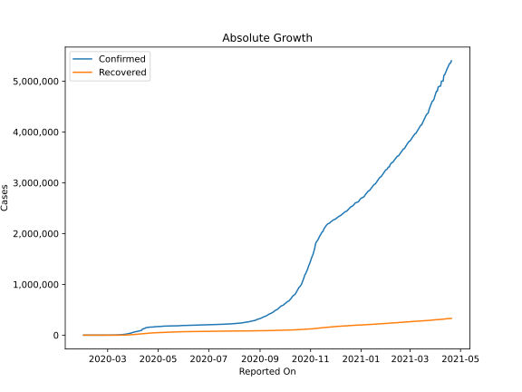
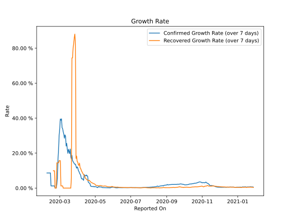

# Country Figures: Growth Rate for France 

The growth rates below are calculated based on
* an exponential growth assumption
* for time difference of past seven (7) days.
The growth rate is to be understood as on "growth per day".

The first growth rate indicates the increase of confirmed (infected) cases.

The second growth rate indicates the increase of recovered (healed) cases.

| Reported On | Confirmed | Growth Rate (Confirmed) | Recovered | Growth Rate (Recovered) |
|-------------|-----------|-------------------------|-----------|-------------------------|
| 2020-04-28 | 169053 |  0.85 %  | 47775 |  2.602 %  | 
| 2020-04-27 | 165963 |  0.84 %  | 46293 |  2.807 %  | 
| 2020-04-26 | 162220 |  0.73 %  | 45681 |  2.940 %  | 
| 2020-04-25 | 161644 |  1.15 %  | 45372 |  3.074 %  | 
| 2020-04-24 | 159952 |  1.00 %  | 44271 |  3.354 %  | 
| 2020-04-23 | 159460 |  1.15 %  | 42762 |  3.561 %  | 
| 2020-04-22 | 157125 |  2.21 %  | 41326 |  3.892 %  | 
| 2020-04-21 | 159297 |  2.75 %  | 39819 |  4.481 %  | 
| 2020-04-20 | 156480 |  1.81 %  | 38036 |  4.376 %  | 
| 2020-04-19 | 154097 |  2.03 %  | 37183 |  4.326 %  | 
| 2020-04-18 | 149149 |  1.88 %  | 36587 |  4.520 %  | 
| 2020-04-17 | 149130 |  2.42 %  | 35006 |  4.698 %  | 
| 2020-04-16 | 147091 |  3.05 %  | 33327 |  5.044 %  | 
| 2020-04-15 | 134582 |  2.38 %  | 31470 |  5.475 %  | 
| 2020-04-14 | 131361 |  2.53 %  | 29098 |  5.701 %  | 
| 2020-04-13 | 137875 |  4.74 %  | 28001 |  6.774 %  | 
| 2020-04-12 | 133670 |  5.06 %  | 27469 |  7.413 %  | 
| 2020-04-11 | 130727 |  5.20 %  | 26663 |  7.683 %  | 
| 2020-04-10 | 125931 |  9.40 %  | 25195 |  8.257 %  | 
| 2020-04-09 | 118781 |  9.77 %  | 23413 |  8.910 %  | 
| 2020-04-08 | 113959 |  9.71 %  | 21452 |  9.473 %  | 
| 2020-04-07 | 110065 |  10.49 %  | 19523 |  10.270 %  | 
| 2020-04-06 | 98963 |  11.20 %  | 17428 |  11.188 %  | 
| 2020-04-05 | 93773 |  11.92 %  | 16349 |  11.664 %  | 
| 2020-04-04 | 90848 |  12.41 %  | 15572 |  14.297 %  | 
| 2020-04-03 | 65202 |  9.56 %  | 14135 |  12.957 %  | 
| 2020-04-02 | 59929 |  10.10 %  | 12548 |  13.274 %  | 
| 2020-04-01 | 57749 |  11.62 %  | 11053 |  14.856 %  | 
| 2020-03-31 | 52827 |  12.12 %  | 9513 |  15.177 %  | 
| 2020-03-30 | 45170 |  11.55 %  | 7964 |  18.333 %  | 
| 2020-03-29 | 40708 |  13.15 %  | 7226 |  16.982 %  | 
| 2020-03-28 | 38105 |  13.85 %  | 5724 |  82.315 %  | 
| 2020-03-27 | 33402 |  13.76 %  | 5707 |  88.065 %  | 
| 2020-03-26 | 29551 |  14.16 %  | 4955 |  86.046 %  | 
| 2020-03-25 | 25600 |  14.74 %  | 3907 |  82.652 %  | 
| 2020-03-24 | 22622 |  15.37 %  | 3288 |  80.188 %  | 
| 2020-03-23 | 20123 |  15.75 %  | 2207 |  74.493 %  | 
| 2020-03-22 | 16214 |  18.23 %  | 2201 |  74.454 %  | 
| 2020-03-21 | 14456 |  16.67 %  | 18 |  5.792 %  | 
| 2020-03-20 | 12752 |  17.75 %  | 12 |  None  | 
| 2020-03-19 | 10967 |  22.36 %  | 12 |  None  | 
| 2020-03-18 | 9121 |  19.72 %  | 12 |  None  | 
| 2020-03-17 | 7715 |  20.85 %  | 12 |  None  | 
| 2020-03-16 | 6683 |  24.33 %  | 12 |  None  | 
| 2020-03-15 | 4525 |  19.74 %  | 12 |  None  | 
| 2020-03-14 | 4501 |  22.09 %  | 12 |  None  | 
| 2020-03-13 | 3681 |  24.64 %  | 12 |  None  | 
| 2020-03-12 | 2293 |  25.68 %  | 12 |  None  | 
| 2020-03-11 | 2293 |  29.64 %  | 12 |  None  | 
| 2020-03-10 | 1792 |  31.04 %  | 12 |  None  | 
| 2020-03-09 | 1217 |  26.46 %  | 12 |  None  | 
| 2020-03-08 | 1136 |  30.97 %  | 12 |  None  | 
| 2020-03-07 | 959 |  32.30 %  | 12 |  None  | 
| 2020-03-06 | 656 |  34.90 %  | 12 |  1.243 %  | 
| 2020-03-05 | 380 |  32.89 %  | 12 |  1.243 %  | 
| 2020-03-04 | 288 |  39.61 %  | 12 |  1.243 %  | 
| 2020-03-03 | 204 |  38.27 %  | 12 |  1.243 %  | 
| 2020-03-02 | 191 |  39.53 %  | 12 |  15.694 %  | 
| 2020-03-01 | 130 |  34.04 %  | 12 |  15.694 %  | 
| 2020-02-29 | 100 |  30.29 %  | 12 |  15.694 %  | 
| 2020-02-28 | 57 |  22.26 %  | 11 |  14.451 %  | 
| 2020-02-27 | 38 |  16.47 %  | 11 |  14.451 %  | 
| 2020-02-26 | 18 |  5.79 %  | 11 |  14.451 %  | 
| 2020-02-25 | 14 |  2.20 %  | 11 |  14.451 %  | 
| 2020-02-24 | 12 |  None  | 4 |  None  | 
| 2020-02-23 | 12 |  None  | 4 |  None  | 
| 2020-02-22 | 12 |  None  | 4 |  None  | 
| 2020-02-21 | 12 |  1.24 %  | 4 |  9.902 %  | 
| 2020-02-20 | 12 |  1.24 %  | 4 |  9.902 %  | 
| 2020-02-19 | 12 |  1.24 %  | 4 |  9.902 %  | 
| 2020-02-18 | 12 |  1.24 %  | 4 |  None  | 
| 2020-02-17 | 12 |  1.24 %  | 4 |  None  | 
| 2020-02-16 | 12 |  1.24 %  | 4 |  None  | 
| 2020-02-15 | 12 |  1.24 %  | 4 |  None  | 
| 2020-02-14 | 11 |  8.66 %  | 2 |  None  | 
| 2020-02-13 | 11 |  8.66 %  | 2 |  None  | 
| 2020-02-12 | 11 |  8.66 %  | 2 |  None  | 
| 2020-02-11 | 11 |  8.66 %  | 0 |  None  | 
| 2020-02-10 | 11 |  8.66 %  | 0 |  None  | 
| 2020-02-09 | 11 |  8.66 %  | 0 |  None  | 
| 2020-02-08 | 11 |  8.66 %  | 0 |  None  | 
| 2020-02-07 | 6 |  None  | 0 |  None  | 
| 2020-02-06 | 6 |  None  | 0 |  None  | 
| 2020-02-05 | 6 |  None  | 0 |  None  | 
| 2020-02-04 | 6 |  None  | 0 |  None  | 
| 2020-02-03 | 6 |  None  | 0 |  None  | 
| 2020-02-02 | 6 |  None  | 0 |  None  | 
| 2020-02-01 | 6 |  None  | 0 |  None  | 

