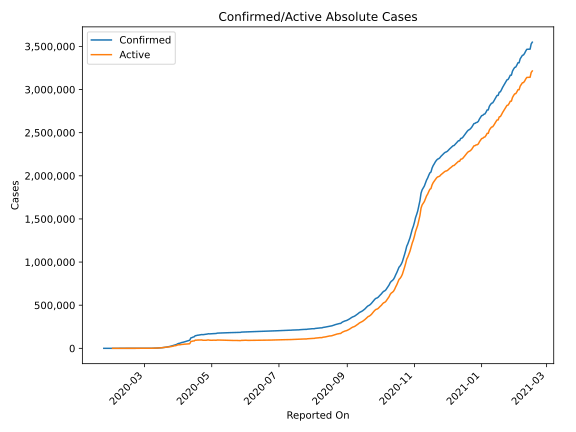
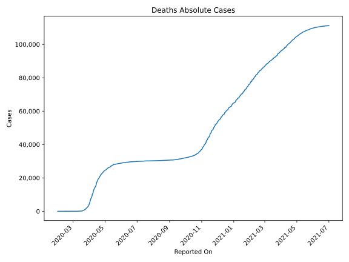
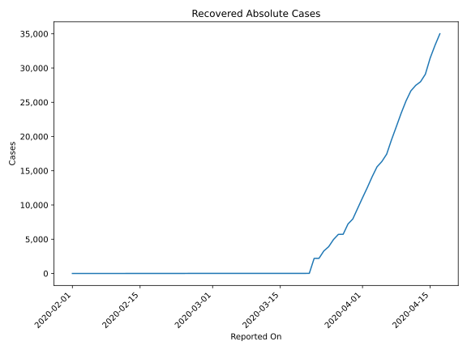
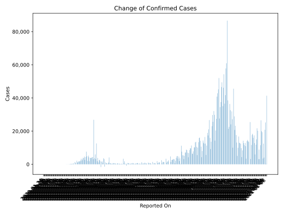
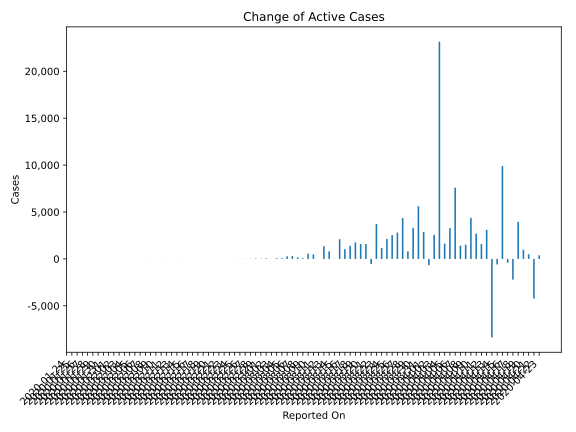
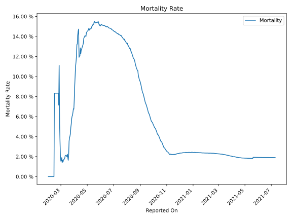

# Country Figures: Time Series for France 

| Reported On | Confirmed | Deaths | Recovered | Active | Mortality | &Delta; Confirmed | &Delta; Deaths | &Delta; Recovered | &Delta; Active | % Active of Population |
|-------------|-----------|--------|-----------|--------|-----------|-------------------|----------------|-------------------|----------------|------------------------|
| 2020-04-23 | 159460 | 21889 | 42762 | 94809 |  13.73 %  | 2335 | 516 | 1436 | 383 |  0.142 %  | 
| 2020-04-22 | 157125 | 21373 | 41326 | 94426 |  13.60 %  | -2172 | 544 | 1507 | -4223 |  0.141 %  | 
| 2020-04-21 | 159297 | 20829 | 39819 | 98649 |  13.08 %  | 2817 | 537 | 1783 | 497 |  0.147 %  | 
| 2020-04-20 | 156480 | 20292 | 38036 | 98152 |  12.97 %  | 2383 | 548 | 853 | 982 |  0.147 %  | 
| 2020-04-19 | 154097 | 19744 | 37183 | 97170 |  12.81 %  | 4948 | 399 | 596 | 3953 |  0.145 %  | 
| 2020-04-18 | 149149 | 19345 | 36587 | 93217 |  12.97 %  | 19 | 642 | 1581 | -2204 |  0.139 %  | 
| 2020-04-17 | 149130 | 18703 | 35006 | 95421 |  12.54 %  | 2039 | 762 | 1679 | -402 |  0.142 %  | 
| 2020-04-16 | 147091 | 17941 | 33327 | 95823 |  12.20 %  | 12509 | 753 | 1857 | 9899 |  0.143 %  | 
| 2020-04-15 | 134582 | 17188 | 31470 | 85924 |  12.77 %  | 3221 | 1440 | 2372 | -591 |  0.128 %  | 
| 2020-04-14 | 131361 | 15748 | 29098 | 86515 |  11.99 %  | -6514 | 762 | 1097 | -8373 |  0.129 %  | 
| 2020-04-13 | 137875 | 14986 | 28001 | 94888 |  10.87 %  | 4205 | 574 | 532 | 3099 |  0.142 %  | 
| 2020-04-12 | 133670 | 14412 | 27469 | 91789 |  10.78 %  | 2943 | 561 | 806 | 1576 |  0.137 %  | 
| 2020-04-11 | 130727 | 13851 | 26663 | 90213 |  10.60 %  | 4796 | 636 | 1468 | 2692 |  0.135 %  | 
| 2020-04-10 | 125931 | 13215 | 25195 | 87521 |  10.49 %  | 7150 | 987 | 1782 | 4381 |  0.131 %  | 
| 2020-04-09 | 118781 | 12228 | 23413 | 83140 |  10.29 %  | 4822 | 1341 | 1961 | 1520 |  0.124 %  | 
| 2020-04-08 | 113959 | 10887 | 21452 | 81620 |  9.55 %  | 3894 | 544 | 1929 | 1421 |  0.122 %  | 
| 2020-04-07 | 110065 | 10343 | 19523 | 80199 |  9.40 %  | 11102 | 1417 | 2095 | 7590 |  0.120 %  | 
| 2020-04-06 | 98963 | 8926 | 17428 | 72609 |  9.02 %  | 5190 | 833 | 1079 | 3278 |  0.108 %  | 
| 2020-04-05 | 93773 | 8093 | 16349 | 69331 |  8.63 %  | 2925 | 519 | 777 | 1629 |  0.103 %  | 
| 2020-04-04 | 90848 | 7574 | 15572 | 67702 |  8.34 %  | 25646 | 1054 | 1437 | 23155 |  0.101 %  | 
| 2020-04-03 | 65202 | 6520 | 14135 | 44547 |  10.00 %  | 5273 | 1122 | 1587 | 2564 |  0.067 %  | 
| 2020-04-02 | 59929 | 5398 | 12548 | 41983 |  9.01 %  | 2180 | 1355 | 1495 | -670 |  0.063 %  | 
| 2020-04-01 | 57749 | 4043 | 11053 | 42653 |  7.00 %  | 4922 | 511 | 1540 | 2871 |  0.064 %  | 
| 2020-03-31 | 52827 | 3532 | 9513 | 39782 |  6.69 %  | 7657 | 502 | 1549 | 5606 |  0.059 %  | 
| 2020-03-30 | 45170 | 3030 | 7964 | 34176 |  6.71 %  | 4462 | 419 | 738 | 3305 |  0.051 %  | 
| 2020-03-29 | 40708 | 2611 | 7226 | 30871 |  6.41 %  | 2603 | 294 | 1502 | 807 |  0.046 %  | 
| 2020-03-28 | 38105 | 2317 | 5724 | 30064 |  6.08 %  | 4703 | 320 | 17 | 4366 |  0.045 %  | 
| 2020-03-27 | 33402 | 1997 | 5707 | 25698 |  5.98 %  | 3851 | 299 | 752 | 2800 |  0.038 %  | 
| 2020-03-26 | 29551 | 1698 | 4955 | 22898 |  5.75 %  | 3951 | 365 | 1048 | 2538 |  0.034 %  | 
| 2020-03-25 | 25600 | 1333 | 3907 | 20360 |  5.21 %  | 2978 | 231 | 619 | 2128 |  0.030 %  | 
| 2020-03-24 | 22622 | 1102 | 3288 | 18232 |  4.87 %  | 2499 | 240 | 1081 | 1178 |  0.027 %  | 
| 2020-03-23 | 20123 | 862 | 2207 | 17054 |  4.28 %  | 3909 | 186 | 6 | 3717 |  0.025 %  | 
| 2020-03-22 | 16214 | 676 | 2201 | 13337 |  4.17 %  | 1758 | 113 | 2183 | -538 |  0.020 %  | 
| 2020-03-21 | 14456 | 563 | 18 | 13875 |  3.89 %  | 1704 | 112 | 6 | 1586 |  0.021 %  | 
| 2020-03-20 | 12752 | 451 | 12 | 12289 |  3.54 %  | 1785 | 207 | 0 | 1578 |  0.018 %  | 
| 2020-03-19 | 10967 | 244 | 12 | 10711 |  2.22 %  | 1846 | 95 | 0 | 1751 |  0.016 %  | 
| 2020-03-18 | 9121 | 149 | 12 | 8960 |  1.63 %  | 1406 | 0 | 0 | 1406 |  0.013 %  | 
| 2020-03-17 | 7715 | 149 | 12 | 7554 |  1.93 %  | 1032 | 0 | 0 | 1032 |  0.011 %  | 
| 2020-03-16 | 6683 | 149 | 12 | 6522 |  2.23 %  | 2158 | 58 | 0 | 2100 |  0.010 %  | 
| 2020-03-15 | 4525 | 91 | 12 | 4422 |  2.01 %  | 24 | 0 | 0 | 24 |  0.007 %  | 
| 2020-03-14 | 4501 | 91 | 12 | 4398 |  2.02 %  | 820 | 12 | 0 | 808 |  0.007 %  | 
| 2020-03-13 | 3681 | 79 | 12 | 3590 |  2.15 %  | 1388 | 31 | 0 | 1357 |  0.005 %  | 
| 2020-03-12 | 2293 | 48 | 12 | 2233 |  2.09 %  | 0 | 0 | 0 | 0 |  0.003 %  | 
| 2020-03-11 | 2293 | 48 | 12 | 2233 |  2.09 %  | 501 | 15 | 0 | 486 |  0.003 %  | 
| 2020-03-10 | 1792 | 33 | 12 | 1747 |  1.84 %  | 575 | 14 | 0 | 561 |  0.003 %  | 
| 2020-03-09 | 1217 | 19 | 12 | 1186 |  1.56 %  | 81 | 0 | 0 | 81 |  0.002 %  | 
| 2020-03-08 | 1136 | 19 | 12 | 1105 |  1.67 %  | 177 | 8 | 0 | 169 |  0.002 %  | 
| 2020-03-07 | 959 | 11 | 12 | 936 |  1.15 %  | 303 | 2 | 0 | 301 |  0.001 %  | 
| 2020-03-06 | 656 | 9 | 12 | 635 |  1.37 %  | 276 | 3 | 0 | 273 |  0.001 %  | 
| 2020-03-05 | 380 | 6 | 12 | 362 |  1.58 %  | 92 | 2 | 0 | 90 |  0.001 %  | 
| 2020-03-04 | 288 | 4 | 12 | 272 |  1.39 %  | 84 | 0 | 0 | 84 |  0.000 %  | 
| 2020-03-03 | 204 | 4 | 12 | 188 |  1.96 %  | 13 | 1 | 0 | 12 |  0.000 %  | 
| 2020-03-02 | 191 | 3 | 12 | 176 |  1.57 %  | 61 | 1 | 0 | 60 |  0.000 %  | 
| 2020-03-01 | 130 | 2 | 12 | 116 |  1.54 %  | 30 | 0 | 0 | 30 |  0.000 %  | 
| 2020-02-29 | 100 | 2 | 12 | 86 |  2.00 %  | 43 | 0 | 1 | 42 |  0.000 %  | 
| 2020-02-28 | 57 | 2 | 11 | 44 |  3.51 %  | 19 | 0 | 0 | 19 |  0.000 %  | 
| 2020-02-27 | 38 | 2 | 11 | 25 |  5.26 %  | 20 | 0 | 0 | 20 |  0.000 %  | 
| 2020-02-26 | 18 | 2 | 11 | 5 |  11.11 %  | 4 | 1 | 0 | 3 |  0.000 %  | 
| 2020-02-25 | 14 | 1 | 11 | 2 |  7.14 %  | 2 | 0 | 7 | -5 |  0.000 %  | 
| 2020-02-24 | 12 | 1 | 4 | 7 |  8.33 %  | 0 | 0 | 0 | 0 |  0.000 %  | 
| 2020-02-23 | 12 | 1 | 4 | 7 |  8.33 %  | 0 | 0 | 0 | 0 |  0.000 %  | 
| 2020-02-22 | 12 | 1 | 4 | 7 |  8.33 %  | 0 | 0 | 0 | 0 |  0.000 %  | 
| 2020-02-21 | 12 | 1 | 4 | 7 |  8.33 %  | 0 | 0 | 0 | 0 |  0.000 %  | 
| 2020-02-20 | 12 | 1 | 4 | 7 |  8.33 %  | 0 | 0 | 0 | 0 |  0.000 %  | 
| 2020-02-19 | 12 | 1 | 4 | 7 |  8.33 %  | 0 | 0 | 0 | 0 |  0.000 %  | 
| 2020-02-18 | 12 | 1 | 4 | 7 |  8.33 %  | 0 | 0 | 0 | 0 |  0.000 %  | 
| 2020-02-17 | 12 | 1 | 4 | 7 |  8.33 %  | 0 | 0 | 0 | 0 |  0.000 %  | 
| 2020-02-16 | 12 | 1 | 4 | 7 |  8.33 %  | 0 | 0 | 0 | 0 |  0.000 %  | 
| 2020-02-15 | 12 | 1 | 4 | 7 |  8.33 %  | 1 | 1 | 2 | -2 |  0.000 %  | 
| 2020-02-14 | 11 | 0 | 2 | 9 |  None  | 0 | 0 | 0 | 0 |  0.000 %  | 
| 2020-02-13 | 11 | 0 | 2 | 9 |  None  | 0 | 0 | 0 | 0 |  0.000 %  | 
| 2020-02-12 | 11 | 0 | 2 | 9 |  None  | 0 | 0 | 2 | -2 |  0.000 %  | 
| 2020-02-11 | 11 | 0 | 0 | 11 |  None  | 0 | 0 | 0 | 0 |  0.000 %  | 
| 2020-02-10 | 11 | 0 | 0 | 11 |  None  | 0 | 0 | 0 | 0 |  0.000 %  | 
| 2020-02-09 | 11 | 0 | 0 | 11 |  None  | 0 | 0 | 0 | 0 |  0.000 %  | 
| 2020-02-08 | 11 | 0 | 0 | 11 |  None  | 5 | 0 | 0 | 5 |  0.000 %  | 
| 2020-02-07 | 6 | 0 | 0 | 6 |  None  | 0 | 0 | 0 | 0 |  0.000 %  | 
| 2020-02-06 | 6 | 0 | 0 | 6 |  None  | 0 | 0 | 0 | 0 |  0.000 %  | 
| 2020-02-05 | 6 | 0 | 0 | 6 |  None  | 0 | 0 | 0 | 0 |  0.000 %  | 
| 2020-02-04 | 6 | 0 | 0 | 6 |  None  | 0 | 0 | 0 | 0 |  0.000 %  | 
| 2020-02-03 | 6 | 0 | 0 | 6 |  None  | 0 | 0 | 0 | 0 |  0.000 %  | 
| 2020-02-02 | 6 | 0 | 0 | 6 |  None  | 0 | 0 | 0 | 0 |  0.000 %  | 
| 2020-02-01 | 6 | 0 | 0 | 6 |  None  | 1 | None | None | None |  0.000 %  | 
| 2020-01-31 | 5 | None | None | None |  None  | 0 | None | None | None |  n/a  | 
| 2020-01-30 | 5 | None | None | None |  None  | 0 | None | None | None |  n/a  | 
| 2020-01-29 | 5 | None | None | None |  None  | 1 | None | None | None |  n/a  | 
| 2020-01-28 | 4 | None | None | None |  None  | 1 | None | None | None |  n/a  | 
| 2020-01-27 | 3 | None | None | None |  None  | 0 | None | None | None |  n/a  | 
| 2020-01-26 | 3 | None | None | None |  None  | 0 | None | None | None |  n/a  | 
| 2020-01-25 | 3 | None | None | None |  None  | 1 | None | None | None |  n/a  | 
| 2020-01-24 | 2 | None | None | None |  None  | None | None | None | None |  n/a  | 

