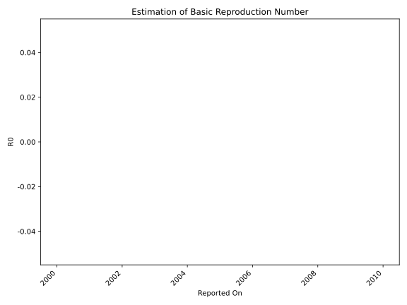

# Country Figures: Time Series for Basic Reproduction Number of FaroeIslands 

| Reported On | &Delta; Confirmed | Total &Delta; Confirmed First Interval | Total &Delta; Confirmed Second Interval | Estimated Basic Reproduction Number R0 | 
|-------------|-------------------|----------------------------------------|-----------------------------------------|---------------------------------------------------|
| 2020-03-10 | 0 |  1  |  None  |  None  | 
| 2020-03-09 | 0 |  1  |  None  |  None  | 
| 2020-03-08 | 1 |  None  |  None  |  None  | 
| 2020-03-07 | 0 |  None  |  None  |  None  | 
| 2020-03-06 | 0 |  None  |  None  |  None  | 
| 2020-03-05 | 0 |  None  |  None  |  None  | 
| 2020-03-04 | None |  None  |  None  |  None  | 

