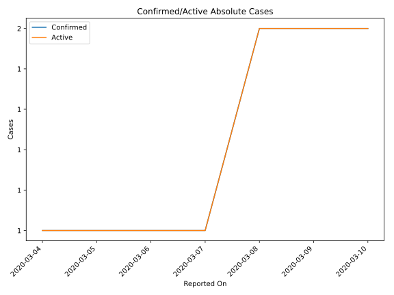
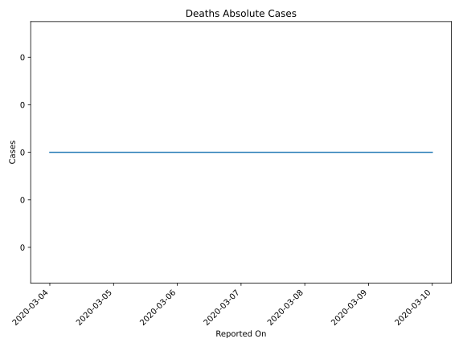
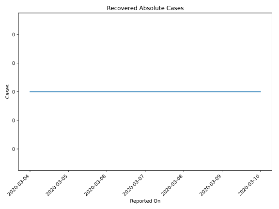
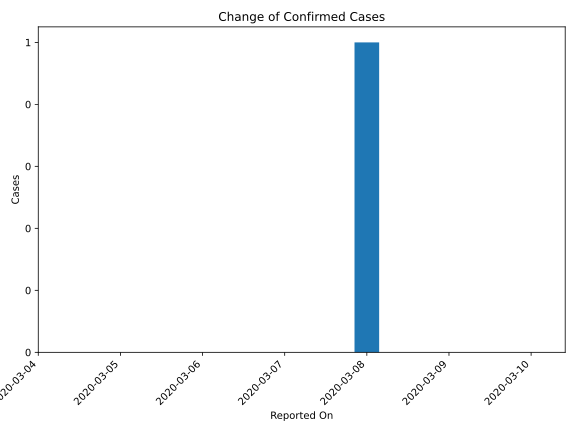
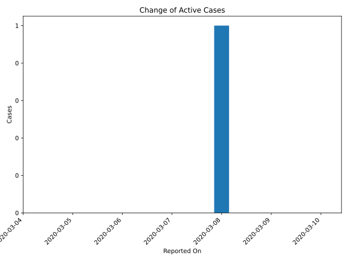
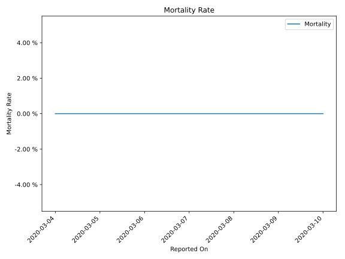

# Country Figures: Time Series for FaroeIslands 

| Reported On | Confirmed | Deaths | Recovered | Active | Mortality | &Delta; Confirmed | &Delta; Deaths | &Delta; Active | % Active of Population |
|-------------|-----------|--------|-----------|--------|-----------|-------------------|----------------|----------------|------------------------|
| 2020-03-10 | 2 | 0 | 0 | 2 |  None  | 0 | 0 | 0 |  0.004 %  | 
| 2020-03-09 | 2 | 0 | 0 | 2 |  None  | 0 | 0 | 0 |  0.004 %  | 
| 2020-03-08 | 2 | 0 | 0 | 2 |  None  | 1 | 0 | 1 |  0.004 %  | 
| 2020-03-07 | 1 | 0 | 0 | 1 |  None  | 0 | 0 | 0 |  0.002 %  | 
| 2020-03-06 | 1 | 0 | 0 | 1 |  None  | 0 | 0 | 0 |  0.002 %  | 
| 2020-03-05 | 1 | 0 | 0 | 1 |  None  | 0 | 0 | 0 |  0.002 %  | 
| 2020-03-04 | 1 | 0 | 0 | 1 |  None  | None | None | None |  0.002 %  | 

