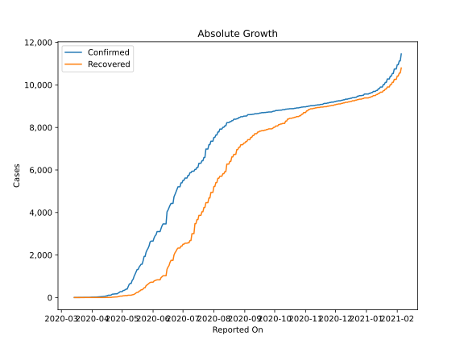
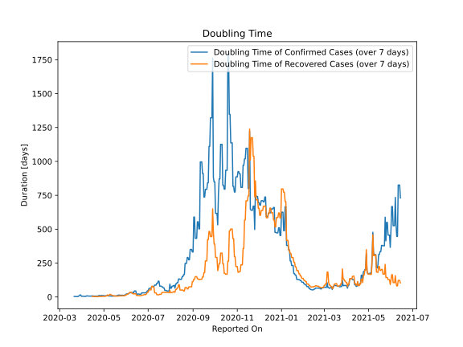

# Country Figures: Doubling Time of Infections for Gabon 

The doubling time below are calculated based on
* an exponential growth assumption
* for time difference of past seven (7) days.
The doubling time's unit is "days".

The first doubling time indicates the increase of confirmed (infected)
cases. There, the *higher* the number is, the better is to take control
of the disease.

The second doubling time indicates the increase of recovered (healed)
cases. There, the *lower* the number is, the better it is to take
control of the disease.

| Reported On | Confirmed | Doubling Time (Confirmed) | Recovered | Doubling Time (Recovered) |
|-------------|-----------|---------------------------|-----------|---------------------------|
| 2020-05-04 | 367 |  9.1 days  | 93 |  6.6 days  | 
| 2020-05-03 | 335 |  7.9 days  | 85 |  5.0 days  | 
| 2020-05-02 | 335 |  7.9 days  | 85 |  5.0 days  | 
| 2020-05-01 | 276 |  10.6 days  | 67 |  5.5 days  | 
| 2020-04-30 | 276 |  10.0 days  | 67 |  5.1 days  | 
| 2020-04-29 | 276 |  9.9 days  | 67 |  5.1 days  | 
| 2020-04-28 | 238 |  11.8 days  | 53 |  4.4 days  | 
| 2020-04-27 | 211 |  8.9 days  | 43 |  3.0 days  | 
| 2020-04-26 | 176 |  10.5 days  | 30 |  3.7 days  | 
| 2020-04-25 | 176 |  10.3 days  | 30 |  3.7 days  | 
| 2020-04-24 | 172 |  10.8 days  | 26 |  4.0 days  | 
| 2020-04-23 | 167 |  6.9 days  | 24 |  3.0 days  | 
| 2020-04-22 | 166 |  7.0 days  | 24 |  3.0 days  | 
| 2020-04-21 | 156 |  5.2 days  | 16 |  2.1 days  | 
| 2020-04-20 | 120 |  6.9 days  | 7 |  2.8 days  | 
| 2020-04-19 | 109 |  6.4 days  | 7 |  2.8 days  | 
| 2020-04-18 | 108 |  6.0 days  | 7 |  2.8 days  | 
| 2020-04-17 | 108 |  5.7 days  | 7 |  2.8 days  | 
| 2020-04-16 | 80 |  8.5 days  | 4 |  3.8 days  | 
| 2020-04-15 | 80 |  6.0 days  | 4 |  3.8 days  | 
| 2020-04-14 | 57 |  7.9 days  | 1 |  None  | 
| 2020-04-13 | 57 |  5.9 days  | 1 |  None  | 
| 2020-04-12 | 49 |  6.1 days  | 1 |  None  | 
| 2020-04-11 | 46 |  6.5 days  | 1 |  None  | 
| 2020-04-10 | 44 |  6.9 days  | 1 |  None  | 
| 2020-04-09 | 44 |  6.9 days  | 1 |  None  | 
| 2020-04-08 | 34 |  8.0 days  | 1 |  None  | 
| 2020-04-07 | 30 |  8.1 days  | 1 |  None  | 
| 2020-04-06 | 24 |  4.3 days  | 1 |  None  | 
| 2020-04-05 | 21 |  4.8 days  | 1 |  None  | 
| 2020-04-04 | 21 |  4.8 days  | 1 |  None  | 
| 2020-04-03 | 21 |  4.8 days  | 1 |  None  | 
| 2020-04-02 | 21 |  4.8 days  | 0 |  None  | 
| 2020-04-01 | 18 |  4.8 days  | 0 |  None  | 
| 2020-03-31 | 16 |  5.3 days  | 0 |  None  | 
| 2020-03-30 | 7 |  14.8 days  | 0 |  None  | 
| 2020-03-29 | 7 |  14.8 days  | 0 |  None  | 
| 2020-03-28 | 7 |  9.0 days  | 0 |  None  | 
| 2020-03-27 | 7 |  6.1 days  | 0 |  None  | 
| 2020-03-26 | 7 |  2.8 days  | 0 |  None  | 
| 2020-03-25 | 6 |  3.0 days  | 0 |  None  | 
| 2020-03-24 | 6 |  3.0 days  | 0 |  None  | 
| 2020-03-23 | 5 |  3.3 days  | 0 |  None  | 
| 2020-03-22 | 5 |  3.3 days  | 0 |  None  | 
| 2020-03-21 | 4 |  3.8 days  | 0 |  None  | 
| 2020-03-20 | 3 |  None  | 0 |  None  | 
| 2020-03-19 | 1 |  None  | 0 |  None  | 
| 2020-03-18 | 1 |  None  | 0 |  None  | 
| 2020-03-17 | 1 |  None  | 0 |  None  | 
| 2020-03-16 | 1 |  None  | 0 |  None  | 
| 2020-03-15 | 1 |  None  | 0 |  None  | 
| 2020-03-14 | 1 |  None  | 0 |  None  | 

