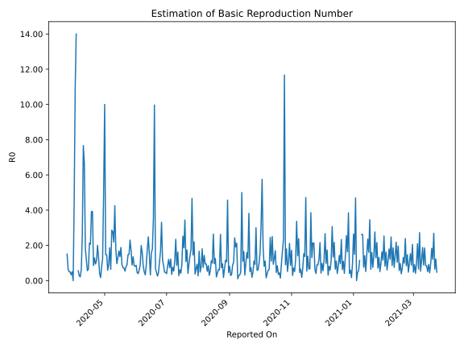

# Country Figures: Time Series for Basic Reproduction Number of Gabon 

| Reported On | &Delta; Confirmed | Total &Delta; Confirmed First Interval | Total &Delta; Confirmed Second Interval | Estimated Basic Reproduction Number R0 | 
|-------------|-------------------|----------------------------------------|-----------------------------------------|---------------------------------------------------|
| 2020-05-06 | 0 |  121  |  65  |  1.86  | 
| 2020-05-05 | 30 |  91  |  100  |  0.91  | 
| 2020-05-04 | 32 |  59  |  100  |  0.59  | 
| 2020-05-03 | 0 |  97  |  66  |  1.47  | 
| 2020-05-02 | 59 |  65  |  44  |  1.48  | 
| 2020-05-01 | 0 |  100  |  10  |  10.00  | 
| 2020-04-30 | 0 |  100  |  20  |  5.00  | 
| 2020-04-29 | 38 |  66  |  52  |  1.27  | 
| 2020-04-28 | 27 |  44  |  58  |  0.76  | 
| 2020-04-27 | 35 |  10  |  58  |  0.17  | 
| 2020-04-26 | 0 |  20  |  48  |  0.42  | 
| 2020-04-25 | 4 |  52  |  40  |  1.30  | 
| 2020-04-24 | 5 |  58  |  29  |  2.00  | 
| 2020-04-23 | 1 |  58  |  51  |  1.14  | 
| 2020-04-22 | 10 |  48  |  51  |  0.94  | 
| 2020-04-21 | 36 |  40  |  31  |  1.29  | 
| 2020-04-20 | 11 |  29  |  34  |  0.85  | 
| 2020-04-19 | 1 |  51  |  13  |  3.92  | 
| 2020-04-18 | 0 |  51  |  13  |  3.92  | 
| 2020-04-17 | 28 |  31  |  15  |  2.07  | 
| 2020-04-16 | 0 |  34  |  16  |  2.12  | 
| 2020-04-15 | 23 |  13  |  20  |  0.65  | 
| 2020-04-14 | 0 |  13  |  23  |  0.57  | 
| 2020-04-13 | 8 |  15  |  13  |  1.15  | 
| 2020-04-12 | 3 |  16  |  9  |  1.78  | 
| 2020-04-11 | 2 |  20  |  3  |  6.67  | 
| 2020-04-10 | 0 |  23  |  3  |  7.67  | 
| 2020-04-09 | 10 |  13  |  5  |  2.60  | 
| 2020-04-08 | 4 |  9  |  14  |  0.64  | 
| 2020-04-07 | 6 |  3  |  14  |  0.21  | 
| 2020-04-06 | 3 |  3  |  11  |  0.27  | 
| 2020-04-05 | 0 |  5  |  9  |  0.56  | 
| 2020-04-04 | 0 |  14  |  None  |  None  | 
| 2020-04-03 | 0 |  14  |  1  |  14.00  | 
| 2020-04-02 | 3 |  11  |  1  |  11.00  | 
| 2020-04-01 | 2 |  9  |  2  |  4.50  | 
| 2020-03-31 | 9 |  None  |  2  |  None  | 
| 2020-03-30 | 0 |  1  |  2  |  0.50  | 
| 2020-03-29 | 0 |  1  |  3  |  0.33  | 
| 2020-03-28 | 0 |  2  |  4  |  0.50  | 
| 2020-03-27 | 0 |  2  |  4  |  0.50  | 
| 2020-03-26 | 1 |  2  |  3  |  0.67  | 
| 2020-03-25 | 0 |  3  |  2  |  1.50  | 
| 2020-03-24 | 1 |  4  |  None  |  None  | 
| 2020-03-23 | 0 |  4  |  None  |  None  | 
| 2020-03-22 | 1 |  3  |  None  |  None  | 
| 2020-03-21 | 1 |  2  |  None  |  None  | 
| 2020-03-20 | 2 |  None  |  None  |  None  | 
| 2020-03-19 | 0 |  None  |  None  |  None  | 
| 2020-03-18 | 0 |  None  |  None  |  None  | 
| 2020-03-17 | 0 |  None  |  None  |  None  | 
| 2020-03-16 | 0 |  None  |  None  |  None  | 
| 2020-03-15 | 0 |  None  |  None  |  None  | 
| 2020-03-14 | None |  None  |  None  |  None  | 

