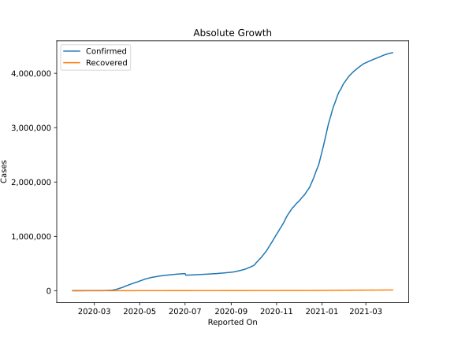
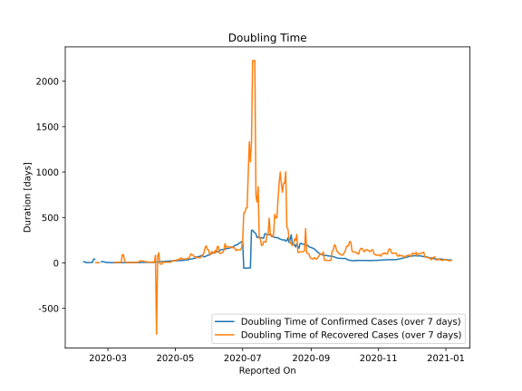

# Country Figures: Doubling Time of Infections for UnitedKingdom 

The doubling time below are calculated based on
* an exponential growth assumption
* for time difference of past seven (7) days.
The doubling time's unit is "days".

The first doubling time indicates the increase of confirmed (infected)
cases. There, the *higher* the number is, the better is to take control
of the disease.

The second doubling time indicates the increase of recovered (healed)
cases. There, the *lower* the number is, the better it is to take
control of the disease.

| Reported On | Confirmed | Doubling Time (Confirmed) | Recovered | Doubling Time (Recovered) |
|-------------|-----------|---------------------------|-----------|---------------------------|
| 2020-05-05 | 196243 |  25.9 days  | 926 |  37.6 days  | 
| 2020-05-04 | 191832 |  25.6 days  | 910 |  40.7 days  | 
| 2020-05-03 | 187842 |  24.8 days  | 901 |  33.4 days  | 
| 2020-05-02 | 183500 |  24.1 days  | 896 |  33.5 days  | 
| 2020-05-01 | 178685 |  23.3 days  | 892 |  23.6 days  | 
| 2020-04-30 | 172481 |  23.0 days  | 859 |  26.2 days  | 
| 2020-04-29 | 166441 |  23.2 days  | 857 |  21.7 days  | 
| 2020-04-28 | 162350 |  22.3 days  | 813 |  20.4 days  | 
| 2020-04-27 | 158348 |  21.5 days  | 807 |  8.5 days  | 
| 2020-04-26 | 154037 |  20.6 days  | 778 |  8.7 days  | 
| 2020-04-25 | 149569 |  19.0 days  | 774 |  8.1 days  | 
| 2020-04-24 | 144640 |  17.9 days  | 724 |  8.3 days  | 
| 2020-04-23 | 139246 |  17.0 days  | 712 |  7.9 days  | 
| 2020-04-22 | 134638 |  16.4 days  | 683 |  8.2 days  | 
| 2020-04-21 | 130172 |  15.7 days  | 638 |  7.5 days  | 
| 2020-04-20 | 125856 |  14.6 days  | 446 |  13.0 days  | 
| 2020-04-19 | 121172 |  14.1 days  | 436 |  -13.1 days  | 
| 2020-04-18 | 115314 |  13.6 days  | 414 |  -11.6 days  | 
| 2020-04-17 | 109769 |  12.9 days  | 394 |  -11.8 days  | 
| 2020-04-16 | 104145 |  10.9 days  | 375 |  111.6 days  | 
| 2020-04-15 | 99483 |  10.4 days  | 368 |  75.5 days  | 
| 2020-04-14 | 94845 |  9.5 days  | 323 |  -785.7 days  | 
| 2020-04-13 | 89570 |  9.4 days  | 304 |  84.7 days  | 
| 2020-04-12 | 85206 |  8.9 days  | 626 |  5.2 days  | 
| 2020-04-11 | 79874 |  8.0 days  | 622 |  4.9 days  | 
| 2020-04-10 | 74605 |  7.7 days  | 588 |  5.0 days  | 
| 2020-04-09 | 65872 |  7.7 days  | 359 |  8.1 days  | 
| 2020-04-08 | 61474 |  7.1 days  | 345 |  7.7 days  | 
| 2020-04-07 | 55949 |  6.5 days  | 325 |  8.5 days  | 
| 2020-04-06 | 52279 |  6.1 days  | 287 |  9.7 days  | 
| 2020-04-05 | 48436 |  5.8 days  | 229 |  12.0 days  | 
| 2020-04-04 | 42477 |  5.7 days  | 215 |  14.1 days  | 
| 2020-04-03 | 38689 |  5.4 days  | 208 |  15.5 days  | 
| 2020-04-02 | 34173 |  4.9 days  | 192 |  20.0 days  | 
| 2020-04-01 | 29865 |  4.6 days  | 179 |  20.1 days  | 
| 2020-03-31 | 25481 |  4.6 days  | 179 |  20.1 days  | 
| 2020-03-30 | 22453 |  4.4 days  | 171 |  24.6 days  | 
| 2020-03-29 | 19780 |  4.3 days  | 151 |  10.8 days  | 
| 2020-03-28 | 17312 |  4.3 days  | 151 |  6.3 days  | 
| 2020-03-27 | 14745 |  4.1 days  | 151 |  6.3 days  | 
| 2020-03-26 | 11812 |  3.6 days  | 150 |  6.4 days  | 
| 2020-03-25 | 9640 |  4.1 days  | 140 |  6.9 days  | 
| 2020-03-24 | 8164 |  3.7 days  | 140 |  5.3 days  | 
| 2020-03-23 | 6726 |  3.6 days  | 140 |  2.9 days  | 
| 2020-03-22 | 5741 |  3.3 days  | 95 |  3.3 days  | 
| 2020-03-21 | 5067 |  3.6 days  | 67 |  4.2 days  | 
| 2020-03-20 | 4014 |  3.3 days  | 67 |  4.2 days  | 
| 2020-03-19 | 2716 |  3.1 days  | 67 |  4.2 days  | 
| 2020-03-18 | 2642 |  3.1 days  | 67 |  4.2 days  | 
| 2020-03-17 | 1960 |  3.3 days  | 53 |  4.8 days  | 
| 2020-03-16 | 1551 |  3.4 days  | 21 |  31.8 days  | 
| 2020-03-15 | 1144 |  3.7 days  | 19 |  90.1 days  | 
| 2020-03-14 | 1144 |  3.2 days  | 19 |  90.1 days  | 
| 2020-03-13 | 801 |  3.4 days  | 19 |  5.9 days  | 
| 2020-03-12 | 459 |  3.8 days  | 19 |  5.9 days  | 
| 2020-03-11 | 459 |  3.2 days  | 19 |  5.9 days  | 
| 2020-03-10 | 383 |  2.7 days  | 18 |  6.3 days  | 
| 2020-03-09 | 321 |  2.7 days  | 18 |  6.3 days  | 
| 2020-03-08 | 273 |  2.7 days  | 18 |  6.3 days  | 
| 2020-03-07 | 206 |  2.5 days  | 18 |  6.3 days  | 
| 2020-03-06 | 163 |  2.7 days  | 8 |  None  | 
| 2020-03-05 | 115 |  2.7 days  | 8 |  None  | 
| 2020-03-04 | 85 |  2.9 days  | 8 |  None  | 
| 2020-03-03 | 51 |  3.9 days  | 8 |  None  | 
| 2020-03-02 | 40 |  4.7 days  | 8 |  None  | 
| 2020-03-01 | 36 |  3.8 days  | 8 |  None  | 
| 2020-02-29 | 23 |  5.5 days  | 8 |  None  | 
| 2020-02-28 | 21 |  6.1 days  | 8 |  None  | 
| 2020-02-27 | 15 |  9.8 days  | 8 |  None  | 
| 2020-02-26 | 13 |  13.5 days  | 8 |  None  | 
| 2020-02-25 | 13 |  13.5 days  | 8 |  None  | 
| 2020-02-24 | 13 |  13.5 days  | 8 |  None  | 
| 2020-02-23 | 9 |  None  | 8 |  None  | 
| 2020-02-22 | 9 |  None  | 8 |  2.7 days  | 
| 2020-02-21 | 9 |  None  | 8 |  2.7 days  | 
| 2020-02-20 | 9 |  None  | 8 |  2.7 days  | 
| 2020-02-19 | 9 |  None  | 8 |  2.7 days  | 
| 2020-02-18 | 9 |  41.5 days  | 8 |  None  | 
| 2020-02-17 | 9 |  41.5 days  | 8 |  None  | 
| 2020-02-16 | 9 |  4.8 days  | 8 |  None  | 
| 2020-02-15 | 9 |  4.8 days  | 1 |  None  | 
| 2020-02-14 | 9 |  4.8 days  | 1 |  None  | 
| 2020-02-13 | 9 |  3.6 days  | 1 |  None  | 
| 2020-02-12 | 9 |  3.6 days  | 1 |  None  | 
| 2020-02-11 | 8 |  3.8 days  | 0 |  None  | 
| 2020-02-10 | 8 |  3.8 days  | 0 |  None  | 
| 2020-02-09 | 3 |  12.3 days  | 0 |  None  | 
| 2020-02-08 | 3 |  12.3 days  | 0 |  None  | 
| 2020-02-07 | 3 |  None  | 0 |  None  | 
| 2020-02-06 | 2 |  None  | 0 |  None  | 
| 2020-02-05 | 2 |  None  | 0 |  None  | 
| 2020-02-04 | 2 |  None  | 0 |  None  | 
| 2020-02-03 | 2 |  None  | 0 |  None  | 
| 2020-02-02 | 2 |  None  | 0 |  None  | 
| 2020-02-01 | 2 |  None  | 0 |  None  | 

