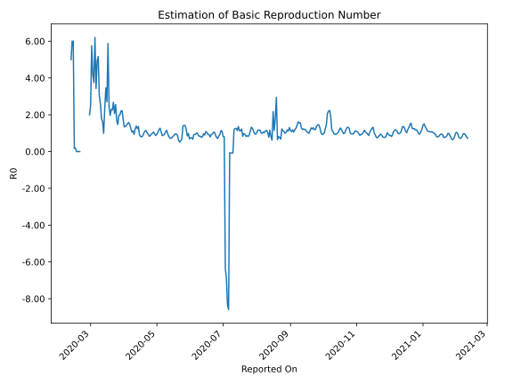

# Country Figures: Time Series for Basic Reproduction Number of UnitedKingdom 

| Reported On | &Delta; Confirmed | Total &Delta; Confirmed First Interval | Total &Delta; Confirmed Second Interval | Estimated Basic Reproduction Number R0 | 
|-------------|-------------------|----------------------------------------|-----------------------------------------|---------------------------------------------------|
| 2020-04-28 | 4002 |  19102  |  18074  |  1.06  | 
| 2020-04-27 | 4311 |  19399  |  19324  |  1.00  | 
| 2020-04-26 | 4468 |  19397  |  20403  |  0.95  | 
| 2020-04-25 | 4929 |  18784  |  21711  |  0.87  | 
| 2020-04-24 | 5394 |  18074  |  21689  |  0.83  | 
| 2020-04-23 | 4608 |  19324  |  20469  |  0.94  | 
| 2020-04-22 | 4466 |  20403  |  20199  |  1.01  | 
| 2020-04-21 | 4316 |  21711  |  18939  |  1.15  | 
| 2020-04-20 | 4684 |  21689  |  19609  |  1.11  | 
| 2020-04-19 | 5858 |  20469  |  20240  |  1.01  | 
| 2020-04-18 | 5545 |  20199  |  23698  |  0.85  | 
| 2020-04-17 | 5624 |  18939  |  23732  |  0.80  | 
| 2020-04-16 | 4662 |  19609  |  23925  |  0.82  | 
| 2020-04-15 | 4638 |  20240  |  22326  |  0.91  | 
| 2020-04-14 | 5275 |  23698  |  17436  |  1.36  | 
| 2020-04-13 | 4364 |  23732  |  18997  |  1.25  | 
| 2020-04-12 | 5332 |  23925  |  17260  |  1.39  | 
| 2020-04-11 | 5269 |  22326  |  18106  |  1.23  | 
| 2020-04-10 | 8733 |  17436  |  18571  |  0.94  | 
| 2020-04-09 | 4398 |  18997  |  16996  |  1.12  | 
| 2020-04-08 | 5525 |  17260  |  16236  |  1.06  | 
| 2020-04-07 | 3670 |  18106  |  14393  |  1.26  | 
| 2020-04-06 | 3843 |  18571  |  12553  |  1.48  | 
| 2020-04-05 | 5959 |  16996  |  10736  |  1.58  | 
| 2020-04-04 | 3788 |  16236  |  10641  |  1.53  | 
| 2020-04-03 | 4516 |  14393  |  10140  |  1.42  | 
| 2020-04-02 | 4308 |  12553  |  9148  |  1.37  | 
| 2020-04-01 | 4384 |  10736  |  8019  |  1.34  | 
| 2020-03-31 | 3028 |  10641  |  6071  |  1.75  | 
| 2020-03-30 | 2673 |  10140  |  4573  |  2.22  | 
| 2020-03-29 | 2468 |  9148  |  4150  |  2.20  | 
| 2020-03-28 | 2567 |  8019  |  4010  |  2.00  | 
| 2020-03-27 | 2933 |  6071  |  3099  |  1.96  | 
| 2020-03-26 | 2172 |  4573  |  3107  |  1.47  | 
| 2020-03-25 | 1476 |  4150  |  2463  |  1.68  | 
| 2020-03-24 | 1438 |  4010  |  1572  |  2.55  | 
| 2020-03-23 | 985 |  3099  |  1498  |  2.07  | 
| 2020-03-22 | 674 |  3107  |  1159  |  2.68  | 
| 2020-03-21 | 1053 |  2463  |  1092  |  2.26  | 
| 2020-03-20 | 1298 |  1572  |  685  |  2.29  | 
| 2020-03-19 | 74 |  1498  |  761  |  1.97  | 
| 2020-03-18 | 682 |  1159  |  480  |  2.41  | 
| 2020-03-17 | 409 |  1092  |  186  |  5.87  | 
| 2020-03-16 | 407 |  685  |  253  |  2.71  | 
| 2020-03-15 | 0 |  761  |  220  |  3.46  | 
| 2020-03-14 | 343 |  480  |  206  |  2.33  | 
| 2020-03-13 | 342 |  186  |  188  |  0.99  | 
| 2020-03-12 | 0 |  253  |  155  |  1.63  | 
| 2020-03-11 | 76 |  220  |  123  |  1.79  | 
| 2020-03-10 | 62 |  206  |  79  |  2.61  | 
| 2020-03-09 | 48 |  188  |  62  |  3.03  | 
| 2020-03-08 | 67 |  155  |  30  |  5.17  | 
| 2020-03-07 | 43 |  123  |  25  |  4.92  | 
| 2020-03-06 | 48 |  79  |  23  |  3.43  | 
| 2020-03-05 | 30 |  62  |  10  |  6.20  | 
| 2020-03-04 | 34 |  30  |  8  |  3.75  | 
| 2020-03-03 | 11 |  25  |  6  |  4.17  | 
| 2020-03-02 | 4 |  23  |  4  |  5.75  | 
| 2020-03-01 | 13 |  10  |  4  |  2.50  | 
| 2020-02-29 | 2 |  8  |  4  |  2.00  | 
| 2020-02-28 | 6 |  6  |  None  |  None  | 
| 2020-02-27 | 2 |  4  |  None  |  None  | 
| 2020-02-26 | 0 |  4  |  None  |  None  | 
| 2020-02-25 | 0 |  4  |  None  |  None  | 
| 2020-02-24 | 4 |  None  |  None  |  None  | 
| 2020-02-23 | 0 |  None  |  None  |  None  | 
| 2020-02-22 | 0 |  None  |  None  |  None  | 
| 2020-02-21 | 0 |  None  |  None  |  None  | 
| 2020-02-20 | 0 |  None  |  1  |  None  | 
| 2020-02-19 | 0 |  None  |  1  |  None  | 
| 2020-02-18 | 0 |  None  |  6  |  None  | 
| 2020-02-17 | 0 |  None  |  6  |  None  | 
| 2020-02-16 | 0 |  1  |  5  |  0.20  | 
| 2020-02-15 | 0 |  1  |  6  |  0.17  | 
| 2020-02-14 | 0 |  6  |  1  |  6.00  | 
| 2020-02-13 | 0 |  6  |  1  |  6.00  | 
| 2020-02-12 | 1 |  5  |  1  |  5.00  | 
| 2020-02-11 | 0 |  6  |  None  |  None  | 
| 2020-02-10 | 5 |  1  |  None  |  None  | 
| 2020-02-09 | 0 |  1  |  None  |  None  | 
| 2020-02-08 | 0 |  1  |  None  |  None  | 
| 2020-02-07 | 1 |  None  |  None  |  None  | 
| 2020-02-06 | 0 |  None  |  None  |  None  | 
| 2020-02-05 | 0 |  None  |  None  |  None  | 
| 2020-02-04 | 0 |  None  |  None  |  None  | 
| 2020-02-03 | 0 |  None  |  None  |  None  | 
| 2020-02-02 | 0 |  None  |  None  |  None  | 
| 2020-02-01 | 0 |  None  |  None  |  None  | 
| 2020-01-31 | None |  None  |  None  |  None  | 

