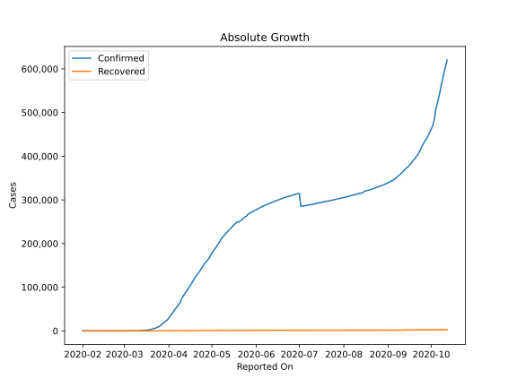
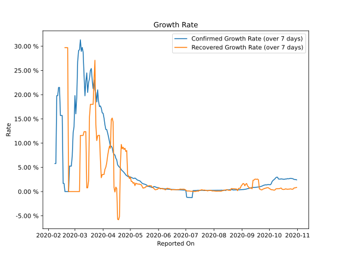

# Country Figures: Growth Rate for UnitedKingdom 

The growth rates below are calculated based on
* an exponential growth assumption
* for time difference of past seven (7) days.
The growth rate is to be understood as on "growth per day".

The first growth rate indicates the increase of confirmed (infected) cases.

The second growth rate indicates the increase of recovered (healed) cases.

| Reported On | Confirmed | Growth Rate (Confirmed) | Recovered | Growth Rate (Recovered) |
|-------------|-----------|-------------------------|-----------|-------------------------|
| 2020-04-06 | 52279 |  12.07 %  | 287 |  7.397 %  | 
| 2020-04-05 | 48436 |  12.79 %  | 229 |  5.949 %  | 
| 2020-04-04 | 42477 |  12.82 %  | 215 |  5.048 %  | 
| 2020-04-03 | 38689 |  13.78 %  | 208 |  4.575 %  | 
| 2020-04-02 | 34173 |  15.18 %  | 192 |  3.527 %  | 
| 2020-04-01 | 29865 |  16.15 %  | 179 |  3.511 %  | 
| 2020-03-31 | 25481 |  16.26 %  | 179 |  3.511 %  | 
| 2020-03-30 | 22453 |  17.22 %  | 171 |  2.857 %  | 
| 2020-03-29 | 19780 |  17.67 %  | 151 |  6.620 %  | 
| 2020-03-28 | 17312 |  17.55 %  | 151 |  11.608 %  | 
| 2020-03-27 | 14745 |  18.59 %  | 151 |  11.608 %  | 
| 2020-03-26 | 11812 |  21.00 %  | 150 |  11.513 %  | 
| 2020-03-25 | 9640 |  18.49 %  | 140 |  10.528 %  | 
| 2020-03-24 | 8164 |  20.38 %  | 140 |  13.876 %  | 
| 2020-03-23 | 6726 |  20.96 %  | 140 |  27.102 %  | 
| 2020-03-22 | 5741 |  23.04 %  | 95 |  22.992 %  | 
| 2020-03-21 | 5067 |  21.26 %  | 67 |  18.004 %  | 
| 2020-03-20 | 4014 |  23.02 %  | 67 |  18.004 %  | 
| 2020-03-19 | 2716 |  25.40 %  | 67 |  18.004 %  | 
| 2020-03-18 | 2642 |  25.00 %  | 67 |  18.004 %  | 
| 2020-03-17 | 1960 |  23.32 %  | 53 |  15.427 %  | 
| 2020-03-16 | 1551 |  22.50 %  | 21 |  2.202 %  | 
| 2020-03-15 | 1144 |  20.47 %  | 19 |  0.772 %  | 
| 2020-03-14 | 1144 |  24.49 %  | 19 |  0.772 %  | 
| 2020-03-13 | 801 |  22.74 %  | 19 |  12.357 %  | 
| 2020-03-12 | 459 |  19.77 %  | 19 |  12.357 %  | 
| 2020-03-11 | 459 |  24.09 %  | 19 |  12.357 %  | 
| 2020-03-10 | 383 |  28.80 %  | 18 |  11.585 %  | 
| 2020-03-09 | 321 |  29.75 %  | 18 |  11.585 %  | 
| 2020-03-08 | 273 |  28.94 %  | 18 |  11.585 %  | 
| 2020-03-07 | 206 |  31.32 %  | 18 |  11.585 %  | 
| 2020-03-06 | 163 |  29.27 %  | 8 |  None  | 
| 2020-03-05 | 115 |  29.10 %  | 8 |  None  | 
| 2020-03-04 | 85 |  26.82 %  | 8 |  None  | 
| 2020-03-03 | 51 |  19.53 %  | 8 |  None  | 
| 2020-03-02 | 40 |  16.06 %  | 8 |  None  | 
| 2020-03-01 | 36 |  19.80 %  | 8 |  None  | 
| 2020-02-29 | 23 |  13.40 %  | 8 |  None  | 
| 2020-02-28 | 21 |  12.10 %  | 8 |  None  | 
| 2020-02-27 | 15 |  7.30 %  | 8 |  None  | 
| 2020-02-26 | 13 |  5.25 %  | 8 |  None  | 
| 2020-02-25 | 13 |  5.25 %  | 8 |  None  | 
| 2020-02-24 | 13 |  5.25 %  | 8 |  None  | 
| 2020-02-23 | 9 |  None  | 8 |  None  | 
| 2020-02-22 | 9 |  None  | 8 |  29.706 %  | 
| 2020-02-21 | 9 |  None  | 8 |  29.706 %  | 
| 2020-02-20 | 9 |  None  | 8 |  29.706 %  | 
| 2020-02-19 | 9 |  None  | 8 |  29.706 %  | 
| 2020-02-18 | 9 |  1.68 %  | 8 |  None  | 
| 2020-02-17 | 9 |  1.68 %  | 8 |  None  | 
| 2020-02-16 | 9 |  15.69 %  | 8 |  None  | 
| 2020-02-15 | 9 |  15.69 %  | 1 |  None  | 
| 2020-02-14 | 9 |  15.69 %  | 1 |  None  | 
| 2020-02-13 | 9 |  21.49 %  | 1 |  None  | 
| 2020-02-12 | 9 |  21.49 %  | 1 |  None  | 
| 2020-02-11 | 8 |  19.80 %  | 0 |  None  | 
| 2020-02-10 | 8 |  19.80 %  | 0 |  None  | 
| 2020-02-09 | 3 |  5.79 %  | 0 |  None  | 
| 2020-02-08 | 3 |  5.79 %  | 0 |  None  | 
| 2020-02-07 | 3 |  None  | 0 |  None  | 
| 2020-02-06 | 2 |  None  | 0 |  None  | 
| 2020-02-05 | 2 |  None  | 0 |  None  | 
| 2020-02-04 | 2 |  None  | 0 |  None  | 
| 2020-02-03 | 2 |  None  | 0 |  None  | 
| 2020-02-02 | 2 |  None  | 0 |  None  | 
| 2020-02-01 | 2 |  None  | 0 |  None  | 

