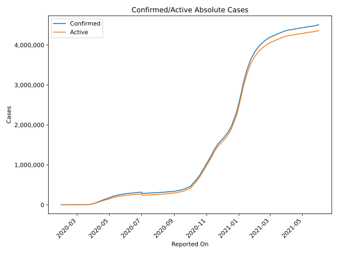
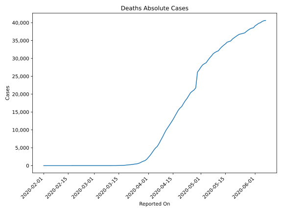
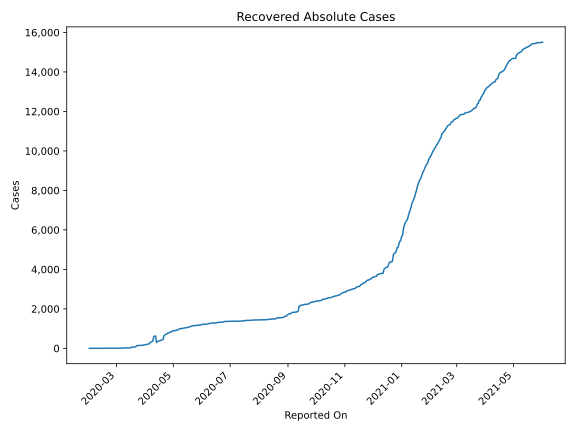
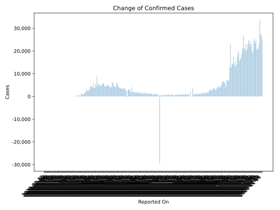
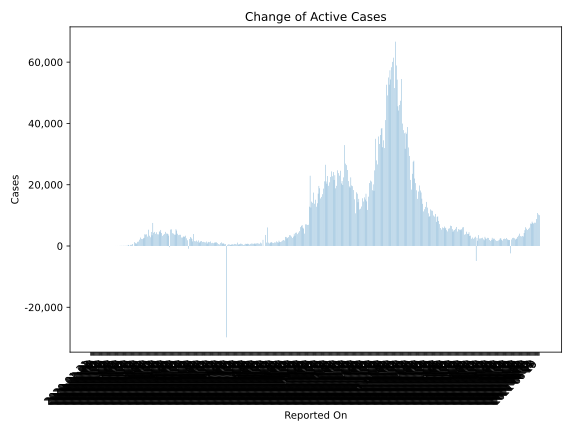
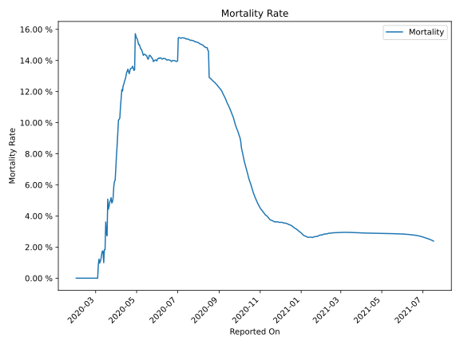

# Country Figures: Time Series for UnitedKingdom 

| Reported On | Confirmed | Deaths | Recovered | Active | Mortality | &Delta; Confirmed | &Delta; Deaths | &Delta; Active | % Active of Population |
|-------------|-----------|--------|-----------|--------|-----------|-------------------|----------------|----------------|------------------------|
| 2020-04-09 | 65872 | 7993 | 359 | 57520 |  12.13 %  | 4398 | 882 | 3502 |  0.087 %  | 
| 2020-04-08 | 61474 | 7111 | 345 | 54018 |  11.57 %  | 5525 | 940 | 4565 |  0.081 %  | 
| 2020-04-07 | 55949 | 6171 | 325 | 49453 |  11.03 %  | 3670 | 786 | 2846 |  0.074 %  | 
| 2020-04-06 | 52279 | 5385 | 287 | 46607 |  10.30 %  | 3843 | 442 | 3343 |  0.070 %  | 
| 2020-04-05 | 48436 | 4943 | 229 | 43264 |  10.21 %  | 5959 | 623 | 5322 |  0.065 %  | 
| 2020-04-04 | 42477 | 4320 | 215 | 37942 |  10.17 %  | 3788 | 709 | 3072 |  0.057 %  | 
| 2020-04-03 | 38689 | 3611 | 208 | 34870 |  9.33 %  | 4516 | 685 | 3815 |  0.052 %  | 
| 2020-04-02 | 34173 | 2926 | 192 | 31055 |  8.56 %  | 4308 | 569 | 3726 |  0.047 %  | 
| 2020-04-01 | 29865 | 2357 | 179 | 27329 |  7.89 %  | 4384 | 564 | 3820 |  0.041 %  | 
| 2020-03-31 | 25481 | 1793 | 179 | 23509 |  7.04 %  | 3028 | 382 | 2638 |  0.035 %  | 
| 2020-03-30 | 22453 | 1411 | 171 | 20871 |  6.28 %  | 2673 | 180 | 2473 |  0.031 %  | 
| 2020-03-29 | 19780 | 1231 | 151 | 18398 |  6.22 %  | 2468 | 210 | 2258 |  0.028 %  | 
| 2020-03-28 | 17312 | 1021 | 151 | 16140 |  5.90 %  | 2567 | 260 | 2307 |  0.024 %  | 
| 2020-03-27 | 14745 | 761 | 151 | 13833 |  5.16 %  | 2933 | 181 | 2751 |  0.021 %  | 
| 2020-03-26 | 11812 | 580 | 150 | 11082 |  4.91 %  | 2172 | 114 | 2048 |  0.017 %  | 
| 2020-03-25 | 9640 | 466 | 140 | 9034 |  4.83 %  | 1476 | 43 | 1433 |  0.014 %  | 
| 2020-03-24 | 8164 | 423 | 140 | 7601 |  5.18 %  | 1438 | 87 | 1351 |  0.011 %  | 
| 2020-03-23 | 6726 | 336 | 140 | 6250 |  5.00 %  | 985 | 54 | 886 |  0.009 %  | 
| 2020-03-22 | 5741 | 282 | 95 | 5364 |  4.91 %  | 674 | 48 | 598 |  0.008 %  | 
| 2020-03-21 | 5067 | 234 | 67 | 4766 |  4.62 %  | 1053 | 56 | 997 |  0.007 %  | 
| 2020-03-20 | 4014 | 178 | 67 | 3769 |  4.43 %  | 1298 | 40 | 1258 |  0.006 %  | 
| 2020-03-19 | 2716 | 138 | 67 | 2511 |  5.08 %  | 74 | 66 | 8 |  0.004 %  | 
| 2020-03-18 | 2642 | 72 | 67 | 2503 |  2.73 %  | 682 | 16 | 652 |  0.004 %  | 
| 2020-03-17 | 1960 | 56 | 53 | 1851 |  2.86 %  | 409 | 0 | 377 |  0.003 %  | 
| 2020-03-16 | 1551 | 56 | 21 | 1474 |  3.61 %  | 407 | 35 | 370 |  0.002 %  | 
| 2020-03-15 | 1144 | 21 | 19 | 1104 |  1.84 %  | 0 | 0 | 0 |  0.002 %  | 
| 2020-03-14 | 1144 | 21 | 19 | 1104 |  1.84 %  | 343 | 13 | 330 |  0.002 %  | 
| 2020-03-13 | 801 | 8 | 19 | 774 |  1.00 %  | 342 | 0 | 342 |  0.001 %  | 
| 2020-03-12 | 459 | 8 | 19 | 432 |  1.74 %  | 0 | 0 | 0 |  0.001 %  | 
| 2020-03-11 | 459 | 8 | 19 | 432 |  1.74 %  | 76 | 2 | 73 |  0.001 %  | 
| 2020-03-10 | 383 | 6 | 18 | 359 |  1.57 %  | 62 | 2 | 60 |  0.001 %  | 
| 2020-03-09 | 321 | 4 | 18 | 299 |  1.25 %  | 48 | 1 | 47 |  0.000 %  | 
| 2020-03-08 | 273 | 3 | 18 | 252 |  1.10 %  | 67 | 1 | 66 |  0.000 %  | 
| 2020-03-07 | 206 | 2 | 18 | 186 |  0.97 %  | 43 | 0 | 33 |  0.000 %  | 
| 2020-03-06 | 163 | 2 | 8 | 153 |  1.23 %  | 48 | 1 | 47 |  0.000 %  | 
| 2020-03-05 | 115 | 1 | 8 | 106 |  0.87 %  | 30 | 1 | 29 |  0.000 %  | 
| 2020-03-04 | 85 | 0 | 8 | 77 |  None  | 34 | 0 | 34 |  0.000 %  | 
| 2020-03-03 | 51 | 0 | 8 | 43 |  None  | 11 | 0 | 11 |  0.000 %  | 
| 2020-03-02 | 40 | 0 | 8 | 32 |  None  | 4 | 0 | 4 |  0.000 %  | 
| 2020-03-01 | 36 | 0 | 8 | 28 |  None  | 13 | 0 | 13 |  0.000 %  | 
| 2020-02-29 | 23 | 0 | 8 | 15 |  None  | 2 | 0 | 2 |  0.000 %  | 
| 2020-02-28 | 21 | 0 | 8 | 13 |  None  | 6 | 0 | 6 |  0.000 %  | 
| 2020-02-27 | 15 | 0 | 8 | 7 |  None  | 2 | 0 | 2 |  0.000 %  | 
| 2020-02-26 | 13 | 0 | 8 | 5 |  None  | 0 | 0 | 0 |  0.000 %  | 
| 2020-02-25 | 13 | 0 | 8 | 5 |  None  | 0 | 0 | 0 |  0.000 %  | 
| 2020-02-24 | 13 | 0 | 8 | 5 |  None  | 4 | 0 | 4 |  0.000 %  | 
| 2020-02-23 | 9 | 0 | 8 | 1 |  None  | 0 | 0 | 0 |  0.000 %  | 
| 2020-02-22 | 9 | 0 | 8 | 1 |  None  | 0 | 0 | 0 |  0.000 %  | 
| 2020-02-21 | 9 | 0 | 8 | 1 |  None  | 0 | 0 | 0 |  0.000 %  | 
| 2020-02-20 | 9 | 0 | 8 | 1 |  None  | 0 | 0 | 0 |  0.000 %  | 
| 2020-02-19 | 9 | 0 | 8 | 1 |  None  | 0 | 0 | 0 |  0.000 %  | 
| 2020-02-18 | 9 | 0 | 8 | 1 |  None  | 0 | 0 | 0 |  0.000 %  | 
| 2020-02-17 | 9 | 0 | 8 | 1 |  None  | 0 | 0 | 0 |  0.000 %  | 
| 2020-02-16 | 9 | 0 | 8 | 1 |  None  | 0 | 0 | -7 |  0.000 %  | 
| 2020-02-15 | 9 | 0 | 1 | 8 |  None  | 0 | 0 | 0 |  0.000 %  | 
| 2020-02-14 | 9 | 0 | 1 | 8 |  None  | 0 | 0 | 0 |  0.000 %  | 
| 2020-02-13 | 9 | 0 | 1 | 8 |  None  | 0 | 0 | 0 |  0.000 %  | 
| 2020-02-12 | 9 | 0 | 1 | 8 |  None  | 1 | 0 | 0 |  0.000 %  | 
| 2020-02-11 | 8 | 0 | 0 | 8 |  None  | 0 | 0 | 0 |  0.000 %  | 
| 2020-02-10 | 8 | 0 | 0 | 8 |  None  | 5 | 0 | 5 |  0.000 %  | 
| 2020-02-09 | 3 | 0 | 0 | 3 |  None  | 0 | 0 | 0 |  0.000 %  | 
| 2020-02-08 | 3 | 0 | 0 | 3 |  None  | 0 | 0 | 0 |  0.000 %  | 
| 2020-02-07 | 3 | 0 | 0 | 3 |  None  | 1 | 0 | 1 |  0.000 %  | 
| 2020-02-06 | 2 | 0 | 0 | 2 |  None  | 0 | 0 | 0 |  0.000 %  | 
| 2020-02-05 | 2 | 0 | 0 | 2 |  None  | 0 | 0 | 0 |  0.000 %  | 
| 2020-02-04 | 2 | 0 | 0 | 2 |  None  | 0 | 0 | 0 |  0.000 %  | 
| 2020-02-03 | 2 | 0 | 0 | 2 |  None  | 0 | 0 | 0 |  0.000 %  | 
| 2020-02-02 | 2 | 0 | 0 | 2 |  None  | 0 | 0 | 0 |  0.000 %  | 
| 2020-02-01 | 2 | 0 | 0 | 2 |  None  | 0 | None | None |  0.000 %  | 
| 2020-01-31 | 2 | None | None | None |  None  | None | None | None |  n/a  | 

