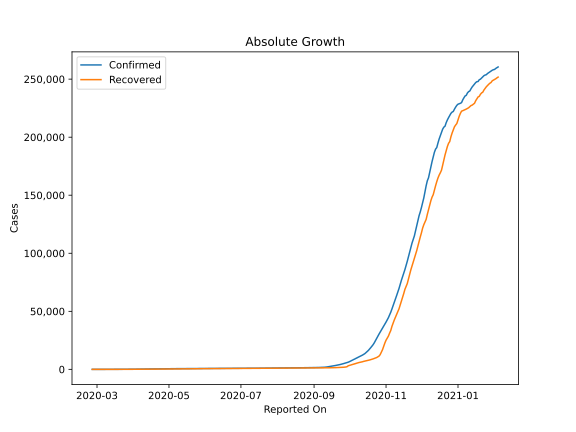
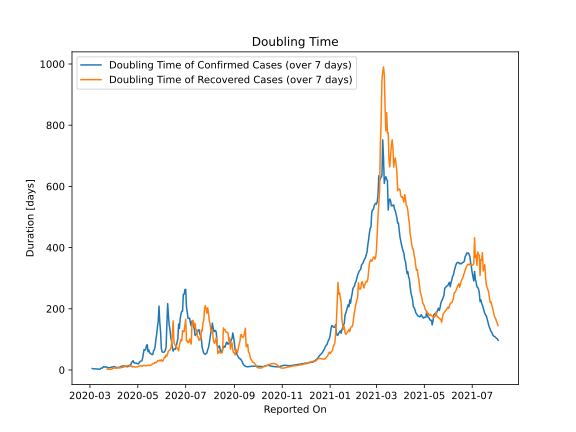

# Country Figures: Doubling Time of Infections for Georgia 

The doubling time below are calculated based on
* an exponential growth assumption
* for time difference of past seven (7) days.
The doubling time's unit is "days".

The first doubling time indicates the increase of confirmed (infected)
cases. There, the *higher* the number is, the better is to take control
of the disease.

The second doubling time indicates the increase of recovered (healed)
cases. There, the *lower* the number is, the better it is to take
control of the disease.

| Reported On | Confirmed | Doubling Time (Confirmed) | Recovered | Doubling Time (Recovered) |
|-------------|-----------|---------------------------|-----------|---------------------------|
| 2020-04-19 | 394 |  11.7 days  | 93 |  15.1 days  | 
| 2020-04-18 | 388 |  10.6 days  | 86 |  13.8 days  | 
| 2020-04-17 | 370 |  10.9 days  | 79 |  13.1 days  | 
| 2020-04-16 | 348 |  10.7 days  | 76 |  12.5 days  | 
| 2020-04-15 | 306 |  13.4 days  | 71 |  14.2 days  | 
| 2020-04-14 | 300 |  11.7 days  | 69 |  12.3 days  | 
| 2020-04-13 | 272 |  13.5 days  | 68 |  9.1 days  | 
| 2020-04-12 | 257 |  12.8 days  | 67 |  8.2 days  | 
| 2020-04-11 | 242 |  12.4 days  | 60 |  9.8 days  | 
| 2020-04-10 | 234 |  12.1 days  | 54 |  7.7 days  | 
| 2020-04-09 | 218 |  10.3 days  | 51 |  7.5 days  | 
| 2020-04-08 | 211 |  8.6 days  | 50 |  6.6 days  | 
| 2020-04-07 | 196 |  8.7 days  | 46 |  6.5 days  | 
| 2020-04-06 | 188 |  8.4 days  | 39 |  7.6 days  | 
| 2020-04-05 | 174 |  7.8 days  | 36 |  7.3 days  | 
| 2020-04-04 | 162 |  8.6 days  | 36 |  5.5 days  | 
| 2020-04-03 | 155 |  8.1 days  | 28 |  7.3 days  | 
| 2020-04-02 | 134 |  9.5 days  | 26 |  6.0 days  | 
| 2020-04-01 | 117 |  11.3 days  | 23 |  6.2 days  | 
| 2020-03-31 | 110 |  11.1 days  | 21 |  6.1 days  | 
| 2020-03-30 | 103 |  9.6 days  | 20 |  5.6 days  | 
| 2020-03-29 | 91 |  9.6 days  | 18 |  2.0 days  | 
| 2020-03-28 | 90 |  8.3 days  | 14 |  2.2 days  | 
| 2020-03-27 | 83 |  7.7 days  | 14 |  2.2 days  | 
| 2020-03-26 | 79 |  7.5 days  | 11 |  2.4 days  | 
| 2020-03-25 | 75 |  7.5 days  | 10 |  2.4 days  | 
| 2020-03-24 | 70 |  7.1 days  | 9 |  2.5 days  | 
| 2020-03-23 | 61 |  8.2 days  | 8 |  2.7 days  | 
| 2020-03-22 | 54 |  10.2 days  | 1 |  None  | 
| 2020-03-21 | 49 |  10.2 days  | 1 |  None  | 
| 2020-03-20 | 43 |  9.3 days  | 1 |  None  | 
| 2020-03-19 | 40 |  9.8 days  | 1 |  None  | 
| 2020-03-18 | 38 |  10.9 days  | 1 |  None  | 
| 2020-03-17 | 34 |  6.3 days  | 1 |  None  | 
| 2020-03-16 | 33 |  6.5 days  | 1 |  None  | 
| 2020-03-15 | 33 |  5.5 days  | 0 |  None  | 
| 2020-03-14 | 30 |  2.7 days  | 0 |  None  | 
| 2020-03-13 | 25 |  3.0 days  | 0 |  None  | 
| 2020-03-12 | 24 |  3.0 days  | 0 |  None  | 
| 2020-03-11 | 24 |  2.7 days  | 0 |  None  | 
| 2020-03-10 | 15 |  3.3 days  | 0 |  None  | 
| 2020-03-09 | 15 |  3.3 days  | 0 |  None  | 
| 2020-03-08 | 13 |  3.6 days  | 0 |  None  | 
| 2020-03-07 | 4 |  3.8 days  | 0 |  None  | 
| 2020-03-06 | 4 |  3.8 days  | 0 |  None  | 
| 2020-03-05 | 4 |  3.8 days  | 0 |  None  | 
| 2020-03-04 | 3 |  4.8 days  | 0 |  None  | 
| 2020-03-03 | 3 |  None  | 0 |  None  | 
| 2020-03-02 | 3 |  None  | 0 |  None  | 
| 2020-03-01 | 3 |  None  | 0 |  None  | 
| 2020-02-29 | 1 |  None  | 0 |  None  | 
| 2020-02-28 | 1 |  None  | 0 |  None  | 
| 2020-02-27 | 1 |  None  | 0 |  None  | 
| 2020-02-26 | 1 |  None  | 0 |  None  | 

