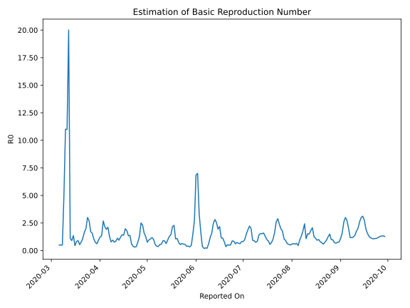

# Country Figures: Time Series for Basic Reproduction Number of Georgia 

| Reported On | &Delta; Confirmed | Total &Delta; Confirmed First Interval | Total &Delta; Confirmed Second Interval | Estimated Basic Reproduction Number R0 | 
|-------------|-------------------|----------------------------------------|-----------------------------------------|---------------------------------------------------|
| 2020-04-28 | 14 |  72  |  31  |  2.32  | 
| 2020-04-27 | 11 |  70  |  28  |  2.50  | 
| 2020-04-26 | 30 |  48  |  38  |  1.26  | 
| 2020-04-25 | 12 |  42  |  54  |  0.78  | 
| 2020-04-24 | 19 |  31  |  88  |  0.35  | 
| 2020-04-23 | 9 |  28  |  88  |  0.32  | 
| 2020-04-22 | 8 |  38  |  98  |  0.39  | 
| 2020-04-21 | 6 |  54  |  91  |  0.59  | 
| 2020-04-20 | 8 |  88  |  64  |  1.38  | 
| 2020-04-19 | 6 |  88  |  66  |  1.33  | 
| 2020-04-18 | 18 |  98  |  54  |  1.81  | 
| 2020-04-17 | 22 |  91  |  46  |  1.98  | 
| 2020-04-16 | 42 |  64  |  46  |  1.39  | 
| 2020-04-15 | 6 |  66  |  46  |  1.43  | 
| 2020-04-14 | 28 |  54  |  44  |  1.23  | 
| 2020-04-13 | 15 |  46  |  49  |  0.94  | 
| 2020-04-12 | 15 |  46  |  41  |  1.12  | 
| 2020-04-11 | 8 |  46  |  54  |  0.85  | 
| 2020-04-10 | 16 |  44  |  57  |  0.77  | 
| 2020-04-09 | 7 |  49  |  52  |  0.94  | 
| 2020-04-08 | 15 |  41  |  52  |  0.79  | 
| 2020-04-07 | 8 |  54  |  43  |  1.26  | 
| 2020-04-06 | 14 |  57  |  27  |  2.11  | 
| 2020-04-05 | 12 |  52  |  27  |  1.93  | 
| 2020-04-04 | 7 |  52  |  24  |  2.17  | 
| 2020-04-03 | 21 |  43  |  16  |  2.69  | 
| 2020-04-02 | 17 |  27  |  20  |  1.35  | 
| 2020-04-01 | 7 |  27  |  22  |  1.23  | 
| 2020-03-31 | 7 |  24  |  25  |  0.96  | 
| 2020-03-30 | 12 |  16  |  26  |  0.62  | 
| 2020-03-29 | 1 |  20  |  27  |  0.74  | 
| 2020-03-28 | 7 |  22  |  21  |  1.05  | 
| 2020-03-27 | 4 |  25  |  16  |  1.56  | 
| 2020-03-26 | 4 |  26  |  15  |  1.73  | 
| 2020-03-25 | 5 |  27  |  10  |  2.70  | 
| 2020-03-24 | 9 |  21  |  7  |  3.00  | 
| 2020-03-23 | 7 |  16  |  8  |  2.00  | 
| 2020-03-22 | 5 |  15  |  9  |  1.67  | 
| 2020-03-21 | 6 |  10  |  9  |  1.11  | 
| 2020-03-20 | 3 |  7  |  9  |  0.78  | 
| 2020-03-19 | 2 |  8  |  15  |  0.53  | 
| 2020-03-18 | 4 |  9  |  10  |  0.90  | 
| 2020-03-17 | 1 |  9  |  11  |  0.82  | 
| 2020-03-16 | 0 |  9  |  20  |  0.45  | 
| 2020-03-15 | 3 |  15  |  11  |  1.36  | 
| 2020-03-14 | 5 |  10  |  11  |  0.91  | 
| 2020-03-13 | 1 |  11  |  10  |  1.10  | 
| 2020-03-12 | 0 |  20  |  1  |  20.00  | 
| 2020-03-11 | 9 |  11  |  1  |  11.00  | 
| 2020-03-10 | 0 |  11  |  1  |  11.00  | 
| 2020-03-09 | 2 |  10  |  2  |  5.00  | 
| 2020-03-08 | 9 |  1  |  2  |  0.50  | 
| 2020-03-07 | 0 |  1  |  2  |  0.50  | 
| 2020-03-06 | 0 |  1  |  2  |  0.50  | 
| 2020-03-05 | 1 |  2  |  None  |  None  | 
| 2020-03-04 | 0 |  2  |  None  |  None  | 
| 2020-03-03 | 0 |  2  |  None  |  None  | 
| 2020-03-02 | 0 |  2  |  None  |  None  | 
| 2020-03-01 | 2 |  None  |  None  |  None  | 
| 2020-02-29 | 0 |  None  |  None  |  None  | 
| 2020-02-28 | 0 |  None  |  None  |  None  | 
| 2020-02-27 | 0 |  None  |  None  |  None  | 
| 2020-02-26 | None |  None  |  None  |  None  | 

