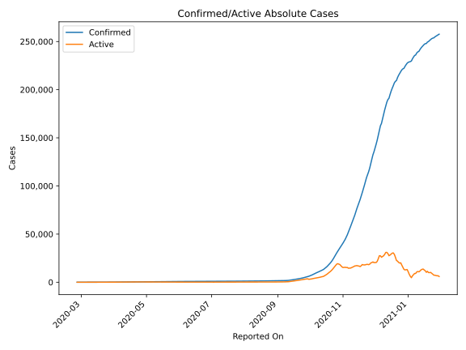
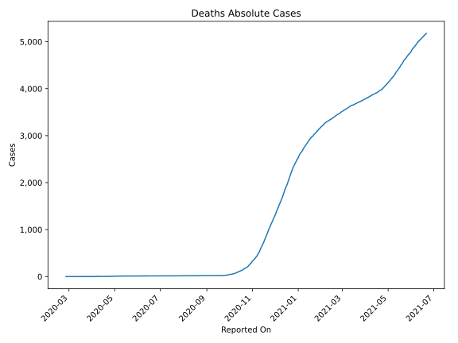
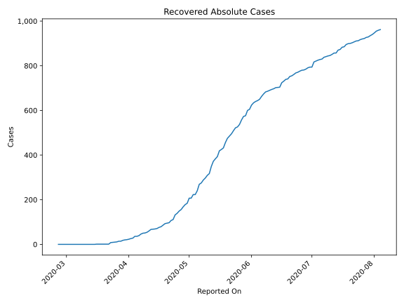
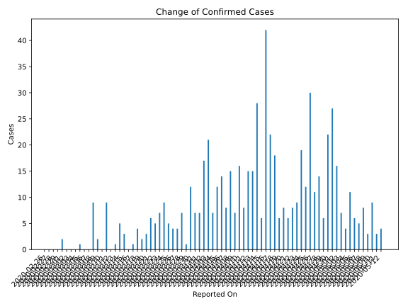
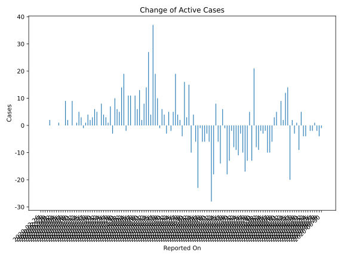
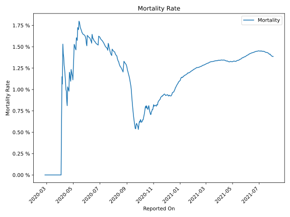

# Country Figures: Time Series for Georgia 

| Reported On | Confirmed | Deaths | Recovered | Active | Mortality | &Delta; Confirmed | &Delta; Deaths | &Delta; Recovered | &Delta; Active | % Active of Population |
|-------------|-----------|--------|-----------|--------|-----------|-------------------|----------------|-------------------|----------------|------------------------|
| 2020-05-05 | 604 | 9 | 240 | 355 |  1.49 %  | 11 | 0 | 17 | -6 |  0.010 %  | 
| 2020-05-04 | 593 | 9 | 223 | 361 |  1.52 %  | 4 | 0 | 0 | 4 |  0.010 %  | 
| 2020-05-03 | 589 | 9 | 223 | 357 |  1.53 %  | 7 | 1 | 16 | -10 |  0.010 %  | 
| 2020-05-02 | 582 | 8 | 207 | 367 |  1.37 %  | 16 | 1 | 0 | 15 |  0.010 %  | 
| 2020-05-01 | 566 | 7 | 207 | 352 |  1.24 %  | 27 | 1 | 23 | 3 |  0.009 %  | 
| 2020-04-30 | 539 | 6 | 184 | 349 |  1.11 %  | 22 | 0 | 6 | 16 |  0.009 %  | 
| 2020-04-29 | 517 | 6 | 178 | 333 |  1.16 %  | 6 | 0 | 10 | -4 |  0.009 %  | 
| 2020-04-28 | 511 | 6 | 168 | 337 |  1.17 %  | 14 | 0 | 12 | 2 |  0.009 %  | 
| 2020-04-27 | 497 | 6 | 156 | 335 |  1.21 %  | 11 | 0 | 7 | 4 |  0.009 %  | 
| 2020-04-26 | 486 | 6 | 149 | 331 |  1.23 %  | 30 | 1 | 10 | 19 |  0.009 %  | 
| 2020-04-25 | 456 | 5 | 139 | 312 |  1.10 %  | 12 | 0 | 7 | 5 |  0.008 %  | 
| 2020-04-24 | 444 | 5 | 132 | 307 |  1.13 %  | 19 | 0 | 21 | -2 |  0.008 %  | 
| 2020-04-23 | 425 | 5 | 111 | 309 |  1.18 %  | 9 | 0 | 4 | 5 |  0.008 %  | 
| 2020-04-22 | 416 | 5 | 107 | 304 |  1.20 %  | 8 | 1 | 10 | -3 |  0.008 %  | 
| 2020-04-21 | 408 | 4 | 97 | 307 |  0.98 %  | 6 | 0 | 2 | 4 |  0.008 %  | 
| 2020-04-20 | 402 | 4 | 95 | 303 |  1.00 %  | 8 | 0 | 2 | 6 |  0.008 %  | 
| 2020-04-19 | 394 | 4 | 93 | 297 |  1.02 %  | 6 | 0 | 7 | -1 |  0.008 %  | 
| 2020-04-18 | 388 | 4 | 86 | 298 |  1.03 %  | 18 | 1 | 7 | 10 |  0.008 %  | 
| 2020-04-17 | 370 | 3 | 79 | 288 |  0.81 %  | 22 | 0 | 3 | 19 |  0.008 %  | 
| 2020-04-16 | 348 | 3 | 76 | 269 |  0.86 %  | 42 | 0 | 5 | 37 |  0.007 %  | 
| 2020-04-15 | 306 | 3 | 71 | 232 |  0.98 %  | 6 | 0 | 2 | 4 |  0.006 %  | 
| 2020-04-14 | 300 | 3 | 69 | 228 |  1.00 %  | 28 | 0 | 1 | 27 |  0.006 %  | 
| 2020-04-13 | 272 | 3 | 68 | 201 |  1.10 %  | 15 | 0 | 1 | 14 |  0.005 %  | 
| 2020-04-12 | 257 | 3 | 67 | 187 |  1.17 %  | 15 | 0 | 7 | 8 |  0.005 %  | 
| 2020-04-11 | 242 | 3 | 60 | 179 |  1.24 %  | 8 | 0 | 6 | 2 |  0.005 %  | 
| 2020-04-10 | 234 | 3 | 54 | 177 |  1.28 %  | 16 | 0 | 3 | 13 |  0.005 %  | 
| 2020-04-09 | 218 | 3 | 51 | 164 |  1.38 %  | 7 | 0 | 1 | 6 |  0.004 %  | 
| 2020-04-08 | 211 | 3 | 50 | 158 |  1.42 %  | 15 | 0 | 4 | 11 |  0.004 %  | 
| 2020-04-07 | 196 | 3 | 46 | 147 |  1.53 %  | 8 | 1 | 7 | 0 |  0.004 %  | 
| 2020-04-06 | 188 | 2 | 39 | 147 |  1.06 %  | 14 | 0 | 3 | 11 |  0.004 %  | 
| 2020-04-05 | 174 | 2 | 36 | 136 |  1.15 %  | 12 | 1 | 0 | 11 |  0.004 %  | 
| 2020-04-04 | 162 | 1 | 36 | 125 |  0.62 %  | 7 | 1 | 8 | -2 |  0.003 %  | 
| 2020-04-03 | 155 | 0 | 28 | 127 |  None  | 21 | 0 | 2 | 19 |  0.003 %  | 
| 2020-04-02 | 134 | 0 | 26 | 108 |  None  | 17 | 0 | 3 | 14 |  0.003 %  | 
| 2020-04-01 | 117 | 0 | 23 | 94 |  None  | 7 | 0 | 2 | 5 |  0.003 %  | 
| 2020-03-31 | 110 | 0 | 21 | 89 |  None  | 7 | 0 | 1 | 6 |  0.002 %  | 
| 2020-03-30 | 103 | 0 | 20 | 83 |  None  | 12 | 0 | 2 | 10 |  0.002 %  | 
| 2020-03-29 | 91 | 0 | 18 | 73 |  None  | 1 | 0 | 4 | -3 |  0.002 %  | 
| 2020-03-28 | 90 | 0 | 14 | 76 |  None  | 7 | 0 | 0 | 7 |  0.002 %  | 
| 2020-03-27 | 83 | 0 | 14 | 69 |  None  | 4 | 0 | 3 | 1 |  0.002 %  | 
| 2020-03-26 | 79 | 0 | 11 | 68 |  None  | 4 | 0 | 1 | 3 |  0.002 %  | 
| 2020-03-25 | 75 | 0 | 10 | 65 |  None  | 5 | 0 | 1 | 4 |  0.002 %  | 
| 2020-03-24 | 70 | 0 | 9 | 61 |  None  | 9 | 0 | 1 | 8 |  0.002 %  | 
| 2020-03-23 | 61 | 0 | 8 | 53 |  None  | 7 | 0 | 7 | 0 |  0.001 %  | 
| 2020-03-22 | 54 | 0 | 1 | 53 |  None  | 5 | 0 | 0 | 5 |  0.001 %  | 
| 2020-03-21 | 49 | 0 | 1 | 48 |  None  | 6 | 0 | 0 | 6 |  0.001 %  | 
| 2020-03-20 | 43 | 0 | 1 | 42 |  None  | 3 | 0 | 0 | 3 |  0.001 %  | 
| 2020-03-19 | 40 | 0 | 1 | 39 |  None  | 2 | 0 | 0 | 2 |  0.001 %  | 
| 2020-03-18 | 38 | 0 | 1 | 37 |  None  | 4 | 0 | 0 | 4 |  0.001 %  | 
| 2020-03-17 | 34 | 0 | 1 | 33 |  None  | 1 | 0 | 0 | 1 |  0.001 %  | 
| 2020-03-16 | 33 | 0 | 1 | 32 |  None  | 0 | 0 | 1 | -1 |  0.001 %  | 
| 2020-03-15 | 33 | 0 | 0 | 33 |  None  | 3 | 0 | 0 | 3 |  0.001 %  | 
| 2020-03-14 | 30 | 0 | 0 | 30 |  None  | 5 | 0 | 0 | 5 |  0.001 %  | 
| 2020-03-13 | 25 | 0 | 0 | 25 |  None  | 1 | 0 | 0 | 1 |  0.001 %  | 
| 2020-03-12 | 24 | 0 | 0 | 24 |  None  | 0 | 0 | 0 | 0 |  0.001 %  | 
| 2020-03-11 | 24 | 0 | 0 | 24 |  None  | 9 | 0 | 0 | 9 |  0.001 %  | 
| 2020-03-10 | 15 | 0 | 0 | 15 |  None  | 0 | 0 | 0 | 0 |  0.000 %  | 
| 2020-03-09 | 15 | 0 | 0 | 15 |  None  | 2 | 0 | 0 | 2 |  0.000 %  | 
| 2020-03-08 | 13 | 0 | 0 | 13 |  None  | 9 | 0 | 0 | 9 |  0.000 %  | 
| 2020-03-07 | 4 | 0 | 0 | 4 |  None  | 0 | 0 | 0 | 0 |  0.000 %  | 
| 2020-03-06 | 4 | 0 | 0 | 4 |  None  | 0 | 0 | 0 | 0 |  0.000 %  | 
| 2020-03-05 | 4 | 0 | 0 | 4 |  None  | 1 | 0 | 0 | 1 |  0.000 %  | 
| 2020-03-04 | 3 | 0 | 0 | 3 |  None  | 0 | 0 | 0 | 0 |  0.000 %  | 
| 2020-03-03 | 3 | 0 | 0 | 3 |  None  | 0 | 0 | 0 | 0 |  0.000 %  | 
| 2020-03-02 | 3 | 0 | 0 | 3 |  None  | 0 | 0 | 0 | 0 |  0.000 %  | 
| 2020-03-01 | 3 | 0 | 0 | 3 |  None  | 2 | 0 | 0 | 2 |  0.000 %  | 
| 2020-02-29 | 1 | 0 | 0 | 1 |  None  | 0 | 0 | 0 | 0 |  0.000 %  | 
| 2020-02-28 | 1 | 0 | 0 | 1 |  None  | 0 | 0 | 0 | 0 |  0.000 %  | 
| 2020-02-27 | 1 | 0 | 0 | 1 |  None  | 0 | 0 | 0 | 0 |  0.000 %  | 
| 2020-02-26 | 1 | 0 | 0 | 1 |  None  | None | None | None | None |  0.000 %  | 

