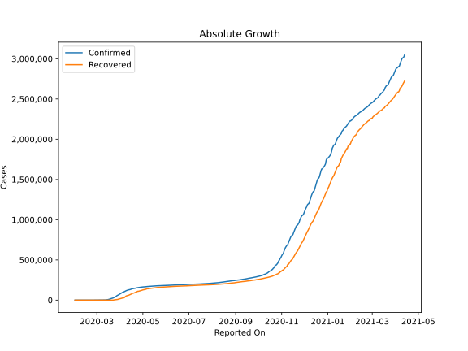
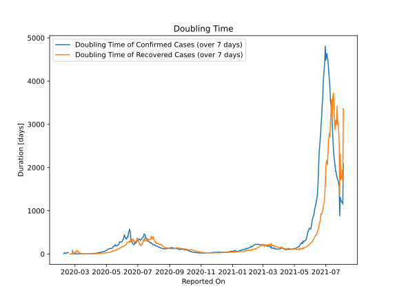

# Country Figures: Doubling Time of Infections for Germany 

The doubling time below are calculated based on
* an exponential growth assumption
* for time difference of past seven (7) days.
The doubling time's unit is "days".

The first doubling time indicates the increase of confirmed (infected)
cases. There, the *higher* the number is, the better is to take control
of the disease.

The second doubling time indicates the increase of recovered (healed)
cases. There, the *lower* the number is, the better it is to take
control of the disease.

| Reported On | Confirmed | Doubling Time (Confirmed) | Recovered | Doubling Time (Recovered) |
|-------------|-----------|---------------------------|-----------|---------------------------|
| 2020-04-17 | 141397 |  33.5 days  | 83114 |  11.6 days  | 
| 2020-04-16 | 137698 |  32.1 days  | 77000 |  13.0 days  | 
| 2020-04-15 | 134753 |  28.3 days  | 72600 |  11.1 days  | 
| 2020-04-14 | 131359 |  24.7 days  | 68200 |  8.0 days  | 
| 2020-04-13 | 130072 |  21.5 days  | 64300 |  6.4 days  | 
| 2020-04-12 | 127854 |  20.2 days  | 60300 |  6.9 days  | 
| 2020-04-11 | 124908 |  18.8 days  | 57400 |  6.6 days  | 
| 2020-04-10 | 122171 |  16.9 days  | 53913 |  6.5 days  | 
| 2020-04-09 | 118181 |  15.0 days  | 52407 |  6.1 days  | 
| 2020-04-08 | 113296 |  13.3 days  | 46300 |  5.7 days  | 
| 2020-04-07 | 107663 |  12.3 days  | 36081 |  6.4 days  | 
| 2020-04-06 | 103374 |  11.5 days  | 28700 |  6.8 days  | 
| 2020-04-05 | 100123 |  10.5 days  | 28700 |  4.6 days  | 
| 2020-04-04 | 96092 |  9.9 days  | 26400 |  4.6 days  | 
| 2020-04-03 | 91159 |  8.7 days  | 24575 |  4.1 days  | 
| 2020-04-02 | 84794 |  7.7 days  | 22440 |  3.9 days  | 
| 2020-04-01 | 77872 |  6.9 days  | 18700 |  3.3 days  | 
| 2020-03-31 | 71808 |  6.6 days  | 16100 |  3.4 days  | 
| 2020-03-30 | 66885 |  6.2 days  | 13500 |  1.8 days  | 
| 2020-03-29 | 62095 |  5.6 days  | 9211 |  1.7 days  | 
| 2020-03-28 | 57695 |  5.4 days  | 8481 |  1.7 days  | 
| 2020-03-27 | 50871 |  5.5 days  | 6658 |  1.7 days  | 
| 2020-03-26 | 43938 |  4.9 days  | 5673 |  1.6 days  | 
| 2020-03-25 | 37323 |  4.7 days  | 3547 |  1.7 days  | 
| 2020-03-24 | 32986 |  4.2 days  | 3243 |  1.6 days  | 
| 2020-03-23 | 29056 |  3.8 days  | 453 |  2.9 days  | 
| 2020-03-22 | 24873 |  3.7 days  | 266 |  3.1 days  | 
| 2020-03-21 | 22213 |  3.4 days  | 233 |  3.3 days  | 
| 2020-03-20 | 19848 |  3.2 days  | 180 |  3.9 days  | 
| 2020-03-19 | 15320 |  2.8 days  | 113 |  3.6 days  | 
| 2020-03-18 | 12327 |  2.9 days  | 105 |  3.7 days  | 
| 2020-03-17 | 9257 |  3.0 days  | 67 |  4.0 days  | 
| 2020-03-16 | 7272 |  3.0 days  | 67 |  4.0 days  | 
| 2020-03-15 | 5795 |  3.2 days  | 46 |  5.5 days  | 
| 2020-03-14 | 4585 |  3.1 days  | 46 |  5.5 days  | 
| 2020-03-13 | 3675 |  3.2 days  | 46 |  5.2 days  | 
| 2020-03-12 | 2078 |  3.7 days  | 25 |  11.2 days  | 
| 2020-03-11 | 1908 |  2.8 days  | 25 |  11.2 days  | 
| 2020-03-10 | 1457 |  2.8 days  | 18 |  41.5 days  | 
| 2020-03-09 | 1176 |  2.8 days  | 18 |  41.5 days  | 
| 2020-03-08 | 1040 |  2.7 days  | 18 |  41.5 days  | 
| 2020-03-07 | 799 |  2.4 days  | 18 |  41.5 days  | 
| 2020-03-06 | 670 |  2.2 days  | 17 |  80.4 days  | 
| 2020-03-05 | 482 |  2.4 days  | 16 |  None  | 
| 2020-03-04 | 262 |  2.5 days  | 16 |  75.5 days  | 
| 2020-03-03 | 196 |  2.3 days  | 16 |  36.7 days  | 
| 2020-03-02 | 159 |  2.4 days  | 16 |  36.7 days  | 
| 2020-03-01 | 130 |  2.6 days  | 16 |  36.7 days  | 
| 2020-02-29 | 79 |  3.4 days  | 16 |  36.7 days  | 
| 2020-02-28 | 48 |  4.8 days  | 16 |  36.7 days  | 
| 2020-02-27 | 46 |  4.9 days  | 16 |  17.2 days  | 
| 2020-02-26 | 27 |  9.6 days  | 15 |  22.1 days  | 
| 2020-02-25 | 17 |  80.4 days  | 14 |  31.8 days  | 
| 2020-02-24 | 16 |  None  | 14 |  2.2 days  | 
| 2020-02-23 | 16 |  None  | 14 |  2.2 days  | 
| 2020-02-22 | 16 |  None  | 14 |  2.2 days  | 
| 2020-02-21 | 16 |  None  | 14 |  2.2 days  | 
| 2020-02-20 | 16 |  None  | 12 |  2.3 days  | 
| 2020-02-19 | 16 |  None  | 12 |  None  | 
| 2020-02-18 | 16 |  None  | 12 |  None  | 
| 2020-02-17 | 16 |  36.7 days  | 1 |  None  | 
| 2020-02-16 | 16 |  36.7 days  | 1 |  None  | 
| 2020-02-15 | 16 |  23.7 days  | 1 |  None  | 
| 2020-02-14 | 16 |  23.7 days  | 1 |  None  | 
| 2020-02-13 | 16 |  17.2 days  | 1 |  None  | 
| 2020-02-12 | 16 |  17.2 days  | 0 |  None  | 
| 2020-02-11 | 16 |  17.2 days  | 0 |  None  | 
| 2020-02-10 | 14 |  31.8 days  | 0 |  None  | 
| 2020-02-09 | 14 |  14.8 days  | 0 |  None  | 
| 2020-02-08 | 13 |  10.3 days  | 0 |  None  | 
| 2020-02-07 | 13 |  None  | 0 |  None  | 
| 2020-02-06 | 12 |  None  | 0 |  None  | 
| 2020-02-05 | 12 |  None  | 0 |  None  | 
| 2020-02-04 | 12 |  None  | 0 |  None  | 
| 2020-02-03 | 12 |  None  | 0 |  None  | 
| 2020-02-02 | 10 |  None  | 0 |  None  | 
| 2020-02-01 | 8 |  None  | 0 |  None  | 

