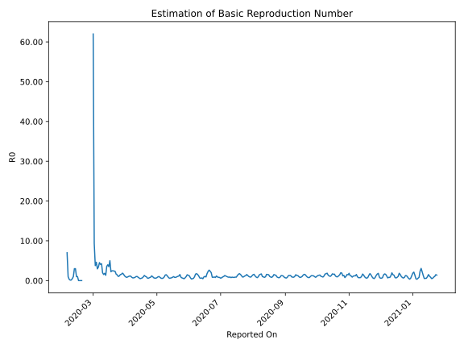

# Country Figures: Time Series for Basic Reproduction Number of Germany 

| Reported On | &Delta; Confirmed | Total &Delta; Confirmed First Interval | Total &Delta; Confirmed Second Interval | Estimated Basic Reproduction Number R0 | 
|-------------|-------------------|----------------------------------------|-----------------------------------------|---------------------------------------------------|
| 2020-05-09 | 736 |  4436  |  3143  |  1.41  | 
| 2020-05-08 | 1158 |  3766  |  4125  |  0.91  | 
| 2020-05-07 | 1268 |  3195  |  5055  |  0.63  | 
| 2020-05-06 | 1155 |  2930  |  5319  |  0.55  | 
| 2020-05-05 | 855 |  3143  |  5239  |  0.60  | 
| 2020-05-04 | 488 |  4125  |  5026  |  0.82  | 
| 2020-05-03 | 697 |  5055  |  4913  |  1.03  | 
| 2020-05-02 | 890 |  5319  |  5629  |  0.94  | 
| 2020-05-01 | 1068 |  5239  |  7122  |  0.74  | 
| 2020-04-30 | 1470 |  5026  |  8222  |  0.61  | 
| 2020-04-29 | 1627 |  4913  |  7934  |  0.62  | 
| 2020-04-28 | 1154 |  5629  |  7945  |  0.71  | 
| 2020-04-27 | 988 |  7122  |  7306  |  0.97  | 
| 2020-04-26 | 1257 |  8222  |  6894  |  1.19  | 
| 2020-04-25 | 1514 |  7934  |  9367  |  0.85  | 
| 2020-04-24 | 1870 |  7945  |  10431  |  0.76  | 
| 2020-04-23 | 2481 |  7306  |  11983  |  0.61  | 
| 2020-04-22 | 2357 |  6894  |  11325  |  0.61  | 
| 2020-04-21 | 1226 |  9367  |  9844  |  0.95  | 
| 2020-04-20 | 1881 |  10431  |  9845  |  1.06  | 
| 2020-04-19 | 1842 |  11983  |  9188  |  1.30  | 
| 2020-04-18 | 1945 |  11325  |  11891  |  0.95  | 
| 2020-04-17 | 3699 |  9844  |  14558  |  0.68  | 
| 2020-04-16 | 2945 |  9845  |  17245  |  0.57  | 
| 2020-04-15 | 3394 |  9188  |  18797  |  0.49  | 
| 2020-04-14 | 1287 |  11891  |  18058  |  0.66  | 
| 2020-04-13 | 2218 |  14558  |  17204  |  0.85  | 
| 2020-04-12 | 2946 |  17245  |  16504  |  1.04  | 
| 2020-04-11 | 2737 |  18797  |  18580  |  1.01  | 
| 2020-04-10 | 3990 |  18058  |  22251  |  0.81  | 
| 2020-04-09 | 4885 |  17204  |  24284  |  0.71  | 
| 2020-04-08 | 5633 |  16504  |  24274  |  0.68  | 
| 2020-04-07 | 4289 |  18580  |  22699  |  0.82  | 
| 2020-04-06 | 3251 |  22251  |  20177  |  1.10  | 
| 2020-04-05 | 4031 |  24284  |  20937  |  1.16  | 
| 2020-04-04 | 4933 |  24274  |  22947  |  1.06  | 
| 2020-04-03 | 6365 |  22699  |  24772  |  0.92  | 
| 2020-04-02 | 6922 |  20177  |  24709  |  0.82  | 
| 2020-04-01 | 6064 |  20937  |  21815  |  0.96  | 
| 2020-03-31 | 4923 |  22947  |  19065  |  1.20  | 
| 2020-03-30 | 4790 |  24772  |  15110  |  1.64  | 
| 2020-03-29 | 4400 |  24709  |  13138  |  1.88  | 
| 2020-03-28 | 6824 |  21815  |  13736  |  1.59  | 
| 2020-03-27 | 6933 |  19065  |  12546  |  1.52  | 
| 2020-03-26 | 6615 |  15110  |  12956  |  1.17  | 
| 2020-03-25 | 4337 |  13138  |  12576  |  1.04  | 
| 2020-03-24 | 3930 |  13736  |  9525  |  1.44  | 
| 2020-03-23 | 4183 |  12546  |  7742  |  1.62  | 
| 2020-03-22 | 2660 |  12956  |  5582  |  2.32  | 
| 2020-03-21 | 2365 |  12576  |  5194  |  2.42  | 
| 2020-03-20 | 4528 |  9525  |  3887  |  2.45  | 
| 2020-03-19 | 2993 |  7742  |  3128  |  2.48  | 
| 2020-03-18 | 3070 |  5582  |  2499  |  2.23  | 
| 2020-03-17 | 1985 |  5194  |  1038  |  5.00  | 
| 2020-03-16 | 1477 |  3887  |  1109  |  3.50  | 
| 2020-03-15 | 1210 |  3128  |  787  |  3.97  | 
| 2020-03-14 | 910 |  2499  |  694  |  3.60  | 
| 2020-03-13 | 1597 |  1038  |  778  |  1.33  | 
| 2020-03-12 | 170 |  1109  |  603  |  1.84  | 
| 2020-03-11 | 451 |  787  |  511  |  1.54  | 
| 2020-03-10 | 281 |  694  |  352  |  1.97  | 
| 2020-03-09 | 136 |  778  |  183  |  4.25  | 
| 2020-03-08 | 241 |  603  |  148  |  4.07  | 
| 2020-03-07 | 129 |  511  |  113  |  4.52  | 
| 2020-03-06 | 188 |  352  |  103  |  3.42  | 
| 2020-03-05 | 220 |  183  |  62  |  2.95  | 
| 2020-03-04 | 66 |  148  |  32  |  4.62  | 
| 2020-03-03 | 37 |  113  |  30  |  3.77  | 
| 2020-03-02 | 29 |  103  |  11  |  9.36  | 
| 2020-03-01 | 51 |  62  |  1  |  62.00  | 
| 2020-02-29 | 31 |  32  |  None  |  None  | 
| 2020-02-28 | 2 |  30  |  None  |  None  | 
| 2020-02-27 | 19 |  11  |  None  |  None  | 
| 2020-02-26 | 10 |  1  |  None  |  None  | 
| 2020-02-25 | 1 |  None  |  None  |  None  | 
| 2020-02-24 | 0 |  None  |  None  |  None  | 
| 2020-02-23 | 0 |  None  |  None  |  None  | 
| 2020-02-22 | 0 |  None  |  None  |  None  | 
| 2020-02-21 | 0 |  None  |  None  |  None  | 
| 2020-02-20 | 0 |  None  |  None  |  None  | 
| 2020-02-19 | 0 |  None  |  2  |  None  | 
| 2020-02-18 | 0 |  None  |  2  |  None  | 
| 2020-02-17 | 0 |  None  |  3  |  None  | 
| 2020-02-16 | 0 |  None  |  3  |  None  | 
| 2020-02-15 | 0 |  2  |  2  |  1.00  | 
| 2020-02-14 | 0 |  2  |  2  |  1.00  | 
| 2020-02-13 | 0 |  3  |  1  |  3.00  | 
| 2020-02-12 | 0 |  3  |  1  |  3.00  | 
| 2020-02-11 | 2 |  2  |  2  |  1.00  | 
| 2020-02-10 | 0 |  2  |  4  |  0.50  | 
| 2020-02-09 | 1 |  1  |  7  |  0.14  | 
| 2020-02-08 | 0 |  1  |  8  |  0.12  | 
| 2020-02-07 | 1 |  2  |  6  |  0.33  | 
| 2020-02-06 | 0 |  4  |  4  |  1.00  | 
| 2020-02-05 | 0 |  7  |  1  |  7.00  | 
| 2020-02-04 | 0 |  8  |  None  |  None  | 
| 2020-02-03 | 2 |  6  |  None  |  None  | 
| 2020-02-02 | 2 |  4  |  None  |  None  | 
| 2020-02-01 | 3 |  1  |  None  |  None  | 
| 2020-01-31 | 1 |  None  |  None  |  None  | 
| 2020-01-30 | 0 |  None  |  None  |  None  | 
| 2020-01-29 | 0 |  None  |  None  |  None  | 
| 2020-01-28 | None |  None  |  None  |  None  | 

