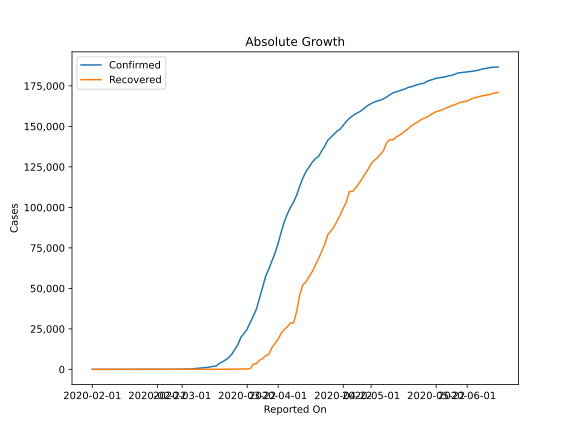
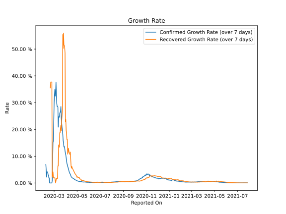

# Country Figures: Growth Rate for Germany 

The growth rates below are calculated based on
* an exponential growth assumption
* for time difference of past seven (7) days.
The growth rate is to be understood as on "growth per day".

The first growth rate indicates the increase of confirmed (infected) cases.

The second growth rate indicates the increase of recovered (healed) cases.

| Reported On | Confirmed | Growth Rate (Confirmed) | Recovered | Growth Rate (Recovered) |
|-------------|-----------|-------------------------|-----------|-------------------------|
| 2020-05-07 | 169430 |  0.55 %  | 141700 |  1.964 %  | 
| 2020-05-06 | 168162 |  0.57 %  | 139900 |  2.144 %  | 
| 2020-05-05 | 167007 |  0.62 %  | 135100 |  2.006 %  | 
| 2020-05-04 | 166152 |  0.65 %  | 132700 |  2.107 %  | 
| 2020-05-03 | 165664 |  0.70 %  | 130600 |  2.195 %  | 
| 2020-05-02 | 164967 |  0.75 %  | 129000 |  2.302 %  | 
| 2020-05-01 | 164077 |  0.81 %  | 126900 |  2.068 %  | 
| 2020-04-30 | 163009 |  0.89 %  | 123500 |  2.551 %  | 
| 2020-04-29 | 161539 |  1.00 %  | 120400 |  2.738 %  | 
| 2020-04-28 | 159912 |  1.08 %  | 117400 |  2.994 %  | 
| 2020-04-27 | 158758 |  1.09 %  | 114500 |  3.203 %  | 
| 2020-04-26 | 157770 |  1.19 %  | 112000 |  3.445 %  | 
| 2020-04-25 | 156513 |  1.26 %  | 109800 |  3.590 %  | 
| 2020-04-24 | 154999 |  1.31 %  | 109800 |  3.978 %  | 
| 2020-04-23 | 153129 |  1.52 %  | 103300 |  4.198 %  | 
| 2020-04-22 | 150648 |  1.59 %  | 99400 |  4.488 %  | 
| 2020-04-21 | 148291 |  1.73 %  | 95200 |  4.765 %  | 
| 2020-04-20 | 147065 |  1.75 %  | 91500 |  5.040 %  | 
| 2020-04-19 | 145184 |  1.82 %  | 88000 |  5.400 %  | 
| 2020-04-18 | 143342 |  1.97 %  | 85400 |  5.676 %  | 
| 2020-04-17 | 141397 |  2.09 %  | 83114 |  6.183 %  | 
| 2020-04-16 | 137698 |  2.18 %  | 77000 |  5.497 %  | 
| 2020-04-15 | 134753 |  2.48 %  | 72600 |  6.426 %  | 
| 2020-04-14 | 131359 |  2.84 %  | 68200 |  9.095 %  | 
| 2020-04-13 | 130072 |  3.28 %  | 64300 |  11.524 %  | 
| 2020-04-12 | 127854 |  3.49 %  | 60300 |  10.606 %  | 
| 2020-04-11 | 124908 |  3.75 %  | 57400 |  11.095 %  | 
| 2020-04-10 | 122171 |  4.18 %  | 53913 |  11.223 %  | 
| 2020-04-09 | 118181 |  4.74 %  | 52407 |  12.117 %  | 
| 2020-04-08 | 113296 |  5.36 %  | 46300 |  12.952 %  | 
| 2020-04-07 | 107663 |  5.79 %  | 36081 |  11.528 %  | 
| 2020-04-06 | 103374 |  6.22 %  | 28700 |  10.774 %  | 
| 2020-04-05 | 100123 |  6.82 %  | 28700 |  16.236 %  | 
| 2020-04-04 | 96092 |  7.29 %  | 26400 |  16.222 %  | 
| 2020-04-03 | 91159 |  8.33 %  | 24575 |  18.656 %  | 
| 2020-04-02 | 84794 |  9.39 %  | 22440 |  19.645 %  | 
| 2020-04-01 | 77872 |  10.51 %  | 18700 |  23.749 %  | 
| 2020-03-31 | 71808 |  11.11 %  | 16100 |  22.890 %  | 
| 2020-03-30 | 66885 |  11.91 %  | 13500 |  48.494 %  | 
| 2020-03-29 | 62095 |  13.07 %  | 9211 |  50.638 %  | 
| 2020-03-28 | 57695 |  13.64 %  | 8481 |  51.351 %  | 
| 2020-03-27 | 50871 |  13.45 %  | 6658 |  51.580 %  | 
| 2020-03-26 | 43938 |  15.05 %  | 5673 |  55.944 %  | 
| 2020-03-25 | 37323 |  15.83 %  | 3547 |  50.284 %  | 
| 2020-03-24 | 32986 |  18.15 %  | 3243 |  55.422 %  | 
| 2020-03-23 | 29056 |  19.79 %  | 453 |  27.303 %  | 
| 2020-03-22 | 24873 |  20.81 %  | 266 |  25.069 %  | 
| 2020-03-21 | 22213 |  22.54 %  | 233 |  23.177 %  | 
| 2020-03-20 | 19848 |  24.09 %  | 180 |  19.490 %  | 
| 2020-03-19 | 15320 |  28.54 %  | 113 |  21.550 %  | 
| 2020-03-18 | 12327 |  26.65 %  | 105 |  20.501 %  | 
| 2020-03-17 | 9257 |  26.41 %  | 67 |  18.776 %  | 
| 2020-03-16 | 7272 |  26.03 %  | 67 |  18.776 %  | 
| 2020-03-15 | 5795 |  24.54 %  | 46 |  13.404 %  | 
| 2020-03-14 | 4585 |  24.96 %  | 46 |  13.404 %  | 
| 2020-03-13 | 3675 |  24.31 %  | 46 |  14.220 %  | 
| 2020-03-12 | 2078 |  20.87 %  | 25 |  6.376 %  | 
| 2020-03-11 | 1908 |  28.36 %  | 25 |  6.376 %  | 
| 2020-03-10 | 1457 |  28.66 %  | 18 |  1.683 %  | 
| 2020-03-09 | 1176 |  28.59 %  | 18 |  1.683 %  | 
| 2020-03-08 | 1040 |  29.71 %  | 18 |  1.683 %  | 
| 2020-03-07 | 799 |  33.06 %  | 18 |  1.683 %  | 
| 2020-03-06 | 670 |  37.66 %  | 17 |  0.866 %  | 
| 2020-03-05 | 482 |  33.56 %  | 16 |  None  | 
| 2020-03-04 | 262 |  32.46 %  | 16 |  0.922 %  | 
| 2020-03-03 | 196 |  34.93 %  | 16 |  1.908 %  | 
| 2020-03-02 | 159 |  32.80 %  | 16 |  1.908 %  | 
| 2020-03-01 | 130 |  29.93 %  | 16 |  1.908 %  | 
| 2020-02-29 | 79 |  22.81 %  | 16 |  1.908 %  | 
| 2020-02-28 | 48 |  15.69 %  | 16 |  1.908 %  | 
| 2020-02-27 | 46 |  15.09 %  | 16 |  4.110 %  | 
| 2020-02-26 | 27 |  7.47 %  | 15 |  3.188 %  | 
| 2020-02-25 | 17 |  0.87 %  | 14 |  2.202 %  | 
| 2020-02-24 | 16 |  None  | 14 |  37.701 %  | 
| 2020-02-23 | 16 |  None  | 14 |  37.701 %  | 
| 2020-02-22 | 16 |  None  | 14 |  37.701 %  | 
| 2020-02-21 | 16 |  None  | 14 |  37.701 %  | 
| 2020-02-20 | 16 |  None  | 12 |  35.499 %  | 
| 2020-02-19 | 16 |  None  | 12 |  None  | 
| 2020-02-18 | 16 |  None  | 12 |  None  | 
| 2020-02-17 | 16 |  1.91 %  | 1 |  None  | 
| 2020-02-16 | 16 |  1.91 %  | 1 |  None  | 
| 2020-02-15 | 16 |  2.97 %  | 1 |  None  | 
| 2020-02-14 | 16 |  2.97 %  | 1 |  None  | 
| 2020-02-13 | 16 |  4.11 %  | 1 |  None  | 
| 2020-02-12 | 16 |  4.11 %  | 0 |  None  | 
| 2020-02-11 | 16 |  4.11 %  | 0 |  None  | 
| 2020-02-10 | 14 |  2.20 %  | 0 |  None  | 
| 2020-02-09 | 14 |  4.81 %  | 0 |  None  | 
| 2020-02-08 | 13 |  6.94 %  | 0 |  None  | 
| 2020-02-07 | 13 |  None  | 0 |  None  | 
| 2020-02-06 | 12 |  None  | 0 |  None  | 
| 2020-02-05 | 12 |  None  | 0 |  None  | 
| 2020-02-04 | 12 |  None  | 0 |  None  | 
| 2020-02-03 | 12 |  None  | 0 |  None  | 
| 2020-02-02 | 10 |  None  | 0 |  None  | 
| 2020-02-01 | 8 |  None  | 0 |  None  | 

