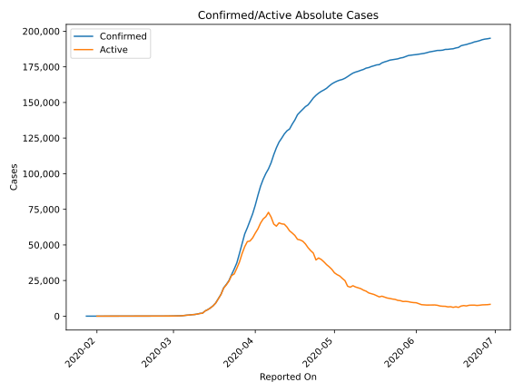
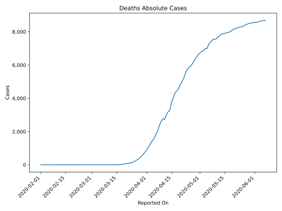
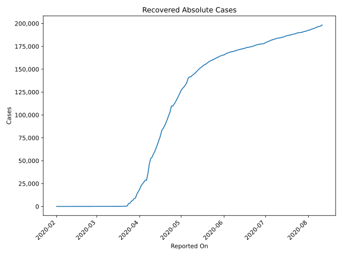
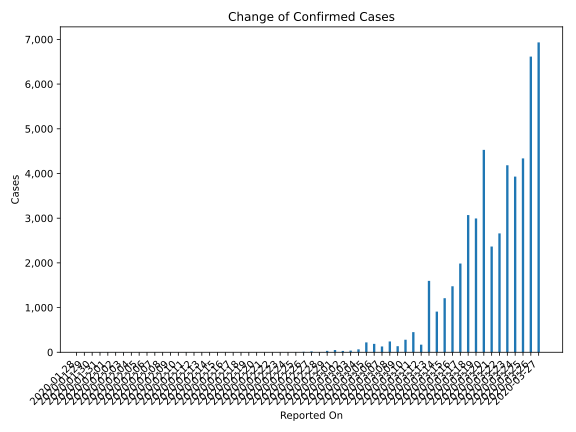
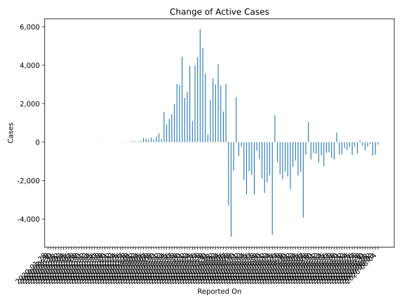
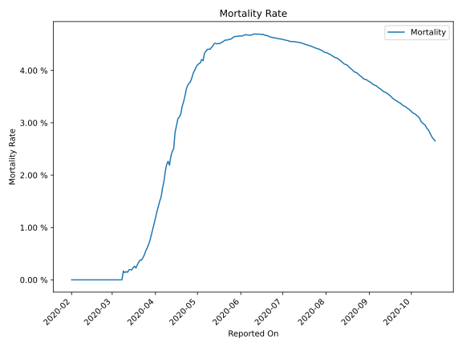

# Country Figures: Time Series for Germany 

| Reported On | Confirmed | Deaths | Recovered | Active | Mortality | &Delta; Confirmed | &Delta; Deaths | &Delta; Recovered | &Delta; Active | % Active of Population |
|-------------|-----------|--------|-----------|--------|-----------|-------------------|----------------|-------------------|----------------|------------------------|
| 2020-04-24 | 154999 | 5760 | 109800 | 39439 |  3.72 %  | 1870 | 185 | 6500 | -4815 |  0.048 %  | 
| 2020-04-23 | 153129 | 5575 | 103300 | 44254 |  3.64 %  | 2481 | 296 | 3900 | -1715 |  0.053 %  | 
| 2020-04-22 | 150648 | 5279 | 99400 | 45969 |  3.50 %  | 2357 | 246 | 4200 | -2089 |  0.056 %  | 
| 2020-04-21 | 148291 | 5033 | 95200 | 48058 |  3.39 %  | 1226 | 171 | 3700 | -2645 |  0.058 %  | 
| 2020-04-20 | 147065 | 4862 | 91500 | 50703 |  3.31 %  | 1881 | 276 | 3500 | -1895 |  0.061 %  | 
| 2020-04-19 | 145184 | 4586 | 88000 | 52598 |  3.16 %  | 1842 | 127 | 2600 | -885 |  0.064 %  | 
| 2020-04-18 | 143342 | 4459 | 85400 | 53483 |  3.11 %  | 1945 | 107 | 2286 | -448 |  0.065 %  | 
| 2020-04-17 | 141397 | 4352 | 83114 | 53931 |  3.08 %  | 3699 | 300 | 6114 | -2715 |  0.065 %  | 
| 2020-04-16 | 137698 | 4052 | 77000 | 56646 |  2.94 %  | 2945 | 248 | 4400 | -1703 |  0.068 %  | 
| 2020-04-15 | 134753 | 3804 | 72600 | 58349 |  2.82 %  | 3394 | 510 | 4400 | -1516 |  0.070 %  | 
| 2020-04-14 | 131359 | 3294 | 68200 | 59865 |  2.51 %  | 1287 | 100 | 3900 | -2713 |  0.072 %  | 
| 2020-04-13 | 130072 | 3194 | 64300 | 62578 |  2.46 %  | 2218 | 172 | 4000 | -1954 |  0.076 %  | 
| 2020-04-12 | 127854 | 3022 | 60300 | 64532 |  2.36 %  | 2946 | 286 | 2900 | -240 |  0.078 %  | 
| 2020-04-11 | 124908 | 2736 | 57400 | 64772 |  2.19 %  | 2737 | -31 | 3487 | -719 |  0.078 %  | 
| 2020-04-10 | 122171 | 2767 | 53913 | 65491 |  2.26 %  | 3990 | 160 | 1506 | 2324 |  0.079 %  | 
| 2020-04-09 | 118181 | 2607 | 52407 | 63167 |  2.21 %  | 4885 | 258 | 6107 | -1480 |  0.076 %  | 
| 2020-04-08 | 113296 | 2349 | 46300 | 64647 |  2.07 %  | 5633 | 333 | 10219 | -4919 |  0.078 %  | 
| 2020-04-07 | 107663 | 2016 | 36081 | 69566 |  1.87 %  | 4289 | 206 | 7381 | -3298 |  0.084 %  | 
| 2020-04-06 | 103374 | 1810 | 28700 | 72864 |  1.75 %  | 3251 | 226 | 0 | 3025 |  0.088 %  | 
| 2020-04-05 | 100123 | 1584 | 28700 | 69839 |  1.58 %  | 4031 | 140 | 2300 | 1591 |  0.084 %  | 
| 2020-04-04 | 96092 | 1444 | 26400 | 68248 |  1.50 %  | 4933 | 169 | 1825 | 2939 |  0.082 %  | 
| 2020-04-03 | 91159 | 1275 | 24575 | 65309 |  1.40 %  | 6365 | 168 | 2135 | 4062 |  0.079 %  | 
| 2020-04-02 | 84794 | 1107 | 22440 | 61247 |  1.31 %  | 6922 | 187 | 3740 | 2995 |  0.074 %  | 
| 2020-04-01 | 77872 | 920 | 18700 | 58252 |  1.18 %  | 6064 | 145 | 2600 | 3319 |  0.070 %  | 
| 2020-03-31 | 71808 | 775 | 16100 | 54933 |  1.08 %  | 4923 | 130 | 2600 | 2193 |  0.066 %  | 
| 2020-03-30 | 66885 | 645 | 13500 | 52740 |  0.96 %  | 4790 | 112 | 4289 | 389 |  0.064 %  | 
| 2020-03-29 | 62095 | 533 | 9211 | 52351 |  0.86 %  | 4400 | 100 | 730 | 3570 |  0.063 %  | 
| 2020-03-28 | 57695 | 433 | 8481 | 48781 |  0.75 %  | 6824 | 91 | 1823 | 4910 |  0.059 %  | 
| 2020-03-27 | 50871 | 342 | 6658 | 43871 |  0.67 %  | 6933 | 75 | 985 | 5873 |  0.053 %  | 
| 2020-03-26 | 43938 | 267 | 5673 | 37998 |  0.61 %  | 6615 | 61 | 2126 | 4428 |  0.046 %  | 
| 2020-03-25 | 37323 | 206 | 3547 | 33570 |  0.55 %  | 4337 | 49 | 304 | 3984 |  0.041 %  | 
| 2020-03-24 | 32986 | 157 | 3243 | 29586 |  0.48 %  | 3930 | 34 | 2790 | 1106 |  0.036 %  | 
| 2020-03-23 | 29056 | 123 | 453 | 28480 |  0.42 %  | 4183 | 29 | 187 | 3967 |  0.034 %  | 
| 2020-03-22 | 24873 | 94 | 266 | 24513 |  0.38 %  | 2660 | 10 | 33 | 2617 |  0.030 %  | 
| 2020-03-21 | 22213 | 84 | 233 | 21896 |  0.38 %  | 2365 | 17 | 53 | 2295 |  0.026 %  | 
| 2020-03-20 | 19848 | 67 | 180 | 19601 |  0.34 %  | 4528 | 23 | 67 | 4438 |  0.024 %  | 
| 2020-03-19 | 15320 | 44 | 113 | 15163 |  0.29 %  | 2993 | 16 | 8 | 2969 |  0.018 %  | 
| 2020-03-18 | 12327 | 28 | 105 | 12194 |  0.23 %  | 3070 | 4 | 38 | 3028 |  0.015 %  | 
| 2020-03-17 | 9257 | 24 | 67 | 9166 |  0.26 %  | 1985 | 7 | 0 | 1978 |  0.011 %  | 
| 2020-03-16 | 7272 | 17 | 67 | 7188 |  0.23 %  | 1477 | 6 | 21 | 1450 |  0.009 %  | 
| 2020-03-15 | 5795 | 11 | 46 | 5738 |  0.19 %  | 1210 | 2 | 0 | 1208 |  0.007 %  | 
| 2020-03-14 | 4585 | 9 | 46 | 4530 |  0.20 %  | 910 | 2 | 0 | 908 |  0.005 %  | 
| 2020-03-13 | 3675 | 7 | 46 | 3622 |  0.19 %  | 1597 | 4 | 21 | 1572 |  0.004 %  | 
| 2020-03-12 | 2078 | 3 | 25 | 2050 |  0.14 %  | 170 | 0 | 0 | 170 |  0.002 %  | 
| 2020-03-11 | 1908 | 3 | 25 | 1880 |  0.16 %  | 451 | 1 | 7 | 443 |  0.002 %  | 
| 2020-03-10 | 1457 | 2 | 18 | 1437 |  0.14 %  | 281 | 0 | 0 | 281 |  0.002 %  | 
| 2020-03-09 | 1176 | 2 | 18 | 1156 |  0.17 %  | 136 | 2 | 0 | 134 |  0.001 %  | 
| 2020-03-08 | 1040 | 0 | 18 | 1022 |  None  | 241 | 0 | 0 | 241 |  0.001 %  | 
| 2020-03-07 | 799 | 0 | 18 | 781 |  None  | 129 | 0 | 1 | 128 |  0.001 %  | 
| 2020-03-06 | 670 | 0 | 17 | 653 |  None  | 188 | 0 | 1 | 187 |  0.001 %  | 
| 2020-03-05 | 482 | 0 | 16 | 466 |  None  | 220 | 0 | 0 | 220 |  0.001 %  | 
| 2020-03-04 | 262 | 0 | 16 | 246 |  None  | 66 | 0 | 0 | 66 |  0.000 %  | 
| 2020-03-03 | 196 | 0 | 16 | 180 |  None  | 37 | 0 | 0 | 37 |  0.000 %  | 
| 2020-03-02 | 159 | 0 | 16 | 143 |  None  | 29 | 0 | 0 | 29 |  0.000 %  | 
| 2020-03-01 | 130 | 0 | 16 | 114 |  None  | 51 | 0 | 0 | 51 |  0.000 %  | 
| 2020-02-29 | 79 | 0 | 16 | 63 |  None  | 31 | 0 | 0 | 31 |  0.000 %  | 
| 2020-02-28 | 48 | 0 | 16 | 32 |  None  | 2 | 0 | 0 | 2 |  0.000 %  | 
| 2020-02-27 | 46 | 0 | 16 | 30 |  None  | 19 | 0 | 1 | 18 |  0.000 %  | 
| 2020-02-26 | 27 | 0 | 15 | 12 |  None  | 10 | 0 | 1 | 9 |  0.000 %  | 
| 2020-02-25 | 17 | 0 | 14 | 3 |  None  | 1 | 0 | 0 | 1 |  0.000 %  | 
| 2020-02-24 | 16 | 0 | 14 | 2 |  None  | 0 | 0 | 0 | 0 |  0.000 %  | 
| 2020-02-23 | 16 | 0 | 14 | 2 |  None  | 0 | 0 | 0 | 0 |  0.000 %  | 
| 2020-02-22 | 16 | 0 | 14 | 2 |  None  | 0 | 0 | 0 | 0 |  0.000 %  | 
| 2020-02-21 | 16 | 0 | 14 | 2 |  None  | 0 | 0 | 2 | -2 |  0.000 %  | 
| 2020-02-20 | 16 | 0 | 12 | 4 |  None  | 0 | 0 | 0 | 0 |  0.000 %  | 
| 2020-02-19 | 16 | 0 | 12 | 4 |  None  | 0 | 0 | 0 | 0 |  0.000 %  | 
| 2020-02-18 | 16 | 0 | 12 | 4 |  None  | 0 | 0 | 11 | -11 |  0.000 %  | 
| 2020-02-17 | 16 | 0 | 1 | 15 |  None  | 0 | 0 | 0 | 0 |  0.000 %  | 
| 2020-02-16 | 16 | 0 | 1 | 15 |  None  | 0 | 0 | 0 | 0 |  0.000 %  | 
| 2020-02-15 | 16 | 0 | 1 | 15 |  None  | 0 | 0 | 0 | 0 |  0.000 %  | 
| 2020-02-14 | 16 | 0 | 1 | 15 |  None  | 0 | 0 | 0 | 0 |  0.000 %  | 
| 2020-02-13 | 16 | 0 | 1 | 15 |  None  | 0 | 0 | 1 | -1 |  0.000 %  | 
| 2020-02-12 | 16 | 0 | 0 | 16 |  None  | 0 | 0 | 0 | 0 |  0.000 %  | 
| 2020-02-11 | 16 | 0 | 0 | 16 |  None  | 2 | 0 | 0 | 2 |  0.000 %  | 
| 2020-02-10 | 14 | 0 | 0 | 14 |  None  | 0 | 0 | 0 | 0 |  0.000 %  | 
| 2020-02-09 | 14 | 0 | 0 | 14 |  None  | 1 | 0 | 0 | 1 |  0.000 %  | 
| 2020-02-08 | 13 | 0 | 0 | 13 |  None  | 0 | 0 | 0 | 0 |  0.000 %  | 
| 2020-02-07 | 13 | 0 | 0 | 13 |  None  | 1 | 0 | 0 | 1 |  0.000 %  | 
| 2020-02-06 | 12 | 0 | 0 | 12 |  None  | 0 | 0 | 0 | 0 |  0.000 %  | 
| 2020-02-05 | 12 | 0 | 0 | 12 |  None  | 0 | 0 | 0 | 0 |  0.000 %  | 
| 2020-02-04 | 12 | 0 | 0 | 12 |  None  | 0 | 0 | 0 | 0 |  0.000 %  | 
| 2020-02-03 | 12 | 0 | 0 | 12 |  None  | 2 | 0 | 0 | 2 |  0.000 %  | 
| 2020-02-02 | 10 | 0 | 0 | 10 |  None  | 2 | 0 | 0 | 2 |  0.000 %  | 
| 2020-02-01 | 8 | 0 | 0 | 8 |  None  | 3 | None | None | None |  0.000 %  | 
| 2020-01-31 | 5 | None | None | None |  None  | 1 | None | None | None |  n/a  | 
| 2020-01-30 | 4 | None | None | None |  None  | 0 | None | None | None |  n/a  | 
| 2020-01-29 | 4 | None | None | None |  None  | 0 | None | None | None |  n/a  | 
| 2020-01-28 | 4 | None | None | None |  None  | None | None | None | None |  n/a  | 

