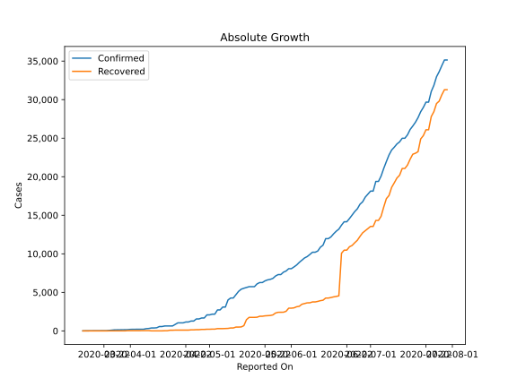
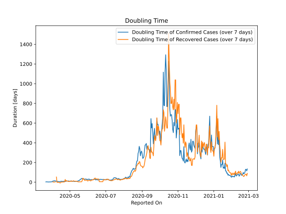

# Country Figures: Doubling Time of Infections for Ghana 

The doubling time below are calculated based on
* an exponential growth assumption
* for time difference of past seven (7) days.
The doubling time's unit is "days".

The first doubling time indicates the increase of confirmed (infected)
cases. There, the *higher* the number is, the better is to take control
of the disease.

The second doubling time indicates the increase of recovered (healed)
cases. There, the *lower* the number is, the better it is to take
control of the disease.

| Reported On | Confirmed | Doubling Time (Confirmed) | Recovered | Doubling Time (Recovered) |
|-------------|-----------|---------------------------|-----------|---------------------------|
| 2020-04-09 | 378 |  8.2 days  | 3 |  -1.7 days  | 
| 2020-04-08 | 313 |  10.6 days  | 34 |  52.9 days  | 
| 2020-04-07 | 287 |  8.7 days  | 31 |  None  | 
| 2020-04-06 | 214 |  14.5 days  | 31 |  2.1 days  | 
| 2020-04-05 | 214 |  14.5 days  | 31 |  2.1 days  | 
| 2020-04-04 | 205 |  13.3 days  | 31 |  2.1 days  | 
| 2020-04-03 | 205 |  12.4 days  | 31 |  2.1 days  | 
| 2020-04-02 | 204 |  11.5 days  | 31 |  1.7 days  | 
| 2020-04-01 | 195 |  6.9 days  | 31 |  None  | 
| 2020-03-31 | 161 |  4.7 days  | 31 |  None  | 
| 2020-03-30 | 152 |  3.1 days  | 2 |  None  | 
| 2020-03-29 | 152 |  2.9 days  | 2 |  None  | 
| 2020-03-28 | 141 |  2.8 days  | 2 |  None  | 
| 2020-03-27 | 137 |  2.6 days  | 2 |  None  | 
| 2020-03-26 | 132 |  2.3 days  | 1 |  None  | 
| 2020-03-25 | 93 |  2.2 days  | 0 |  None  | 
| 2020-03-24 | 53 |  2.7 days  | 0 |  None  | 
| 2020-03-23 | 27 |  3.6 days  | 0 |  None  | 
| 2020-03-22 | 23 |  3.9 days  | 0 |  None  | 
| 2020-03-21 | 19 |  3.0 days  | 0 |  None  | 
| 2020-03-20 | 16 |  None  | 0 |  None  | 
| 2020-03-19 | 11 |  None  | 0 |  None  | 
| 2020-03-18 | 7 |  None  | 0 |  None  | 
| 2020-03-17 | 7 |  None  | 0 |  None  | 
| 2020-03-16 | 6 |  None  | 0 |  None  | 
| 2020-03-15 | 6 |  None  | 0 |  None  | 
| 2020-03-14 | 3 |  None  | 0 |  None  | 

