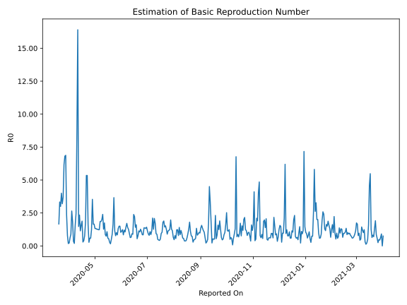

# Country Figures: Time Series for Basic Reproduction Number of Ghana 

| Reported On | &Delta; Confirmed | Total &Delta; Confirmed First Interval | Total &Delta; Confirmed Second Interval | Estimated Basic Reproduction Number R0 | 
|-------------|-------------------|----------------------------------------|-----------------------------------------|---------------------------------------------------|
| 2020-05-04 | 550 |  498  |  392  |  1.27  | 
| 2020-05-03 | 0 |  498  |  392  |  1.27  | 
| 2020-05-02 | 95 |  524  |  396  |  1.32  | 
| 2020-05-01 | 0 |  524  |  396  |  1.32  | 
| 2020-04-30 | 403 |  392  |  237  |  1.65  | 
| 2020-04-29 | 0 |  392  |  237  |  1.65  | 
| 2020-04-28 | 121 |  396  |  112  |  3.54  | 
| 2020-04-27 | 0 |  396  |  320  |  1.24  | 
| 2020-04-26 | 271 |  237  |  401  |  0.59  | 
| 2020-04-25 | 0 |  237  |  401  |  0.59  | 
| 2020-04-24 | 125 |  112  |  406  |  0.28  | 
| 2020-04-23 | 0 |  320  |  198  |  1.62  | 
| 2020-04-22 | 112 |  401  |  75  |  5.35  | 
| 2020-04-21 | 0 |  401  |  75  |  5.35  | 
| 2020-04-20 | 0 |  406  |  228  |  1.78  | 
| 2020-04-19 | 208 |  198  |  258  |  0.77  | 
| 2020-04-18 | 193 |  75  |  188  |  0.40  | 
| 2020-04-17 | 0 |  75  |  253  |  0.30  | 
| 2020-04-16 | 5 |  228  |  121  |  1.88  | 
| 2020-04-15 | 0 |  258  |  164  |  1.57  | 
| 2020-04-14 | 70 |  188  |  164  |  1.15  | 
| 2020-04-13 | 0 |  253  |  108  |  2.34  | 
| 2020-04-12 | 158 |  121  |  82  |  1.48  | 
| 2020-04-11 | 30 |  164  |  10  |  16.40  | 
| 2020-04-10 | 0 |  164  |  19  |  8.63  | 
| 2020-04-09 | 65 |  108  |  44  |  2.45  | 
| 2020-04-08 | 26 |  82  |  53  |  1.55  | 
| 2020-04-07 | 73 |  10  |  52  |  0.19  | 
| 2020-04-06 | 0 |  19  |  54  |  0.35  | 
| 2020-04-05 | 9 |  44  |  24  |  1.83  | 
| 2020-04-04 | 0 |  53  |  20  |  2.65  | 
| 2020-04-03 | 1 |  52  |  59  |  0.88  | 
| 2020-04-02 | 9 |  54  |  88  |  0.61  | 
| 2020-04-01 | 34 |  24  |  110  |  0.22  | 
| 2020-03-31 | 9 |  20  |  109  |  0.18  | 
| 2020-03-30 | 0 |  59  |  74  |  0.80  | 
| 2020-03-29 | 11 |  88  |  37  |  2.38  | 
| 2020-03-28 | 4 |  110  |  16  |  6.88  | 
| 2020-03-27 | 5 |  109  |  16  |  6.81  | 
| 2020-03-26 | 39 |  74  |  12  |  6.17  | 
| 2020-03-25 | 40 |  37  |  10  |  3.70  | 
| 2020-03-24 | 26 |  16  |  5  |  3.20  | 
| 2020-03-23 | 4 |  16  |  4  |  4.00  | 
| 2020-03-22 | 4 |  12  |  4  |  3.00  | 
| 2020-03-21 | 3 |  10  |  3  |  3.33  | 
| 2020-03-20 | 5 |  5  |  3  |  1.67  | 
| 2020-03-19 | 4 |  4  |  None  |  None  | 
| 2020-03-18 | 0 |  4  |  None  |  None  | 
| 2020-03-17 | 1 |  3  |  None  |  None  | 
| 2020-03-16 | 0 |  3  |  None  |  None  | 
| 2020-03-15 | 3 |  None  |  None  |  None  | 
| 2020-03-14 | None |  None  |  None  |  None  | 

