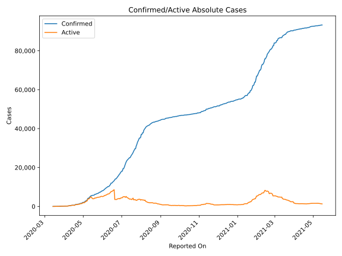
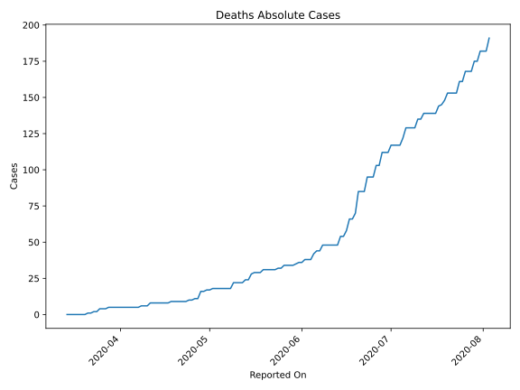
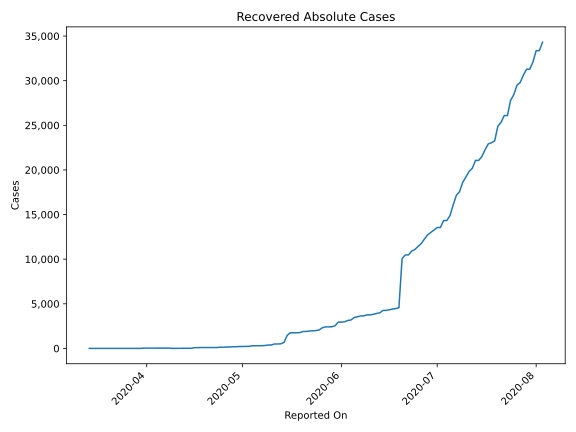
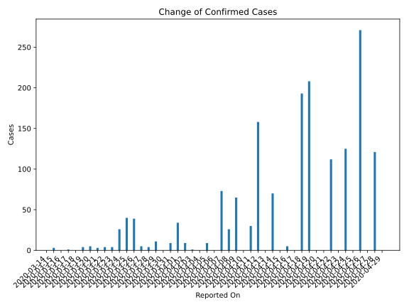
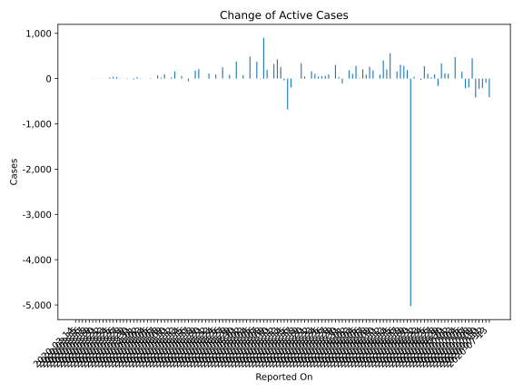
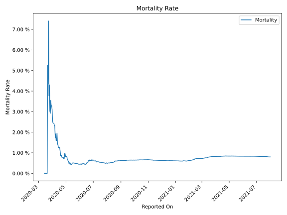

# Country Figures: Time Series for Ghana 

| Reported On | Confirmed | Deaths | Recovered | Active | Mortality | &Delta; Confirmed | &Delta; Deaths | &Delta; Recovered | &Delta; Active | % Active of Population |
|-------------|-----------|--------|-----------|--------|-----------|-------------------|----------------|-------------------|----------------|------------------------|
| 2020-04-17 | 641 | 8 | 83 | 550 |  1.25 %  | 0 | 0 | 0 | 0 |  0.002 %  | 
| 2020-04-16 | 641 | 8 | 83 | 550 |  1.25 %  | 5 | 0 | 66 | -61 |  0.002 %  | 
| 2020-04-15 | 636 | 8 | 17 | 611 |  1.26 %  | 0 | 0 | 0 | 0 |  0.002 %  | 
| 2020-04-14 | 636 | 8 | 17 | 611 |  1.26 %  | 70 | 0 | 13 | 57 |  0.002 %  | 
| 2020-04-13 | 566 | 8 | 4 | 554 |  1.41 %  | 0 | 0 | 0 | 0 |  0.002 %  | 
| 2020-04-12 | 566 | 8 | 4 | 554 |  1.41 %  | 158 | 0 | 0 | 158 |  0.002 %  | 
| 2020-04-11 | 408 | 8 | 4 | 396 |  1.96 %  | 30 | 2 | 0 | 28 |  0.001 %  | 
| 2020-04-10 | 378 | 6 | 4 | 368 |  1.59 %  | 0 | 0 | 1 | -1 |  0.001 %  | 
| 2020-04-09 | 378 | 6 | 3 | 369 |  1.59 %  | 65 | 0 | -31 | 96 |  0.001 %  | 
| 2020-04-08 | 313 | 6 | 34 | 273 |  1.92 %  | 26 | 1 | 3 | 22 |  0.001 %  | 
| 2020-04-07 | 287 | 5 | 31 | 251 |  1.74 %  | 73 | 0 | 0 | 73 |  0.001 %  | 
| 2020-04-06 | 214 | 5 | 31 | 178 |  2.34 %  | 0 | 0 | 0 | 0 |  0.001 %  | 
| 2020-04-05 | 214 | 5 | 31 | 178 |  2.34 %  | 9 | 0 | 0 | 9 |  0.001 %  | 
| 2020-04-04 | 205 | 5 | 31 | 169 |  2.44 %  | 0 | 0 | 0 | 0 |  0.001 %  | 
| 2020-04-03 | 205 | 5 | 31 | 169 |  2.44 %  | 1 | 0 | 0 | 1 |  0.001 %  | 
| 2020-04-02 | 204 | 5 | 31 | 168 |  2.45 %  | 9 | 0 | 0 | 9 |  0.001 %  | 
| 2020-04-01 | 195 | 5 | 31 | 159 |  2.56 %  | 34 | 0 | 0 | 34 |  0.001 %  | 
| 2020-03-31 | 161 | 5 | 31 | 125 |  3.11 %  | 9 | 0 | 29 | -20 |  0.000 %  | 
| 2020-03-30 | 152 | 5 | 2 | 145 |  3.29 %  | 0 | 0 | 0 | 0 |  0.000 %  | 
| 2020-03-29 | 152 | 5 | 2 | 145 |  3.29 %  | 11 | 0 | 0 | 11 |  0.000 %  | 
| 2020-03-28 | 141 | 5 | 2 | 134 |  3.55 %  | 4 | 1 | 0 | 3 |  0.000 %  | 
| 2020-03-27 | 137 | 4 | 2 | 131 |  2.92 %  | 5 | 0 | 1 | 4 |  0.000 %  | 
| 2020-03-26 | 132 | 4 | 1 | 127 |  3.03 %  | 39 | 0 | 1 | 38 |  0.000 %  | 
| 2020-03-25 | 93 | 4 | 0 | 89 |  4.30 %  | 40 | 2 | 0 | 38 |  0.000 %  | 
| 2020-03-24 | 53 | 2 | 0 | 51 |  3.77 %  | 26 | 0 | 0 | 26 |  0.000 %  | 
| 2020-03-23 | 27 | 2 | 0 | 25 |  7.41 %  | 4 | 1 | 0 | 3 |  0.000 %  | 
| 2020-03-22 | 23 | 1 | 0 | 22 |  4.35 %  | 4 | 0 | 0 | 4 |  0.000 %  | 
| 2020-03-21 | 19 | 1 | 0 | 18 |  5.26 %  | 3 | 1 | 0 | 2 |  0.000 %  | 
| 2020-03-20 | 16 | 0 | 0 | 16 |  None  | 5 | 0 | 0 | 5 |  0.000 %  | 
| 2020-03-19 | 11 | 0 | 0 | 11 |  None  | 4 | 0 | 0 | 4 |  0.000 %  | 
| 2020-03-18 | 7 | 0 | 0 | 7 |  None  | 0 | 0 | 0 | 0 |  0.000 %  | 
| 2020-03-17 | 7 | 0 | 0 | 7 |  None  | 1 | 0 | 0 | 1 |  0.000 %  | 
| 2020-03-16 | 6 | 0 | 0 | 6 |  None  | 0 | 0 | 0 | 0 |  0.000 %  | 
| 2020-03-15 | 6 | 0 | 0 | 6 |  None  | 3 | 0 | 0 | 3 |  0.000 %  | 
| 2020-03-14 | 3 | 0 | 0 | 3 |  None  | None | None | None | None |  0.000 %  | 

