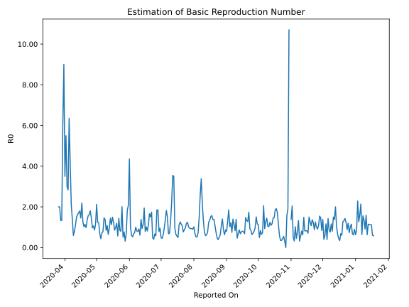

# Country Figures: Time Series for Basic Reproduction Number of Guinea 

| Reported On | &Delta; Confirmed | Total &Delta; Confirmed First Interval | Total &Delta; Confirmed Second Interval | Estimated Basic Reproduction Number R0 | 
|-------------|-------------------|----------------------------------------|-----------------------------------------|---------------------------------------------------|
| 2020-04-29 | 111 |  286  |  332  |  0.86  | 
| 2020-04-28 | 77 |  301  |  283  |  1.06  | 
| 2020-04-27 | 167 |  235  |  243  |  0.97  | 
| 2020-04-26 | 0 |  308  |  211  |  1.46  | 
| 2020-04-25 | 42 |  332  |  184  |  1.80  | 
| 2020-04-24 | 92 |  283  |  175  |  1.62  | 
| 2020-04-23 | 101 |  243  |  155  |  1.57  | 
| 2020-04-22 | 73 |  211  |  158  |  1.34  | 
| 2020-04-21 | 66 |  184  |  188  |  0.98  | 
| 2020-04-20 | 43 |  175  |  154  |  1.14  | 
| 2020-04-19 | 61 |  155  |  151  |  1.03  | 
| 2020-04-18 | 41 |  158  |  125  |  1.26  | 
| 2020-04-17 | 39 |  188  |  86  |  2.19  | 
| 2020-04-16 | 34 |  154  |  106  |  1.45  | 
| 2020-04-15 | 41 |  151  |  84  |  1.80  | 
| 2020-04-14 | 44 |  125  |  73  |  1.71  | 
| 2020-04-13 | 69 |  86  |  53  |  1.62  | 
| 2020-04-12 | 0 |  106  |  71  |  1.49  | 
| 2020-04-11 | 38 |  84  |  76  |  1.11  | 
| 2020-04-10 | 18 |  73  |  91  |  0.80  | 
| 2020-04-09 | 30 |  53  |  89  |  0.60  | 
| 2020-04-08 | 20 |  71  |  51  |  1.39  | 
| 2020-04-07 | 16 |  76  |  36  |  2.11  | 
| 2020-04-06 | 7 |  91  |  22  |  4.14  | 
| 2020-04-05 | 10 |  89  |  14  |  6.36  | 
| 2020-04-04 | 38 |  51  |  18  |  2.83  | 
| 2020-04-03 | 21 |  36  |  12  |  3.00  | 
| 2020-04-02 | 22 |  22  |  4  |  5.50  | 
| 2020-04-01 | 8 |  14  |  4  |  3.50  | 
| 2020-03-31 | 0 |  18  |  2  |  9.00  | 
| 2020-03-30 | 6 |  12  |  2  |  6.00  | 
| 2020-03-29 | 8 |  4  |  3  |  1.33  | 
| 2020-03-28 | 0 |  4  |  3  |  1.33  | 
| 2020-03-27 | 4 |  2  |  1  |  2.00  | 
| 2020-03-26 | 0 |  2  |  1  |  2.00  | 
| 2020-03-25 | 0 |  3  |  None  |  None  | 
| 2020-03-24 | 0 |  3  |  None  |  None  | 
| 2020-03-23 | 2 |  1  |  None  |  None  | 
| 2020-03-22 | 0 |  1  |  None  |  None  | 
| 2020-03-21 | 1 |  None  |  None  |  None  | 
| 2020-03-20 | 0 |  None  |  None  |  None  | 
| 2020-03-19 | 0 |  None  |  None  |  None  | 
| 2020-03-18 | 0 |  None  |  None  |  None  | 
| 2020-03-17 | 0 |  None  |  None  |  None  | 
| 2020-03-16 | 0 |  None  |  None  |  None  | 
| 2020-03-15 | 0 |  None  |  None  |  None  | 
| 2020-03-14 | 0 |  None  |  None  |  None  | 
| 2020-03-13 | None |  None  |  None  |  None  | 

