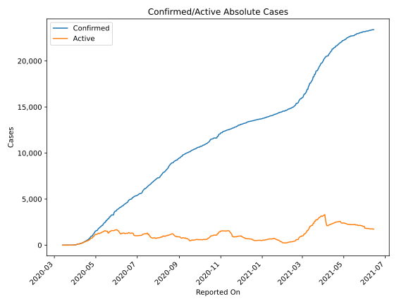
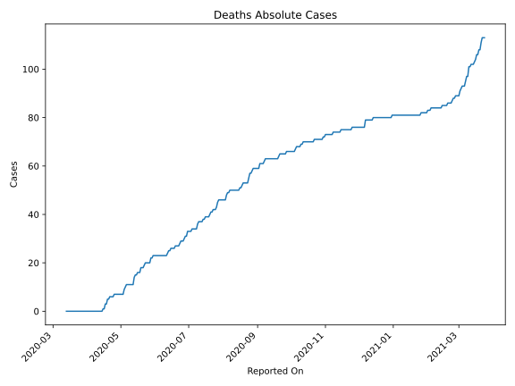
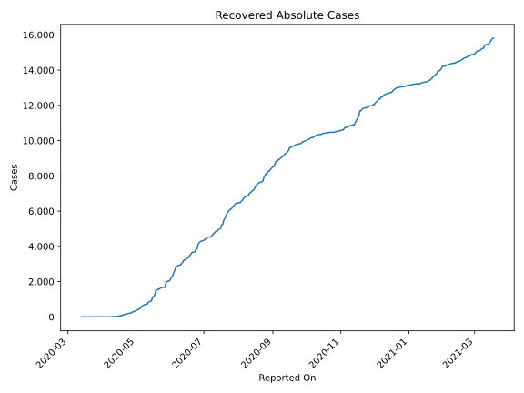
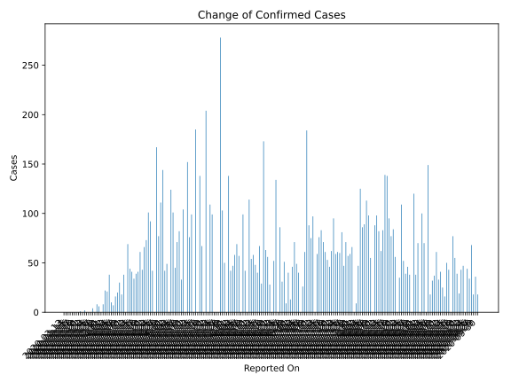
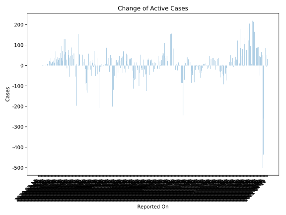
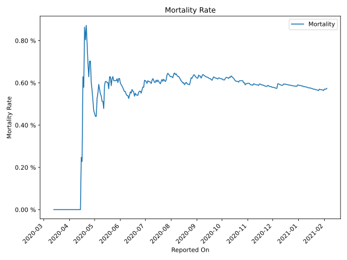

# Country Figures: Time Series for Guinea 

| Reported On | Confirmed | Deaths | Recovered | Active | Mortality | &Delta; Confirmed | &Delta; Deaths | &Delta; Active | % Active of Population |
|-------------|-----------|--------|-----------|--------|-----------|-------------------|----------------|----------------|------------------------|
| 2020-04-07 | 144 | 0 | 5 | 139 |  None  | 16 | 0 | 16 |  0.001 %  | 
| 2020-04-06 | 128 | 0 | 5 | 123 |  None  | 7 | 0 | 7 |  0.001 %  | 
| 2020-04-05 | 121 | 0 | 5 | 116 |  None  | 10 | 0 | 10 |  0.001 %  | 
| 2020-04-04 | 111 | 0 | 5 | 106 |  None  | 38 | 0 | 35 |  0.001 %  | 
| 2020-04-03 | 73 | 0 | 2 | 71 |  None  | 21 | 0 | 19 |  0.001 %  | 
| 2020-04-02 | 52 | 0 | 0 | 52 |  None  | 22 | 0 | 22 |  0.000 %  | 
| 2020-04-01 | 30 | 0 | 0 | 30 |  None  | 8 | 0 | 8 |  0.000 %  | 
| 2020-03-31 | 22 | 0 | 0 | 22 |  None  | 0 | 0 | 0 |  0.000 %  | 
| 2020-03-30 | 22 | 0 | 0 | 22 |  None  | 6 | 0 | 6 |  0.000 %  | 
| 2020-03-29 | 16 | 0 | 0 | 16 |  None  | 8 | 0 | 8 |  0.000 %  | 
| 2020-03-28 | 8 | 0 | 0 | 8 |  None  | 0 | 0 | 0 |  0.000 %  | 
| 2020-03-27 | 8 | 0 | 0 | 8 |  None  | 4 | 0 | 4 |  0.000 %  | 
| 2020-03-26 | 4 | 0 | 0 | 4 |  None  | 0 | 0 | 0 |  0.000 %  | 
| 2020-03-25 | 4 | 0 | 0 | 4 |  None  | 0 | 0 | 0 |  0.000 %  | 
| 2020-03-24 | 4 | 0 | 0 | 4 |  None  | 0 | 0 | 0 |  0.000 %  | 
| 2020-03-23 | 4 | 0 | 0 | 4 |  None  | 2 | 0 | 2 |  0.000 %  | 
| 2020-03-22 | 2 | 0 | 0 | 2 |  None  | 0 | 0 | 0 |  0.000 %  | 
| 2020-03-21 | 2 | 0 | 0 | 2 |  None  | 1 | 0 | 1 |  0.000 %  | 
| 2020-03-20 | 1 | 0 | 0 | 1 |  None  | 0 | 0 | 0 |  0.000 %  | 
| 2020-03-19 | 1 | 0 | 0 | 1 |  None  | 0 | 0 | 0 |  0.000 %  | 
| 2020-03-18 | 1 | 0 | 0 | 1 |  None  | 0 | 0 | 0 |  0.000 %  | 
| 2020-03-17 | 1 | 0 | 0 | 1 |  None  | 0 | 0 | 0 |  0.000 %  | 
| 2020-03-16 | 1 | 0 | 0 | 1 |  None  | 0 | 0 | 0 |  0.000 %  | 
| 2020-03-15 | 1 | 0 | 0 | 1 |  None  | 0 | 0 | 0 |  0.000 %  | 
| 2020-03-14 | 1 | 0 | 0 | 1 |  None  | 0 | 0 | 0 |  0.000 %  | 
| 2020-03-13 | 1 | 0 | 0 | 1 |  None  | None | None | None |  0.000 %  | 

