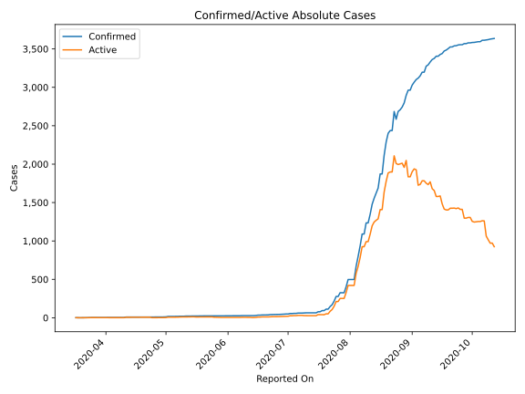
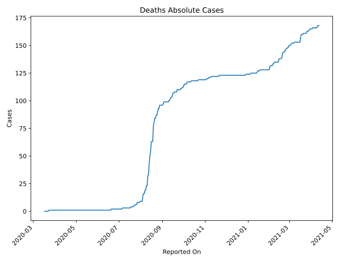
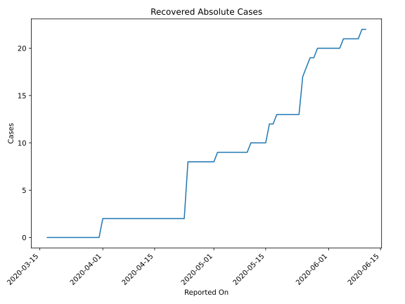
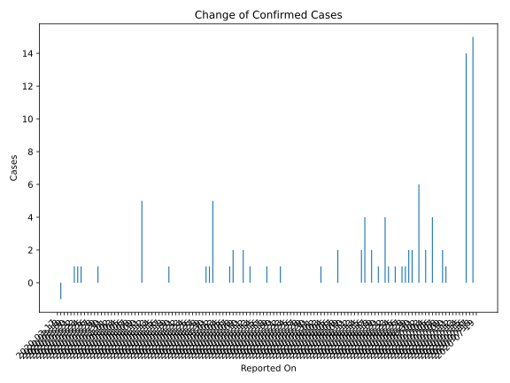
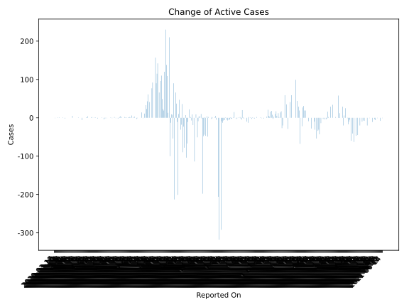
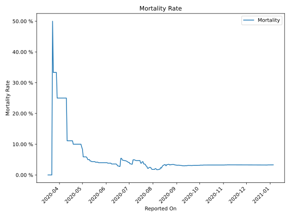

# Country Figures: Time Series for Gambia 

| Reported On | Confirmed | Deaths | Recovered | Active | Mortality | &Delta; Confirmed | &Delta; Deaths | &Delta; Recovered | &Delta; Active | % Active of Population |
|-------------|-----------|--------|-----------|--------|-----------|-------------------|----------------|-------------------|----------------|------------------------|
| 2020-04-22 | 10 | 1 | 2 | 7 |  10.00 %  | 0 | 0 | 0 | 0 |  0.000 %  | 
| 2020-04-21 | 10 | 1 | 2 | 7 |  10.00 %  | 0 | 0 | 0 | 0 |  0.000 %  | 
| 2020-04-20 | 10 | 1 | 2 | 7 |  10.00 %  | 0 | 0 | 0 | 0 |  0.000 %  | 
| 2020-04-19 | 10 | 1 | 2 | 7 |  10.00 %  | 1 | 0 | 0 | 1 |  0.000 %  | 
| 2020-04-18 | 9 | 1 | 2 | 6 |  11.11 %  | 0 | 0 | 0 | 0 |  0.000 %  | 
| 2020-04-17 | 9 | 1 | 2 | 6 |  11.11 %  | 0 | 0 | 0 | 0 |  0.000 %  | 
| 2020-04-16 | 9 | 1 | 2 | 6 |  11.11 %  | 0 | 0 | 0 | 0 |  0.000 %  | 
| 2020-04-15 | 9 | 1 | 2 | 6 |  11.11 %  | 0 | 0 | 0 | 0 |  0.000 %  | 
| 2020-04-14 | 9 | 1 | 2 | 6 |  11.11 %  | 0 | 0 | 0 | 0 |  0.000 %  | 
| 2020-04-13 | 9 | 1 | 2 | 6 |  11.11 %  | 0 | 0 | 0 | 0 |  0.000 %  | 
| 2020-04-12 | 9 | 1 | 2 | 6 |  11.11 %  | 0 | 0 | 0 | 0 |  0.000 %  | 
| 2020-04-11 | 9 | 1 | 2 | 6 |  11.11 %  | 5 | 0 | 0 | 5 |  0.000 %  | 
| 2020-04-10 | 4 | 1 | 2 | 1 |  25.00 %  | 0 | 0 | 0 | 0 |  0.000 %  | 
| 2020-04-09 | 4 | 1 | 2 | 1 |  25.00 %  | 0 | 0 | 0 | 0 |  0.000 %  | 
| 2020-04-08 | 4 | 1 | 2 | 1 |  25.00 %  | 0 | 0 | 0 | 0 |  0.000 %  | 
| 2020-04-07 | 4 | 1 | 2 | 1 |  25.00 %  | 0 | 0 | 0 | 0 |  0.000 %  | 
| 2020-04-06 | 4 | 1 | 2 | 1 |  25.00 %  | 0 | 0 | 0 | 0 |  0.000 %  | 
| 2020-04-05 | 4 | 1 | 2 | 1 |  25.00 %  | 0 | 0 | 0 | 0 |  0.000 %  | 
| 2020-04-04 | 4 | 1 | 2 | 1 |  25.00 %  | 0 | 0 | 0 | 0 |  0.000 %  | 
| 2020-04-03 | 4 | 1 | 2 | 1 |  25.00 %  | 0 | 0 | 0 | 0 |  0.000 %  | 
| 2020-04-02 | 4 | 1 | 2 | 1 |  25.00 %  | 0 | 0 | 0 | 0 |  0.000 %  | 
| 2020-04-01 | 4 | 1 | 2 | 1 |  25.00 %  | 0 | 0 | 2 | -2 |  0.000 %  | 
| 2020-03-31 | 4 | 1 | 0 | 3 |  25.00 %  | 0 | 0 | 0 | 0 |  0.000 %  | 
| 2020-03-30 | 4 | 1 | 0 | 3 |  25.00 %  | 0 | 0 | 0 | 0 |  0.000 %  | 
| 2020-03-29 | 4 | 1 | 0 | 3 |  25.00 %  | 1 | 0 | 0 | 1 |  0.000 %  | 
| 2020-03-28 | 3 | 1 | 0 | 2 |  33.33 %  | 0 | 0 | 0 | 0 |  0.000 %  | 
| 2020-03-27 | 3 | 1 | 0 | 2 |  33.33 %  | 0 | 0 | 0 | 0 |  0.000 %  | 
| 2020-03-26 | 3 | 1 | 0 | 2 |  33.33 %  | 0 | 0 | 0 | 0 |  0.000 %  | 
| 2020-03-25 | 3 | 1 | 0 | 2 |  33.33 %  | 0 | 0 | 0 | 0 |  0.000 %  | 
| 2020-03-24 | 3 | 1 | 0 | 2 |  33.33 %  | 1 | 0 | 0 | 1 |  0.000 %  | 
| 2020-03-23 | 2 | 1 | 0 | 1 |  50.00 %  | 1 | 1 | 0 | 0 |  0.000 %  | 
| 2020-03-22 | 1 | 0 | 0 | 1 |  None  | 1 | 0 | 0 | 1 |  0.000 %  | 
| 2020-03-21 | 0 | 0 | 0 | 0 |  None  | 0 | 0 | 0 | 0 |  n/a  | 
| 2020-03-20 | 0 | 0 | 0 | 0 |  None  | 0 | 0 | 0 | 0 |  n/a  | 
| 2020-03-19 | 0 | 0 | 0 | 0 |  None  | 0 | 0 | 0 | 0 |  n/a  | 
| 2020-03-18 | 0 | 0 | 0 | 0 |  None  | -1 | 0 | 0 | -1 |  n/a  | 
| 2020-03-17 | 1 | 0 | 0 | 1 |  None  | None | None | None | None |  0.000 %  | 

