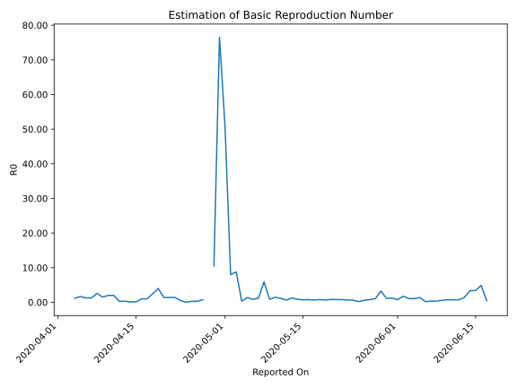

# Country Figures: Time Series for Basic Reproduction Number of Guinea-Bissau 

| Reported On | &Delta; Confirmed | Total &Delta; Confirmed First Interval | Total &Delta; Confirmed Second Interval | Estimated Basic Reproduction Number R0 | 
|-------------|-------------------|----------------------------------------|-----------------------------------------|---------------------------------------------------|
| 2020-05-01 | 52 |  152  |  3  |  50.67  | 
| 2020-04-30 | 0 |  153  |  2  |  76.50  | 
| 2020-04-29 | 132 |  21  |  2  |  10.50  | 
| 2020-04-28 | 0 |  23  |  None  |  None  | 
| 2020-04-27 | 20 |  3  |  4  |  0.75  | 
| 2020-04-26 | 1 |  2  |  7  |  0.29  | 
| 2020-04-25 | 0 |  2  |  7  |  0.29  | 
| 2020-04-24 | 2 |  None  |  7  |  None  | 
| 2020-04-23 | 0 |  4  |  8  |  0.50  | 
| 2020-04-22 | 0 |  7  |  5  |  1.40  | 
| 2020-04-21 | 0 |  7  |  5  |  1.40  | 
| 2020-04-20 | 0 |  7  |  5  |  1.40  | 
| 2020-04-19 | 4 |  8  |  2  |  4.00  | 
| 2020-04-18 | 3 |  5  |  2  |  2.50  | 
| 2020-04-17 | 0 |  5  |  5  |  1.00  | 
| 2020-04-16 | 0 |  5  |  5  |  1.00  | 
| 2020-04-15 | 5 |  2  |  18  |  0.11  | 
| 2020-04-14 | 0 |  2  |  18  |  0.11  | 
| 2020-04-13 | 0 |  5  |  15  |  0.33  | 
| 2020-04-12 | 0 |  5  |  18  |  0.28  | 
| 2020-04-11 | 2 |  18  |  9  |  2.00  | 
| 2020-04-10 | 0 |  18  |  9  |  2.00  | 
| 2020-04-09 | 3 |  15  |  10  |  1.50  | 
| 2020-04-08 | 0 |  18  |  7  |  2.57  | 
| 2020-04-07 | 15 |  9  |  7  |  1.29  | 
| 2020-04-06 | 0 |  9  |  7  |  1.29  | 
| 2020-04-05 | 0 |  10  |  6  |  1.67  | 
| 2020-04-04 | 3 |  7  |  6  |  1.17  | 
| 2020-04-03 | 6 |  7  |  None  |  None  | 
| 2020-04-02 | 0 |  7  |  None  |  None  | 
| 2020-04-01 | 1 |  6  |  None  |  None  | 
| 2020-03-31 | 0 |  6  |  None  |  None  | 
| 2020-03-30 | 6 |  None  |  None  |  None  | 
| 2020-03-29 | 0 |  None  |  None  |  None  | 
| 2020-03-28 | 0 |  None  |  None  |  None  | 
| 2020-03-27 | 0 |  None  |  None  |  None  | 
| 2020-03-26 | 0 |  None  |  None  |  None  | 
| 2020-03-25 | None |  None  |  None  |  None  | 

