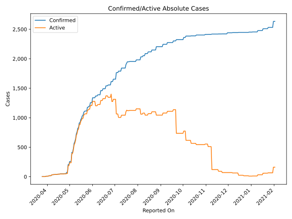
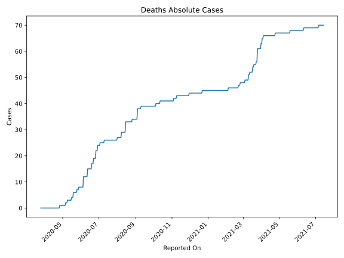
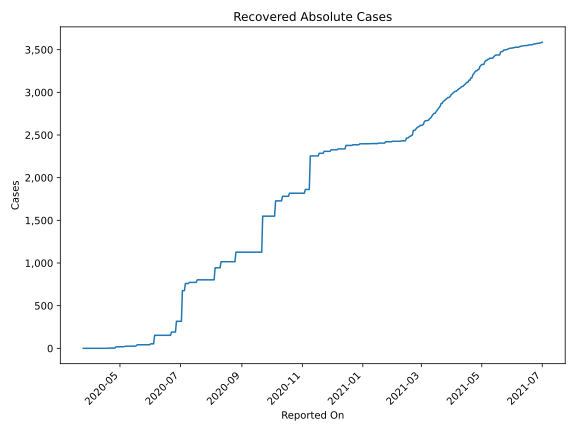
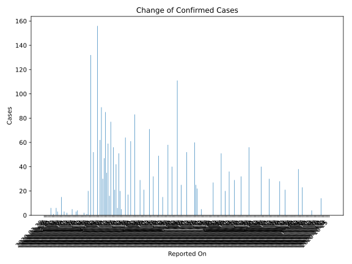
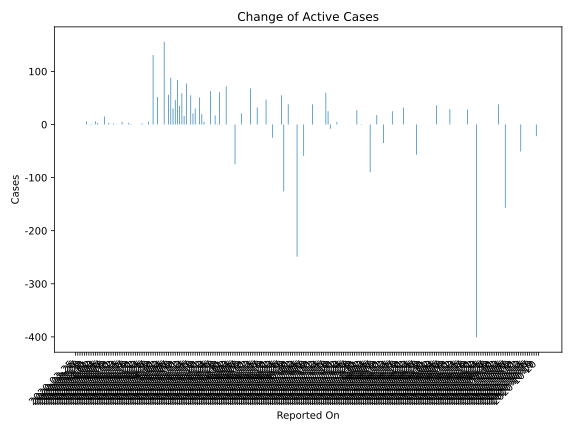
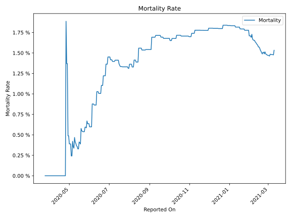

# Country Figures: Time Series for Guinea-Bissau 

| Reported On | Confirmed | Deaths | Recovered | Active | Mortality | &Delta; Confirmed | &Delta; Deaths | &Delta; Recovered | &Delta; Active | % Active of Population |
|-------------|-----------|--------|-----------|--------|-----------|-------------------|----------------|-------------------|----------------|------------------------|
| 2020-05-05 | 413 | 1 | 19 | 393 |  0.24 %  | 0 | 0 | 0 | 0 |  0.021 %  | 
| 2020-05-04 | 413 | 1 | 19 | 393 |  0.24 %  | 156 | 0 | 0 | 156 |  0.021 %  | 
| 2020-05-03 | 257 | 1 | 19 | 237 |  0.39 %  | 0 | 0 | 0 | 0 |  0.013 %  | 
| 2020-05-02 | 257 | 1 | 19 | 237 |  0.39 %  | 0 | 0 | 0 | 0 |  0.013 %  | 
| 2020-05-01 | 257 | 1 | 19 | 237 |  0.39 %  | 52 | 0 | 0 | 52 |  0.013 %  | 
| 2020-04-30 | 205 | 1 | 19 | 185 |  0.49 %  | 0 | 0 | 0 | 0 |  0.010 %  | 
| 2020-04-29 | 205 | 1 | 19 | 185 |  0.49 %  | 132 | 0 | 1 | 131 |  0.010 %  | 
| 2020-04-28 | 73 | 1 | 18 | 54 |  1.37 %  | 0 | 0 | 0 | 0 |  0.003 %  | 
| 2020-04-27 | 73 | 1 | 18 | 54 |  1.37 %  | 20 | 0 | 15 | 5 |  0.003 %  | 
| 2020-04-26 | 53 | 1 | 3 | 49 |  1.89 %  | 1 | 1 | 0 | 0 |  0.003 %  | 
| 2020-04-25 | 52 | 0 | 3 | 49 |  None  | 0 | 0 | 0 | 0 |  0.003 %  | 
| 2020-04-24 | 52 | 0 | 3 | 49 |  None  | 2 | 0 | 0 | 2 |  0.003 %  | 
| 2020-04-23 | 50 | 0 | 3 | 47 |  None  | 0 | 0 | 0 | 0 |  0.003 %  | 
| 2020-04-22 | 50 | 0 | 3 | 47 |  None  | 0 | 0 | 0 | 0 |  0.003 %  | 
| 2020-04-21 | 50 | 0 | 3 | 47 |  None  | 0 | 0 | 0 | 0 |  0.003 %  | 
| 2020-04-20 | 50 | 0 | 3 | 47 |  None  | 0 | 0 | 0 | 0 |  0.003 %  | 
| 2020-04-19 | 50 | 0 | 3 | 47 |  None  | 4 | 0 | 3 | 1 |  0.003 %  | 
| 2020-04-18 | 46 | 0 | 0 | 46 |  None  | 3 | 0 | 0 | 3 |  0.002 %  | 
| 2020-04-17 | 43 | 0 | 0 | 43 |  None  | 0 | 0 | 0 | 0 |  0.002 %  | 
| 2020-04-16 | 43 | 0 | 0 | 43 |  None  | 0 | 0 | 0 | 0 |  0.002 %  | 
| 2020-04-15 | 43 | 0 | 0 | 43 |  None  | 5 | 0 | 0 | 5 |  0.002 %  | 
| 2020-04-14 | 38 | 0 | 0 | 38 |  None  | 0 | 0 | 0 | 0 |  0.002 %  | 
| 2020-04-13 | 38 | 0 | 0 | 38 |  None  | 0 | 0 | 0 | 0 |  0.002 %  | 
| 2020-04-12 | 38 | 0 | 0 | 38 |  None  | 0 | 0 | 0 | 0 |  0.002 %  | 
| 2020-04-11 | 38 | 0 | 0 | 38 |  None  | 2 | 0 | 0 | 2 |  0.002 %  | 
| 2020-04-10 | 36 | 0 | 0 | 36 |  None  | 0 | 0 | 0 | 0 |  0.002 %  | 
| 2020-04-09 | 36 | 0 | 0 | 36 |  None  | 3 | 0 | 0 | 3 |  0.002 %  | 
| 2020-04-08 | 33 | 0 | 0 | 33 |  None  | 0 | 0 | 0 | 0 |  0.002 %  | 
| 2020-04-07 | 33 | 0 | 0 | 33 |  None  | 15 | 0 | 0 | 15 |  0.002 %  | 
| 2020-04-06 | 18 | 0 | 0 | 18 |  None  | 0 | 0 | 0 | 0 |  0.001 %  | 
| 2020-04-05 | 18 | 0 | 0 | 18 |  None  | 0 | 0 | 0 | 0 |  0.001 %  | 
| 2020-04-04 | 18 | 0 | 0 | 18 |  None  | 3 | 0 | 0 | 3 |  0.001 %  | 
| 2020-04-03 | 15 | 0 | 0 | 15 |  None  | 6 | 0 | 0 | 6 |  0.001 %  | 
| 2020-04-02 | 9 | 0 | 0 | 9 |  None  | 0 | 0 | 0 | 0 |  0.000 %  | 
| 2020-04-01 | 9 | 0 | 0 | 9 |  None  | 1 | 0 | 0 | 1 |  0.000 %  | 
| 2020-03-31 | 8 | 0 | 0 | 8 |  None  | 0 | 0 | 0 | 0 |  0.000 %  | 
| 2020-03-30 | 8 | 0 | 0 | 8 |  None  | 6 | 0 | 0 | 6 |  0.000 %  | 
| 2020-03-29 | 2 | 0 | 0 | 2 |  None  | 0 | 0 | 0 | 0 |  0.000 %  | 
| 2020-03-28 | 2 | 0 | 0 | 2 |  None  | 0 | 0 | 0 | 0 |  0.000 %  | 
| 2020-03-27 | 2 | 0 | 0 | 2 |  None  | 0 | 0 | 0 | 0 |  0.000 %  | 
| 2020-03-26 | 2 | 0 | 0 | 2 |  None  | 0 | 0 | 0 | 0 |  0.000 %  | 
| 2020-03-25 | 2 | 0 | 0 | 2 |  None  | None | None | None | None |  0.000 %  | 

